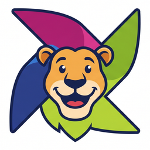
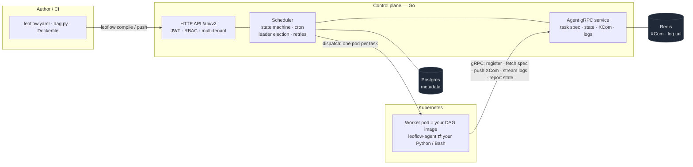

<p align="center">
  
</p>

<h1 align="center">Leoflow</h1>

<p align="center">
  <em>The workflow orchestrator that ate Apache Airflow's lunch.<br>
  Same UI. Same vocabulary. Ten times the speed. Zero of the pain.</em>
</p>

[](https://opensource.org/licenses/Apache-2.0)
[](https://goreportcard.com/report/github.com/neochaotic/leoflow)
[](https://github.com/neochaotic/leoflow/actions/workflows/ci.yaml)
[](https://github.com/neochaotic/leoflow/actions/workflows/security.yaml)
[](https://securityscorecards.dev/viewer/?uri=github.com/neochaotic/leoflow)

> The OpenSSF Best Practices badge will be added once the project is registered at [bestpractices.dev](https://www.bestpractices.dev) (post-v0.1.0 target, per ADR 0014).

---

## 📚 Documentation

**Full docs → <https://neochaotic.github.io/leoflow/>** (DAG authoring, deploy, API reference, architecture).

| | |
|---|---|
| [Operating modes](docs/operating-modes.md) | Demo · Dev · Production (coming soon) |
| [DAG authoring](docs/dag-authoring.md) | write a DAG; the dev → deploy lifecycle |
| [CI/CD & deploy examples](docs/deploy.md) | GitHub Actions · GitLab · Cloud Build/Run · generic |
| [HTTP API (Scalar)](docs/api-reference.md) · [Go packages](docs/go-api.md) | API references |
| [Concepts & glossary](docs/concepts.md) · [Architecture](docs/architecture.md) | the model & the *why* |

---

## The Five Wounds Apache Airflow Will Not Heal

Airflow is the most widely deployed workflow orchestrator on earth. It is also the one that bleeds the most in production. Every data engineer recognizes these wounds:

- **The scheduler that stalls.** Three seconds between tasks. Ten when the cluster is busy. Pipelines that should run in two minutes take twenty.
- **The triggerer that suffocates.** Above five hundred concurrent sensors, the Python asyncio loop chokes. Sensors stop firing. SLAs miss.
- **The DAG file that re-parses itself to death.** Every scheduler loop opens every `.py` file in `/dags`. CPU spikes for nothing. Memory grows. Restarts become a ritual.
- **The worker that leaks until it dies.** Long-running Celery workers accumulate file descriptors, database connections, half-loaded modules. OOMKilled at three in the morning. Always.
- **The dependency hell that has no door.** `pandas==1.0` for the legacy DAG, `pandas==2.0` for the new one. One Airflow image. Pick a side. Cry either way.

Leoflow was built to close these five wounds, on day one, by construction.

## How It Closes Them

Leoflow does not invent a new execution model. Pod-per-task is the right pattern, and Airflow's `KubernetesExecutor` proved it years ago. What Leoflow does is **strip out the Python overhead from every layer of the orchestration stack**:

| Wound | Airflow today | Leoflow |
|---|---|---|
| Scheduler latency | 3-10 seconds per decision | **<200 ms** — native Go, zero GIL |
| Sensor concurrency | ~500 (asyncio Triggerer) | **100,000+** — each sensor is a 2 KB goroutine |
| DAG parsing cost | Re-parsed every scheduler loop | **Zero** — DAG is pre-compiled to immutable JSON |
| Worker lifecycle | Long-lived, leak-prone | **Ephemeral pod per task** — spawn, run, die |
| Worker image size | 1.5 GB+ Airflow base | **200 MB typical** — each DAG is its own slim image |
| Dependency isolation | Workaround via `KubernetesPodOperator` | **Native** — every DAG is a container |
| Cold start | 15-45 s | **2-5 s target** — agent is a 15 MB static binary |
| Observability | Retrofitted with effort | **Native** — Prometheus + OpenTelemetry + structured logs from commit one |

This is not marketing. This is what falls out of replacing a Python control plane with Go and embracing the container as the unit of isolation.

## What Leoflow Is

Leoflow is a **GitOps-first, container-native workflow orchestrator** written in Go. Each phrase carries weight:

- **GitOps-first.** Your DAG is a versioned artifact (`dag.json` + container image), not live source code. CI builds it. The registry stores it. Rollback is a tag change.
- **Container-native.** Each DAG is its own container image, with its own dependencies, its own Python version, its own everything. Built automatically from a one-page `leoflow.yaml` — you never touch Docker unless you want to.
- **Airflow-UI compatible.** The MVP runs the unmodified Apache Airflow 3.2.x UI. Your team's muscle memory survives the migration. No new tool to learn.
- **Go performance, Go discipline.** Static binary. No GIL. Goroutines for concurrency. Test-driven from the first commit. Go Report Card A+ enforced in CI.

## What It Looks Like to Use

A complete Leoflow DAG project. No Dockerfile. No `requirements.txt`. No CI plumbing to invent.

```yaml
# leoflow.yaml
dag_id: etl_vendas
python_version: "3.11"
dependencies:
  - pandas==2.1.0
  - requests==2.31.0
```

```python
# dag.py
from leoflow import DAG, task

@task
def fetch():
    import requests
    return requests.get("https://api.example.com/orders").json()

@task
def transform(orders):
    return [{"id": o["id"], "value": o["amount"] * 1.1} for o in orders]

with DAG("etl_vendas", schedule="0 5 * * *") as dag:
    raw = fetch()
    processed = transform(raw)
```

```bash
leoflow compile .              # generates Dockerfile, builds image, produces dag.json
leoflow push ./dag.json        # registers with the control plane
```

That is the entire developer surface. The CLI builds the image against an official base (`leoflow/python-runtime:3.11`), pushes to your registry, and registers a versioned DAG. The Airflow UI shows it at the next refresh.

## Architecture

A DAG is compiled into an **immutable artifact** (a `dag.json` spec plus a
container image) and pushed to the control plane. A Go **control plane**
schedules it and, for each task, dispatches an ephemeral **worker pod** whose
`leoflow-agent` runs the user code and reports back over gRPC. Postgres holds
metadata; Redis holds XCom values and live-log fan-out.



Short-lived `http_api` tasks skip the pod and run inline as goroutines in the
control plane (capped); everything else runs pod-per-task. Read
[the ADRs](docs/adr/) for the reasoning behind every decision.

## Status

🚧 **Pre-alpha, under active development. Not production-ready.**

**Implemented today (Phases 1–4):**

- **CLI + parser** — `leoflow init / validate / compile / push / runs trigger / runs status / auth create-token`; the Python DAG parser; `compile --build / --push` builds and pushes the DAG image (out-of-process).
- **Control plane** — Airflow-compatible `/api/v2` API, JWT auth + RBAC + multi-tenant, the scheduler state machine with cron scheduling, Postgres advisory-lock leader election, **task retries**, embedded Scalar API docs, and Prometheus + OpenTelemetry observability.
- **Execution** — real pod-per-task execution via the `leoflow-agent` over gRPC (Kubernetes, ADR 0015), plus inline `http_api` goroutines for short calls; orphaned-pod reconciliation and completed-pod garbage collection.
- **Data flow** — XCom on Redis (256 KB limit, TTL, optional schema validation) passed between tasks; log shipping to disk with a read API and live tailing over Redis pub/sub.

**Not yet implemented:** the Airflow 3.2.x UI integration (Phase 5); the Helm chart, load tests, and S3/GCS log sinks (Phase 6). Tracked refinements live in the [issue tracker](https://github.com/neochaotic/leoflow/issues).

## Features in the MVP

**Shipping in v0.1.0:**

- Python, Bash, and HTTP API operators
- DAG-as-Image model with automatic image build via `leoflow.yaml`
- Hybrid DAG authoring: Python source parsed at compile time, or declarative YAML
- XCom on Redis with 256 KB limit, TTL, and optional schema validation
- Apache Airflow 3.2.x UI compatibility (no fork required)
- JWT authentication, RBAC, multi-tenant schema (OIDC-ready)
- Kubernetes-native execution (no worker pool to manage)
- Local development on Kubernetes (k3d/kind) or a dev-only subprocess executor (ADR 0015)
- Trigger rules: `all_success`, `all_failed`, `all_done`, `one_success`, `one_failed`
- Clear task instance to re-run failed tasks
- Leader election via Postgres advisory locks
- OpenSSF Best Practices compliance, signed releases (cosign), supply chain scanning (govulncheck + Trivy + CodeQL)

**On the post-MVP roadmap:**

- Optimized backfill (parallel execution with throttling)
- UI scaling for 10,000+ DAGs (caching, server-side pagination)
- Dynamic task mapping
- OIDC authentication (Google, Azure AD, Keycloak, Okta)
- Mark success/failed manually
- Custom UI (replacing the Airflow UI)
- Deferrable tasks (efficient dispatch + long-poll pattern, native Go implementation without a separate Triggerer process — see [ADR 0016](docs/adr/0016-deferrable-tasks.md))

## Getting Started

### Try it with the UI (one command)

The full stack — Postgres, Redis, and the control plane with the **embedded
Airflow 3.2.1 UI** — runs from a single Compose profile:

```bash
git clone https://github.com/neochaotic/leoflow
cd leoflow
docker compose --profile demo up --build
```

Then open **http://localhost:8080** and log in as **`admin@leoflow.local` / `admin`**.
The server applies migrations, seeds the admin user, and serves the API (`/api/v2`),
the internal UI API (`/ui/*`), and the React UI from one process (ADR 0017). Stop
with `docker compose --profile demo down` (add `-v` to wipe data).

> The pinned Airflow UI is a tactical MVP choice; a purpose-built Leoflow UI is
> the long-term direction (ADR 0018). See `docs/ui-compatibility.md`.

### Local development

```bash
git clone https://github.com/neochaotic/leoflow
cd leoflow
make setup            # Go tools, Python parser, pre-commit hook
make build            # builds bin/leoflow, bin/leoflow-server, bin/leoflow-agent

# Start Postgres + Redis (Docker) and apply migrations
make dev-up           # docker compose up --wait + migrate-up; `make dev-down` to stop

# Run the control plane (bootstraps a default admin user)
LEOFLOW_AUTH_JWT_SECRET=dev LEOFLOW_BOOTSTRAP_PASSWORD=admin123 ./bin/leoflow-server &
# API docs (Scalar) at http://localhost:8080/docs ; metrics at http://localhost:9090/metrics

# Author, compile, and register a DAG
./bin/leoflow init my-dag
./bin/leoflow compile my-dag --image my-dag:dev -o my-dag/dag.json
TOKEN=$(./bin/leoflow auth create-token --username admin@leoflow.local --password admin123)
./bin/leoflow push my-dag/dag.json --token "$TOKEN"
```

> **Two dev environments.** `make dev-up` runs Postgres + Redis as plain Docker containers on the host for a fast inner loop (control plane on the host). Full in-cluster execution — control plane and dependencies on a local Kubernetes cluster (k3d/kind) via the Helm chart, mirroring production and exercising real task pods — arrives with the e2e work in a later phase. Task execution is on Kubernetes only (ADR 0015); the host containers are dev dependencies, not the execution path.

> The Airflow 3.2.1 UI ships embedded in the server and is served at `/` (Phase 5; see the one-command demo above and `docs/ui-compatibility.md`). The Scalar API reference is at `/docs`. The Helm chart and load tests are the remaining Phase 6 work.

## Honest Comparison

We have no patience for marketing fiction. Here is where Leoflow sits in the landscape:

| | Airflow | Argo Workflows | Prefect | Dagster | **Leoflow** |
|---|---|---|---|---|---|
| Language of control plane | Python | Go | Python | Python | **Go** |
| Pod-per-task model | Optional (KubernetesExecutor) | Yes | Optional | Optional | **Yes, only mode** |
| Dependency isolation per DAG | Workaround | Manual | Partial | Partial | **Native** |
| UI familiar to Airflow users | Yes | No | No | No | **Yes (Airflow UI)** |
| GitOps-first DAG model | No | Yes | Partial | Partial | **Yes** |
| Scheduler in Go (no GIL) | No | Yes | No | No | **Yes** |
| Native observability | Add-on | Partial | Partial | Yes | **Built-in** |
| Mental model | Celery-era | K8s-native | Python-native | Software-defined assets | **K8s-native + Airflow vocabulary** |

We borrow from Argo Workflows (container-native), from Prefect (modern developer experience), and from Airflow (the UI and vocabulary). We do not pretend we invented any of those. We just put them together in a way nobody had.

## Documentation

- [Architecture overview](docs/architecture.md)
- [Architecture Decision Records (14 ADRs)](docs/adr/) — every major decision, with its reasoning
- [API reference](docs/api/) — OpenAPI spec, also rendered as interactive docs at `/docs` in the running server
- [Developer guide](docs/developer-guide.md) — writing your first DAG, migration from Airflow
- [Operator guide](docs/operator-guide.md) — production deployment, monitoring, backup
- [Security policy](SECURITY.md) — how to report vulnerabilities

## Engineering Discipline

Leoflow holds itself to a higher bar than most open source projects, because workflow orchestrators must be boring and reliable to be useful:

- **Strict TDD** — every line of production code is preceded by a failing test ([ADR 0011](docs/adr/0011-tdd-strict.md))
- **Go Report Card A+** — enforced in CI from the first commit ([ADR 0012](docs/adr/0012-code-quality-standards.md))
- **GoDocs on every exported identifier** — no exceptions
- **Supply chain security from day one** — govulncheck, gosec, Trivy, CodeQL, Scorecard, signed releases ([ADR 0014](docs/adr/0014-supply-chain-security.md))
- **Per-phase coverage floors** — rising from 70% to 85% across the MVP phases
- **Native observability** — Prometheus, OpenTelemetry, structured logs from commit one ([ADR 0010](docs/adr/0010-observability.md))

If you contribute, read the [CONTRIBUTING guide](CONTRIBUTING.md) first.

## License

Apache License 2.0. See [LICENSE](LICENSE).

## Acknowledgements

Leoflow stands on the shoulders of Apache Airflow. The team behind Airflow defined the vocabulary, proved the architecture, and built the UI that Leoflow reuses without modification in the MVP. This project would not exist without their work, and we credit them at every layer of our documentation.

We also studied the source of Argo Workflows, Prefect, and Dagster carefully. Each made decisions worth borrowing, and we did.

---

> **Star the repo if you have ever waited five seconds for an Airflow task to start.**
> **Watch the repo if you want to be notified when the MVP ships.**
> **Open an issue if you have a chronic Airflow pain we have not addressed yet — there is still time to fix it before v0.1.0.**
