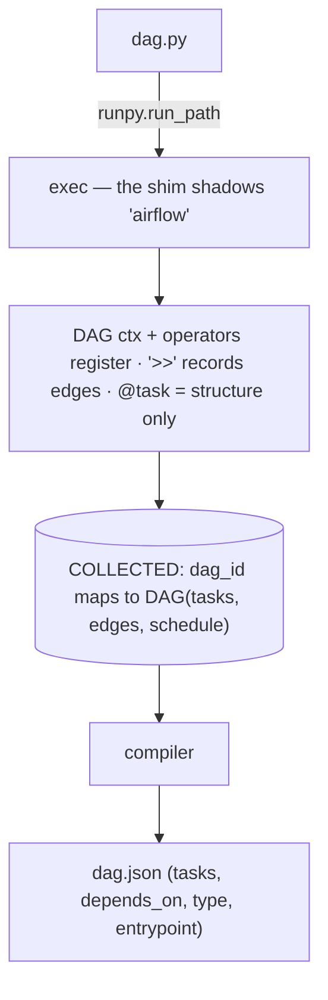

> **TL;DR** — Leoflow runs a Go control plane that **never imports Apache Airflow**,
> yet compiles standard `airflow.sdk` DAGs. It does it with a **structural shim**: a
> pure-stdlib stand-in for `airflow` that the parser puts on the import path, then
> `exec`s your `dag.py` to *record* the graph (without running task bodies or
> installing a single provider). Arbitrary provider operators are **captured by
> class + kwargs** at compile time and run **for real in the task pod** at runtime.
> This is the engineering behind Leoflow v0.1.0.

---

## The constraint that forces the design

Leoflow's scheduler is Go — no GIL, no Python in the hot path (that's the whole
point: Airflow's Python control plane is what makes it slow). But a Leoflow DAG is a
**standard Apache Airflow 3.2 DAG**, written against `airflow.sdk`:

```python
from airflow.sdk import DAG, task
from airflow.providers.standard.operators.bash import BashOperator

with DAG("etl", schedule="@daily"):
    pull = BashOperator(task_id="pull", bash_command="echo '[1,2,3]' > /tmp/raw.json")

    @task
    def transform() -> int:
        import json
        return len(json.load(open("/tmp/raw.json")))

    pull >> transform()
```

So: **how does a control plane that never imports Airflow read a DAG written against
the Airflow SDK?** Importing real Airflow into the parser would drag in the GIL, the
dependency tree, and parse-time side effects — exactly what we're escaping. The
answer (ADR 0024) is to not import Airflow at all.

## The shim: a structural stand-in for `airflow`

The parser ships a **pure-standard-library** package that *looks* like `airflow` —
same import paths, same attribute surface the compiler reads — and **nothing else**.
It's put ahead of any real Airflow on the import path, and then the parser simply
**exec's your `dag.py`**:

```python
import runpy
runpy.run_path("dag.py", run_name="__leoflow_dag__")  # `airflow` resolves to the shim
```

Running the file *builds structure*. Here's the core of the shim (paraphrased):

```python
_CURRENT: list = []     # stack of DAGs being defined
COLLECTED: dict = {}    # dag_id -> DAG, filled as each DAG context is entered

class DAG:
    def __init__(self, dag_id, schedule=None, tags=None, **kw):
        self.dag_id, self.schedule, self.task_dict = dag_id, schedule, {}
        COLLECTED[dag_id] = self
    def __enter__(self):  _CURRENT.append(self); return self
    def __exit__(self, *e): _CURRENT.pop()

class BaseOperator:
    def __init__(self, task_id, **kwargs):
        self.upstream_task_ids, self.downstream_task_ids = set(), set()
        # attach to the active DAG and store every kwarg as an attribute
        dag = kwargs.get("dag") or (_CURRENT[-1] if _CURRENT else None)
        if dag: dag.task_dict[task_id] = self
    def __rshift__(self, other):    # a >> b records the edge
        self.downstream_task_ids.add(other.task_id)
        other.upstream_task_ids.add(self.task_id)
        return other
```



`with DAG(...)` registers; constructing an operator attaches it to the active DAG and
stores its kwargs; `>>` records edges; `@task` builds the node but **never runs the
body**. The compiler then reads `COLLECTED` and emits an immutable `dag.json`.

Two properties fall straight out of this:

- **Unsupported constructs can't be faked.** A `from airflow.<thing>` the shim doesn't
  model raises `ModuleNotFoundError`, which the loader turns into a clear *"not
  supported by Leoflow"* error — at compile time, never a silent half-run.
- **Parsing has no side effects.** `@task` bodies never execute during parsing, so a
  DAG file can't trigger its own work just by being read — the thing that makes
  Airflow's dag-parsing both slow and risky.

The control plane now has the graph **without importing Airflow or installing one
provider**.

## The long tail: capture, don't reimplement

Modeling all **1,500+** provider operators in the shim would be a treadmill. So for
anything beyond the native handful (`bash`, `python`, `http`, `empty`), the shim has a
**meta-path finder** (ADR 0040) that synthesizes *any*
`airflow.providers.<x>.{operators,sensors,transfers}.<Class>` on demand. It doesn't
implement the operator — it **captures** it: records the operator's **real dotted
class path** and its **constructor kwargs**, then registers it like any node:

```python
# in the dag.py — a provider operator the shim has never heard of
from airflow.providers.common.sql.operators.sql import SQLExecuteQueryOperator
SQLExecuteQueryOperator(task_id="rollup", conn_id="warehouse", sql="insert into ...")
# captured as: { class: "airflow.providers.common.sql.operators.sql.SQLExecuteQueryOperator",
#                kwargs: { conn_id: "warehouse", sql: "insert into ..." } }
```

No provider is installed in the parser. The dotted path and kwargs are just data in
`dag.json`.

## The seam: the *real* operator runs in the pod

At runtime, inside the task's own pod — where the provider *is* installed, baked into
that DAG's image — the agent reconstructs and runs the genuine operator:

```python
import_string(dotted_class)(**captured_kwargs).execute(context)
```

The real Airflow operator executes, with the real provider, against the real
connection — while the control plane that scheduled it never imported either.

**Compile time: structure, dependency-free, in Go's world. Run time: the real Airflow
operator, in an isolated pod.** That split is the entire design — it's how you get
Airflow's ecosystem fidelity without Airflow's control plane.

## Why it matters

- **No GIL, no Airflow imports in scheduling** — the control plane stays fast and
  Go-native.
- **No dependency hell** — each DAG owns its image; the parser needs zero providers.
- **No parse-time surprises** — reading a DAG can't run it.
- **Full operator fidelity** — the actual provider operator runs in the pod.

It's all open source (Apache 2.0): **[github.com/neochaotic/leoflow](https://github.com/neochaotic/leoflow)**.
ADR 0024 (the shim) and ADR 0040 (operator capture) have the gory details.
