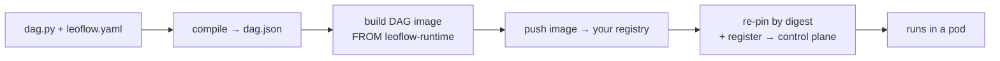

> **TL;DR** — Leoflow `v0.0.2` just shipped, and the headline is one verb: **`leoflow deploy`**. It takes a DAG from `dag.py` on your laptop to a running pod on a Kubernetes control plane in a single command — compile → build → push to your registry → **pin the image by digest** → register the artifact. No bespoke CI pipeline required, no hand-rolled `docker build && docker push && curl`. The same command runs identically from your machine *or* from a CI runner. Login is `leoflow auth login` (token saved, password read hidden). GitHub: **[neochaotic/leoflow](https://github.com/neochaotic/leoflow)**.

---

## The gap nobody talks about

Last time we [rewrote Airflow's control plane in Go](https://github.com/neochaotic/leoflow) and the time before we [ran real provider hooks without installing Airflow](https://github.com/neochaotic/leoflow). Both were about the *runtime*. This one is about the part that quietly eats a week of every Airflow-adjacent project: **getting a DAG you wrote into the thing that runs it.**

In the old world, the inner loop on your laptop is delightful and the path to production is a cliff. You have a DAG that works. Now to ship it you need to: write a `Dockerfile`, build the image for the *cluster's* architecture (not your Mac's), authenticate to a registry, push, find the resulting digest, write a manifest or a `values.yaml`, authenticate to the control plane, and register it — usually all wired into a CI pipeline you have to build and babysit first.

That cliff is why "it works locally" and "it's in production" are two different teams in most shops. Leoflow `v0.0.2` collapses the cliff into one command.

---

## What `leoflow deploy` actually does

```console
$ leoflow auth login --server https://pro.example.com
Username: admin
Password:
Logged in to https://pro.example.com (token saved to ~/.leoflow/config.yaml)

$ leoflow deploy --yes
Compiled dag.py -> dag.json
Building image (linux/amd64) …
Pushed registry.example.com/etl_sales:9f3a2c1
Deployed etl_sales -> https://pro.example.com
  image registry.example.com/etl_sales@sha256:3c90019f2ba4fd8a51bf35fdc9ff65cc0ba0f1f0e2ada1f38d186554ff5b88d6
  registered version 9f3a2c1
```

That one `deploy` ran the entire boundary-crossing sequence:



1. **Compile** — parse `dag.py`, overlay `leoflow.yaml`, run the guardrails (unknown `task_id`, unsupported operator, duplicate keys), emit `dag.json`.
2. **Build** — build the DAG image, **cross-built for the cluster by default** (`linux/amd64`), so building on an arm64 Mac doesn't produce an exec-format-error pod.
3. **Push** — push to *your* registry (Docker Hub, GHCR, ECR, Artifact Registry, ACR, a private one — anywhere the cluster can pull from).
4. **Pin by digest** — capture the registry digest and rewrite `dag.json` to reference the image by `@sha256:…`, not by a mutable tag.
5. **Register** — register the artifact with the control plane. Add `--trigger` to fire a run immediately.

The whole thing is documented in [ADR 0041](https://github.com/neochaotic/leoflow/blob/main/docs/adr/0041-leoflow-deploy-pipelineless.md).

---

## Why digest pinning is the whole point

Leoflow has one non-negotiable principle baked in since [ADR 0003](https://github.com/neochaotic/leoflow/blob/main/docs/adr/0003-dag-as-image.md): **a DAG is an immutable artifact** — a `dag.json` plus a container image, versioned together, never mutated after compilation.

A tag like `:latest` or even `:9f3a2c1` is a *pointer*. Pointers move. The same tag can resolve to a different image tomorrow, and now your "reproducible" run isn't. So `deploy` doesn't register the tag it pushed — it asks the registry for the **content digest** of what landed and pins `dag.json` to `image@sha256:…`. The control plane stores that. Every pod the scheduler launches for that DAG version pulls *exactly those bytes*, forever. Re-tag, overwrite, garbage-collect the tag — the deployed version is unaffected.

This is the difference between "we deploy DAGs" and "we deploy *artifacts*." `deploy` makes the second one the default with zero extra effort from you.

---

## The same command in CI — because the CLI is runtime-independent

Here's a design decision we're proud of: **the `leoflow` CLI doesn't need Lite.** `compile`, `auth login`, `push`, and `deploy` all run standalone. So the laptop one-liner and the CI step are *literally the same command*:

```yaml
# .github/workflows/deploy-dag.yml
- run: |
    leoflow deploy ./dags/etl_sales --yes \
      --server "$LEOFLOW_SERVER" --token "$LEOFLOW_TOKEN"
```

No "CI edition," no second code path that drifts from what you tested by hand. Token comes from a flag, `LEOFLOW_TOKEN`, or the saved config — in that order. Registry auth is your builder's own `docker login` (separate from the control-plane login on purpose: pushing an image and registering an artifact are two different trust boundaries).

Scope it however you like:

```bash
leoflow deploy                 # the project in the current directory
leoflow deploy ./dags/etl      # a specific path
leoflow deploy etl_sales       # by dag_id, from the workspace
leoflow deploy --all           # every DAG in the workspace (best-effort)
```

---

## What it deliberately does *not* do

- **It does not ship your secrets.** The artifact carries no connections and no variables. If a task needs `sales_db`, `deploy` *surfaces* that the connection is required — it never seeds a credential into an image or into the registry. Secrets live in the control plane, delivered to the pod at runtime via the standard `AIRFLOW_CONN_*` seam.
- **It does not link the Docker Go SDK.** `deploy` *shells out* to your builder (`docker`, or `--builder podman`/`nerdctl`). That's an [ADR 0015](https://github.com/neochaotic/leoflow/blob/main/docs/adr/0015-kubernetes-only-execution.md) consequence: no 100-package Docker client tree welded into the binary, smaller supply-chain surface, `govulncheck` stays clean.
- **It requires a registry, loudly.** A `deploy` with no `registry:` configured fails with the exact line to add, not a silent local-only build that surprises you when the cluster can't pull. (Lite needs no registry — this is a Pro concern.)
- **The Dockerfile-free build isn't here *yet*.** Today the simple path uses a four-line `Dockerfile` that layers your code `FROM ghcr.io/neochaotic/leoflow-runtime:py3.11` — the published, signed task base. The richer flow where the build is *synthesized* from `leoflow.yaml` (`connectors:` and all) lands with the connectors release (`v0.1.0`). The [first-Pro-DAG walkthrough](https://github.com/neochaotic/leoflow/blob/main/docs/first-pro-dag.md) shows both, so you can see where it's going.

---

## We didn't just unit-test it

The interesting part of `deploy` is the part unit tests can't reach: does the cluster actually pull the digest-pinned image and run it? So there's an end-to-end test that stands up a real **k3d** cluster with a real registry, runs `leoflow auth login`, then a single `leoflow deploy` that compiles → builds for the cluster arch → pushes → captures the digest → re-pins → registers, then triggers a run and **asserts the task reaches `success`** — i.e. the cluster pulled the digest-pinned image from the registry and ran it. It runs in CI on every release (`E2E deploy (k3d + registry)`).

Before cutting `v0.0.2` final, I re-ran that same e2e against the **published `v0.0.2-rc.2` binaries** (downloaded from the release, checksum-verified, not a local build). Green: built, pushed, pinned by digest, and the cluster ran it. The only delta between rc.2 and the final tag was documentation — so what the e2e exercised is exactly what shipped.

---

## What else is in `v0.0.2`

`v0.0.2` is the "Pro-enablement" release — the smallest cut that makes the laptop→cluster path real:

- **`leoflow deploy`** + **`leoflow auth login`** (the headline).
- **Published, signed task base images** — `ghcr.io/neochaotic/leoflow-runtime:py3.10` / `py3.11` / `py3.12`, multi-arch. Your DAG `Dockerfile` is `FROM` one of these; CI pulls a signed base instead of building one.
- The usual release discipline: binaries **signed with cosign**, **SBOMs** per platform, an **install smoke across eight Linux distros**, and a **previous→`v0.0.2` upgrade smoke** — all green before the tag was promoted from `rc` to final, per [ADR 0037](https://github.com/neochaotic/leoflow/blob/main/docs/adr/0037-release-version-scheme.md).

Install or upgrade:

```bash
curl -fsSL https://raw.githubusercontent.com/neochaotic/leoflow/main/install.sh | sh
leoflow version          # leoflow 0.0.2
```

---

## Try it

The fastest honest test is the [**first Pro DAG walkthrough**](https://github.com/neochaotic/leoflow/blob/main/docs/first-pro-dag.md) — one DAG, one `deploy`, a running pod, about ten minutes. You'll need a builder (`docker`/`podman`/`nerdctl`), a registry the cluster can pull from, and a reachable control plane (a throwaway one comes from the [Helm chart](https://github.com/neochaotic/leoflow/blob/main/docs/helm-chart.md)).

If you just want to feel the inner loop with zero infrastructure, `leoflow lite` still needs none of the above — no cluster, no registry, no deploy at all. Write a DAG, watch it hot-reload, then reach for `deploy` the day you outgrow the laptop.

---

## Help shape the next milestone

We keep the surface small on purpose — boring and reliable beats broad and flaky for a thing that has to run at 5 AM. The connectors + operators epic (`v0.1.0`) is what unlocks the Dockerfile-free `deploy` and the full provider catalog; it's in flight.

1. **Star the repo** — [github.com/neochaotic/leoflow](https://github.com/neochaotic/leoflow).
2. **Run `leoflow deploy`** against a real cluster and tell us where it bit you. Pre-1.0 is *the* time to shape this.
3. **Open an issue** with the Airflow deploy ceremony you most want gone.

**→ [github.com/neochaotic/leoflow](https://github.com/neochaotic/leoflow)** — `v0.0.2` release notes at [/releases/tag/v0.0.2](https://github.com/neochaotic/leoflow/releases/tag/v0.0.2).

Apache 2.0. Thanks for reading — tell us what hurts.
