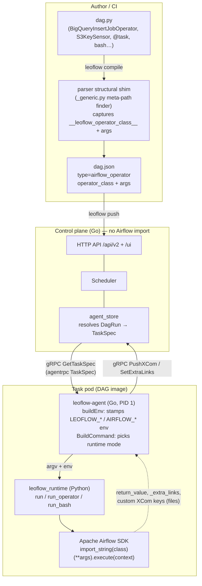

# Airflow operators & sensors

Leoflow runs **any Apache Airflow operator or sensor** — `BigQueryInsertJobOperator`,
`S3KeySensor`, `SnowflakeOperator`, the ~1,500 operators across the provider
ecosystem — without re-implementing a single one. It does this by keeping the
**pod-per-task** execution model and instantiating the real Airflow class inside
the task container, driven by a thin Go control plane and a small Python runtime.

This page documents how that integration works end to end, and every behaviour
the runtime gives an operator: connection resolution, the run context
(`{{ ds }}`, `{{ var.value.X }}`, params, data interval), XCom chaining between
tasks, multi-key XCom, and the **Open in …** UI extra-links. The design rationale
lives in [ADR 0040](adr/0040-airflow-operator-support.md); this page is the
operator's-eye view.

## High-level architecture

The same Airflow SDK is touched at **two** points, for two different reasons:

- **At compile time**, a *structural shim* ([ADR 0024](adr/0024-dag-parsing-structural-shim.md))
  imports the user's `dag.py` to capture the graph — without a scheduler, a
  database, or really running anything. It records each operator's **dotted class
  path** and its constructor arguments into `dag.json`.
- **At run time**, inside the task pod, the **real** Airflow SDK is imported and
  the operator is *actually executed* — `import_string(class)(**args).execute(context)`.

The Go control plane never imports Airflow. It speaks the Airflow-compatible
`/api/v2/` API and orchestrates pods; all Python lives at the two edges.



### The dispatch decision

`dag.json` carries a task `type`. The agent's `BuildCommand`
(`internal/agent/command.go`) maps it to a runtime invocation:

| `type` | argv | What runs |
|---|---|---|
| `python` | `python -m leoflow_runtime <module:callable>` | a `@task` / `PythonOperator` callable |
| `airflow_operator` | `python -m leoflow_runtime --operator <dotted.class>` | a captured provider operator/sensor (ADR 0040) |
| `bash` (plain) | `bash -c <cmd>` | a shell command, no Python needed |
| `bash` (templated) | `python -m leoflow_runtime --bash <cmd>` | shell command after Jinja rendering |
| ~~`http_api`~~ | *(deprecated — ADR 0047; HttpOperator now runs in a pod as `airflow_operator`)* | — |

Only classes the shim actually captured carry the `__leoflow_operator_class__`
marker, so the compiler routes them to `airflow_operator`; everything else stays
on its native fast path. This ordering matters — the class marker is checked
**before** the Bash/Http/Python name-substring heuristic, so an operator whose
name happens to contain "Http" is not mis-routed.

## The agent ⇄ runtime contract

The Go agent and the Python runtime communicate entirely through **environment
variables and small files** — there is no shared Airflow object. The agent's
`buildEnv` stamps the env; the runtime reads it. This is the integration's spine.

| Env var | Set by | Read by | Purpose |
|---|---|---|---|
| `LEOFLOW_OPERATOR_ARGS` | agent | `run_operator` | JSON of the operator's constructor args |
| `LEOFLOW_CALL_ARGS_JSON` | agent | `_resolve_kwargs` | literal args written at a `@task(...)` call (#115) |
| `LEOFLOW_XCOM_<PARAM>` | agent | `_resolve_kwargs` / `_merge_operator_xcom` | one upstream task's `return_value`, keyed by param |
| `LEOFLOW_UPSTREAM_XCOM` | agent | `_load_xcom_by_task` | map of `{task_id: value}` for `ti.xcom_pull` |
| `LEOFLOW_TASK_ID` / `_DAG_ID` / `_RUN_ID` / `_TRY_NUMBER` | agent | context + ti shim | run identity |
| `LEOFLOW_TS` / `LEOFLOW_DS` | agent | `_operator_context` | logical date as ISO timestamp / `YYYY-MM-DD` |
| `LEOFLOW_DATA_INTERVAL_START` / `_END` | agent | `_operator_context` | the run's data interval |
| `LEOFLOW_PARAMS` | agent | `_operator_context` | JSON of DAG/run params (#148) |
| `AIRFLOW_VAR_<KEY>` | agent | Airflow env-secrets backend | a Variable, resolved by `{{ var.value.X }}` / `Variable.get` |
| `AIRFLOW_CONN_<ID>` | agent | Airflow env-secrets backend | a Connection URI, resolved by hooks / `{{ conn.X }}` |
| `LEOFLOW_RETURN_VALUE_PATH` | agent | `_write_return` | file the runtime writes the task's `return_value` to |
| `LEOFLOW_EXTRA_LINKS_PATH` | agent | `_write_extra_links` | file for computed UI extra-links |
| `LEOFLOW_PUSHES_PATH` | agent | `_write_xcom_pushes` | file for custom-keyed `ti.xcom_push` values |

!!! warning "The `LEOFLOW_XCOM_` prefix is reserved"
    `_merge_operator_xcom` consumes **every** env var named `LEOFLOW_XCOM_<…>` as
    an operator constructor kwarg. Any new channel between agent and runtime must
    **not** start with that prefix or it gets silently swallowed as an argument.
    Two bugs were caused by exactly this (`LEOFLOW_XCOM_BY_TASK` and
    `LEOFLOW_XCOM_PUSHES_PATH`), which is why those channels are now named
    `LEOFLOW_UPSTREAM_XCOM` and `LEOFLOW_PUSHES_PATH`. Both were caught by live
    end-to-end runs, not unit tests with fakes.

## Features

### Generic operators & sensors

The runtime's `run_operator(class, args)` does what Airflow's scheduler would do
for a synchronous task, minus the database:

```text
cls = import_string(operator_class)        # the real provider class
op  = cls(task_id=…, **merged_args)         # constructed with the captured args
op.render_template_fields(context)          # Jinja on template_fields ({{ ds }} etc.)
op.execute(context)                         # the actual work
```

Poke-mode **sensors** run on the same path: `execute()` drives the poke loop
standalone; a timeout raises `AirflowSensorTimeout`, which surfaces as an ordinary
task failure. The operator's connection comes from `AIRFLOW_CONN_<ID>` — the same
env-secrets mechanism the connectors work already delivers — so no Airflow
metadata DB is involved.

### Connections & variables

Connections and Variables are delivered as `AIRFLOW_CONN_<ID>` and
`AIRFLOW_VAR_<KEY>` env vars and resolved by Airflow's **native env-secrets
backend** — exactly as they resolve for a hook inside a `@task`. In templates,
`{{ var.value.X }}` and `{{ conn.X }}` resolve through accessors the runtime wires
up in `_secrets_accessors` (preferring `airflow.sdk.execution_time.context`, with
a fallback for older SDKs).

### The full run context

`_operator_context()` builds the dict passed to `execute()` and to templating, so
operators and native tasks see the same macros Airflow exposes:

`ds`, `ts`, `run_id`, `task_instance`/`ti`, `dag_run`, `data_interval_start`,
`data_interval_end`, `params`, `var`, `conn`.

`params` (#148) come from the DAG/run config the control plane resolved
(`run.Conf`), serialized into `LEOFLOW_PARAMS`. The data interval and logical date
ride through the gRPC `TaskSpec` (proto fields `logical_date`,
`data_interval_start/end`, `params_json`).

### XCom chaining between tasks — like Airflow

Tasks pass data the Airflow way: `value = ti.xcom_pull(task_ids="upstream")`.
There is no live TaskInstance in a standalone pod, so the runtime supplies
`_StandaloneTaskInstance` — a tolerant shim whose `xcom_pull` resolves from the
`{task_id: value}` map the agent delivered in `LEOFLOW_UPSTREAM_XCOM`, and whose
`xcom_push(key, value)` captures custom keys for shipping back.

On the control-plane side, the agent only delivers an upstream's value when the
task actually declares the dependency: `FetchXCom` is guarded by the task's
`depends_on` list (a real cross-task fetch that the k3d e2e — not the unit tests —
first exercised).

For TaskFlow `@task` callables, `_resolve_kwargs` injects this same context into
named parameters and a `**context` catch-all, with precedence
**call-args / XCom > context**, so `def f(x, ds=None, **context)` gets the upstream
value for `x`, the macro for `ds`, and everything else via `context`.

### Multi-key XCom

Beyond the single `return_value`, an operator (or a `@task` via `**context`) can
`ti.xcom_push(key="row_count", value=7)`. The runtime collects these in the ti
shim's `pushed` dict and writes them to `LEOFLOW_PUSHES_PATH`; the agent reads that
file and publishes each as an individual XCom. This gives native tasks the same
multi-key XCom that operators emit.

### Extra-links (the "Open in BigQuery" buttons)

Airflow operators expose `operator_extra_links` — the deep-link buttons in the UI
(open the BigQuery job, the EMR step, the Dataflow graph). The runtime reproduces
them generically by calling Airflow's own `link.get_link(operator, ti_key)`, which
reads values the operator stashed via `BaseXCom.get_value`. The runtime bridges
that lookup to the captured pushes (`_generic_link_url`), with a templated URL
fallback (`_format_link_url`) for older link styles. Computed links are written to
`LEOFLOW_EXTRA_LINKS_PATH`; the agent ships them as the reserved `_extra_links`
XCom, and the API serves them from the resource's `/links` action so the Airflow
UI renders the buttons.

### Native parity matrix

The new capabilities were standardized so native task types get them too, without
changing existing behaviour:

| Capability | `@task` / python | `bash` | `airflow_operator` | `http_api` |
|---|:---:|:---:|:---:|:---:|
| Connections / Variables (`AIRFLOW_CONN/VAR_*`) | ✅ | ✅ (env) | ✅ | control-plane |
| Run context (`ds`, `ts`, `data_interval`, `run_id`) | ✅ | ✅ via `{{ }}` + env | ✅ | control-plane |
| `params` (#148) | ✅ | ✅ via `{{ }}` | ✅ | control-plane |
| XCom chaining (`ti.xcom_pull`) | ✅ | n/a (shell) | ✅ | control-plane |
| Multi-key `ti.xcom_push` | ✅ | n/a | ✅ | n/a |
| Operator extra-links | n/a | n/a | ✅ | n/a |

`bash` gets the context through Jinja rendering of the command (`{{ ds }}`,
`{{ var.value.X }}`, `{{ params.region }}`) when the command contains `{{` — a
plain command stays a direct `bash -c` so bash-only images need no Python. Jinja2
is optional at runtime: if it is absent the command falls back to its raw form and
the `$LEOFLOW_DS` / `$AIRFLOW_VAR_*` env vars still reach the shell.

## Not yet supported (loud, not silent)

Capabilities that need scheduler/control-plane work are rejected loudly rather
than half-running:

- **Reschedule-mode sensors** — need the scheduler to persist the next-poke time,
  free the pod, and re-dispatch ([#380](https://github.com/neochaotic/leoflow/issues/380)).
- **Deferrable operators** (the async triggerer) — [#374](https://github.com/neochaotic/leoflow/issues/374).
- **Dynamic task mapping** — [#376](https://github.com/neochaotic/leoflow/issues/376).
- **Branching** — [#377](https://github.com/neochaotic/leoflow/issues/377).

## See also

- [ADR 0040 — Airflow operator + sensor execution](adr/0040-airflow-operator-support.md) — the design and the spikes behind it.
- [ADR 0024 — parser structural shim](adr/0024-dag-parsing-structural-shim.md) — how compile-time capture works.
- [Variables & Connections](variables-connections.md) — how secrets reach a task.
- [Examples](examples.md) and `examples/gcp/` — runnable operator DAGs.
