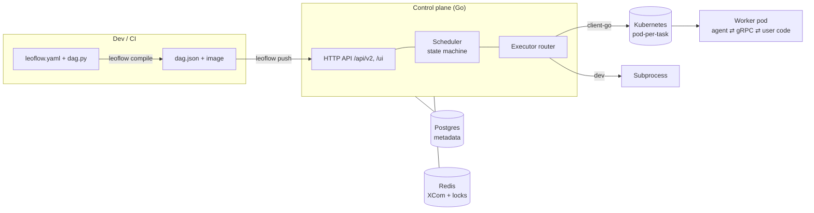

# Architecture

**Control plane (Go).** Gin HTTP serving the Airflow-compatible `/api/v2/*` and
`/ui/*`; a goroutine-based scheduler (state machine, leader-elected via Postgres
advisory locks — [ADR 0009](adr/0009-leader-election.md)); an
executor router (Kubernetes via client-go, subprocess for dev, inline for
http_api — [ADR 0002](adr/0002-pod-per-task.md)).

**Worker pod.** Each task runs in its own pod from the DAG's image. The
**agent** (Go, PID 1) talks gRPC to the control plane: fetches the task spec,
runs the user code, streams logs, pushes XCom, reports state.

**State.** Postgres (metadata) + Redis (XCom ≤256 KB + locks).

**Stack:** Go 1.26 · Gin · sqlc/pgx · golang-migrate · client-go · gRPC ·
log/slog · Prometheus · OpenTelemetry · Cobra · Viper. Python only in the DAG
parser sidecar and inside user task containers.

See the [Architecture Decision Records](adr/0001-why-leoflow.md) for the *why*.
