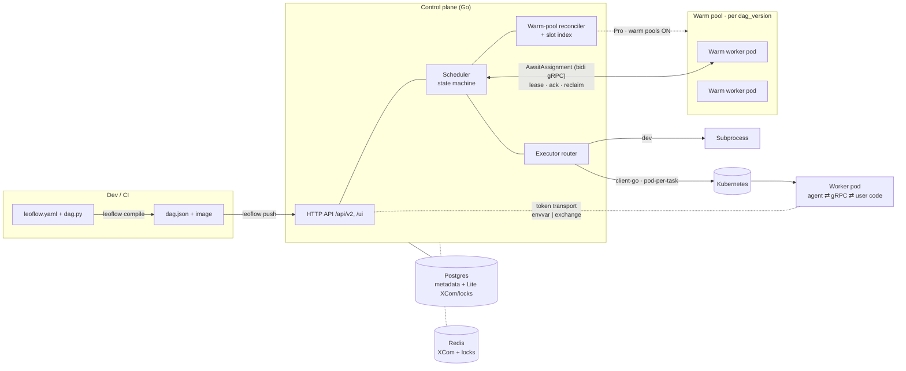

# Architecture


```mermaid
flowchart LR
  subgraph Dev["Dev / CI"]
    A[leoflow.yaml + dag.py] -->|leoflow compile| B[dag.json + image]
  end
  B -->|leoflow push| API
  subgraph CP["Control plane (Go)"]
    API[HTTP API /api/v2, /ui] --- SCH[Scheduler<br/>state machine]
    SCH --- EXR[Executor router]
    SCH --- REC[Warm-pool reconciler<br/>+ slot index]
  end
  EXR -->|"client-go · pod-per-task"| K8S[(Kubernetes)]
  EXR -->|dev| SUB[Subprocess]
  K8S --> POD[Worker pod<br/>agent ⇄ gRPC ⇄ user code]
  REC -. "Pro · warm pools ON" .-> WP
  subgraph WP["Warm pool · per dag_version"]
    W1[Warm worker pod]
    W2[Warm worker pod]
  end
  W1 <-->|"AwaitAssignment (bidi gRPC)<br/>lease · ack · reclaim"| SCH
  POD -. "token transport<br/>envvar | exchange" .- API
  CP --- PG[(Postgres<br/>metadata + Lite XCom/locks)]
  CP -. Pro only .- RD[(Redis<br/>XCom + locks)]
```

**Control plane (Go).** Gin HTTP serving the Airflow-compatible `/api/v2/*` and
`/ui/*`; a goroutine-based scheduler (state machine, leader-elected via Postgres
advisory locks — [ADR 0009](adr/0009-leader-election.md)); an
executor router (Kubernetes via client-go, subprocess for dev —
[ADR 0002](adr/0002-pod-per-task.md); the inline http_api path was removed (ADR 0047/0048),
[ADR 0047](adr/0047-deprecate-native-inline-http.md)).

**Worker pod.** Each task runs in its own pod from the DAG's image. The
**agent** (Go, PID 1) talks gRPC to the control plane: fetches the task spec,
runs the user code, streams logs, pushes XCom, reports state.

**State.** Postgres holds metadata for every edition; on **Lite** it also holds
XCom and the scheduler's advisory locks (no Redis required — [ADR 0026](adr/0026-lite-datastore-no-redis.md)).
On **Pro**, Redis stores XCom (≤256 KB) and the multi-node locks.

**Stack:** Go 1.26 · Gin · sqlc/pgx · golang-migrate · client-go · gRPC ·
log/slog · Prometheus · OpenTelemetry · Cobra · Viper. Python only in the DAG
parser sidecar and inside user task containers.

## Execution: dedicated pods, warm pools, and the token transport

By default each task attempt runs in its **own** pod ([ADR 0002](adr/0002-pod-per-task.md)) —
maximal isolation, at the cost of re-paying cold start every attempt. Two Pro
features change how the executor and the agent credential behave, both **off by
default** so a stock deployment is byte-for-byte the historical path:

- **Warm worker pools** ([ADR 0058](adr/0058-warm-worker-pools.md), behind
  `execution.warm_pools_enabled`) reuse **one pod across many attempts of the same
  DAG version** to amortize the infrastructure cold start. A **warm-pool reconciler**
  behind the execution seam keeps a target number of warm pods ready per DAG version
  and owns an in-memory slot index over Postgres truth; each warm pod holds a
  long-lived bidirectional gRPC stream (`AwaitAssignment`) over which the scheduler
  **leases** a slot, the worker **acks** (writing a durable binding), and lost or
  capped workers are **reclaimed**. There is no new controller — the existing
  single-leader scheduler owns it. See [Warm worker pools](warm-pools.md).
- **The agent credential transport** ([ADR 0055](adr/0055-secret-scoping-and-token-liveness.md),
  behind `auth.agent_token_transport`) selects how the in-pod agent obtains its
  bearer credential: `envvar` (a plaintext token on the pod spec — today's default)
  or `exchange` (a projected ServiceAccount token the control plane validates once
  via a Kubernetes `TokenReview`, then swaps for a task-scoped JWT — nothing secret
  on the pod object). The exchange transport carries a **per-attempt** identity,
  which is what makes pod reuse safe; warm pools therefore **require** it (plus
  liveness enforcement), validated at boot. See
  [Agent credential transport](agent-credential-transport.md).

## Map-reduce (fan-in) data flow

Leoflow treats *N independent tasks → 1 aggregator* — the map-reduce
topology that dominates ML and batch pipelines — as a first-class shape
in the DAG. The activation criterion is purely syntactic: the parser
captures fan-in when **a parameter is bound to a list (or tuple) where
every element is a task call**.

```python
# Activates fan-in (3 equivalent forms):
select_best([trial(lr) for lr in LRs])      # list comprehension
combine([estimate(0), estimate(1), ...])    # explicit list
report((extract_a(), extract_b()))          # tuple

# Does NOT activate fan-in:
transform(extract())            # single upstream — normal TaskFlow path
shard(n=0)                      # literal kwarg → captured as call_args
start >> [a, b, c]              # dependency edge only, no arg binding
f(items=[1, 2, 3])              # list of literals → call_args JSON
```

The pipeline:

1. **Parser** (`_bind_call_arguments`) inspects the bound arguments at the
   call site. If every element of a `list`/`tuple` argument is a
   `XComArg`, it records `xcom_input[param] = [upstream_task_id_1, …,
   upstream_task_id_N]` in `dag.json`. Single-upstream is also a list
   (1-element) so the schema is uniform.

2. **Scheduler** sees the dependency edges in `depends_on` and dispatches
   the N map tasks in parallel. When all are terminal under the
   reducer's trigger rule (default `all_success`), the reducer enters
   `queued`.

3. **Agent** (in the reducer's pod / subprocess), upon `GetTaskSpec`,
   receives `xcom_input_mapping: {param: XComUpstreams{task_ids: [...]}}`.
   For each parameter it fetches every upstream's `return_value` via the
   existing `FetchXCom` gRPC (N round-trips), assembles the values into
   a JSON array in **declaration order**, and stamps
   `LEOFLOW_XCOM_<PARAM>` with the array. A missing upstream contributes
   `null` so the reducer always receives `len(upstreams)` elements.

4. **Runtime** (`_resolve_kwargs`) JSON-decodes the env var; the reducer
   function receives the list directly as its parameter — no XCom API
   call inside the user code.

The wire format on the agent contract is
`map<string, XComUpstreams>` (a proto wrapper), not a delimited string or
a polymorphic value — see [ADR 0034](adr/0034-fan-in-map-reduce-binding.md)
for the full design + non-options considered. The cookbook page at
[map-reduce.md](cookbook/map-reduce.md) covers user-facing guarantees
(scope, order, null semantics, the 256 KB ceiling, the dynamic-mapping
roadmap gap).

See the [Architecture Decision Records](adr/0001-why-leoflow.md) for the *why*.
