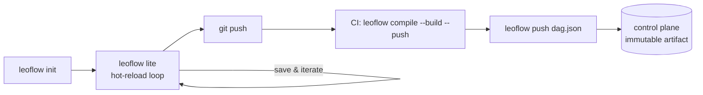

# DAG authoring

A Leoflow DAG is two files in a project directory, compiled into an **immutable
artifact** (`dag.json` + a container image, versioned together — ADR 0003).

```
dags/my_pipeline/
  dag.py         # real Apache Airflow SDK 3.2.x code
  leoflow.yaml   # Leoflow deploy config (not an Airflow file)
```

Scaffold one with `leoflow init dags/my_pipeline`.

## Workspace layout (multi-DAG, Lite only)

> **Lite-specific.** Multi-DAG workspace discovery and the hot-reload watcher
> exist only in `leoflow lite` — the developer-mode loop. **Pro** does not have
> a "workspace"; in Pro every DAG ships as its own image-and-`dag.json` pair,
> built by CI and registered via `leoflow push dag.json`. See
> [The development → deploy lifecycle](#the-development-deploy-lifecycle).

`leoflow lite` watches a **workspace** that can hold many DAGs as sibling
subdirectories. The default workspace is `~/leoflow/` (set by `leoflow setup`).

```
~/leoflow/                       # workspace root
  recurring_print/               # one DAG project per subdir
    leoflow.yaml
    dag.py
  recurring_parallel/
    leoflow.yaml
    dag.py
  ml/
    train/                       # nested subdirs are scanned too
      leoflow.yaml
      dag.py
```

**Recommended layout (best practice, not enforced)**: name the subdirectory the
same as the `dag_id`. The binding is by `dag_id` (yaml field, or the subdir
basename when no yaml is present — see below), but matching names make the
workspace navigable by humans and grep-friendly. `~/leoflow/sales_etl/` for a
DAG named `sales_etl`.

### Discovery rules

`leoflow lite` walks the workspace and treats every subdirectory containing a
`dag.py` (with or without a `leoflow.yaml`) as a project. The scan:

- Goes **at most 5 levels deep** from the workspace root. A DAG at
  `<ws>/a/b/c/d/dag.py` is the deepest valid case. Deeper paths are skipped.
- Skips the `exclude_paths` defaults: `.git`, `__pycache__`, `*.pyc`, `.venv`,
  `venv`, and any other hidden directory (`.*`).
- Fails **loud** on a duplicate `dag_id`: if two subdirs resolve to the same
  id, lite refuses to compile any of them and prints both paths so you can
  rename one. There is no last-write-wins.

Every compile log line names the resolved config source — either the absolute
path of the `leoflow.yaml` that was loaded, or `auto-defaults: <subdir>` when
none exists. This is the one line to grep when "which config did it pick up?"
is the debugging question.

### `leoflow.yaml` is optional

A subdir with just a `dag.py` is a valid project. Leoflow synthesizes a config
with `dag_id = <subdir-basename>` and every other field filled from the schema
defaults (see [Configuration → Defaults](configuration.md#defaults)). Add a
`leoflow.yaml` when you need to pin a Python version, declare dependencies, set
per-task overrides, or change the `dag_id` to something other than the subdir
name.

## dag.py — the Airflow dialect

`dag.py` is **real Airflow SDK 3.2.x** code, imported by the Python parser via the
Airflow `DagBag`. TaskFlow and classic operators both work:

```python
from airflow.sdk import DAG, task

@task
def extract() -> dict:
    return {"rows": 100}

@task
def transform(data: dict) -> dict:
    return {"rows": data["rows"], "doubled": data["rows"] * 2}

with DAG("my_pipeline", schedule="@daily", catchup=False, tags=["etl"]):
    transform(extract())
```

### Supported task types

Leoflow runs the common types on a **native fast path** and everything else — any
of Airflow's ~1,500 provider operators and poke-mode sensors — through a **generic
executor**, native-first by type. Nothing is silently dropped or mistranslated.

| Task type | Airflow operator | Where it runs | Notes |
|---|---|---|---|
| `python` | `@task` (TaskFlow) **or** `PythonOperator` | agent in a pod (Pro) / subprocess (Lite) | The general-purpose escape hatch — any provider library you `pip install` is callable from inside a `@task`. |
| `bash` | `BashOperator` | agent | Executes a shell command. |
| ~~`http_api`~~ (deprecated) | — | — | **Deprecated (ADR 0047).** `HttpOperator` now compiles to `airflow_operator` and runs in a **pod**, like any other provider operator — declare `connectors: [http]`. The old inline path ran the request in the control-plane process (an SSRF surface) and is being removed. |
| `airflow_operator` | **any provider operator/sensor** (Snowflake, S3, Postgres, BigQuery, …) | agent in a pod | The generic executor (ADR 0040): the runtime imports the class, instantiates it with your args, and calls `execute()`. Declare the provider or compile fails. |

Also supported:

- **Trigger rules**: `all_success`, `all_failed`, `all_done`, `one_success`, `one_failed`.
- **XCom**: TaskFlow data-flow (`transform(extract())`) is resolved automatically into typed inputs (`xcom_input`) — for `@task` **and** operator args.
- **Schedule**: cron strings and presets (`@daily`, `0 * * * *`).
- **Dependencies**: linear ordering via TaskFlow calls or `a >> b`.

> Connector cookbooks (postgres, mysql, sqlite, redis, http) are `python`
> tasks that read a managed Connection (`AIRFLOW_CONN_*`) — that is the
> hook-inside-`@task` style. The `airflow_operator` type below is the
> operator-class style; both resolve the same managed connections.

### Provider operators & sensors (`airflow_operator`)

Write the operator exactly as you would in Airflow — Leoflow captures it and runs
it in its own task pod:

```python
from airflow.sdk import DAG, task
from airflow.providers.snowflake.operators.snowflake import SQLExecuteQueryOperator

@task
def build_sql() -> str:
    return "SELECT count(*) FROM events"

with DAG("rollup", schedule="@daily"):
    # an upstream task's output flows straight into an operator arg
    SQLExecuteQueryOperator(task_id="rollup", conn_id="snowflake_default",
                            sql=build_sql())
```

```yaml
# leoflow.yaml — installs apache-airflow-providers-snowflake into the image
connectors: [snowflake]      # or: dependencies: [apache-airflow-providers-snowflake]
```

How it works, and the Phase-A limits:

- The operator runs in its **own task pod**; its hooks resolve connections from
  `AIRFLOW_CONN_*` exactly as inside a `@task`.
- Constructor args must be **JSON-serializable** or an **upstream task's output**
  (wired as XCom, like `sql=build_sql()` above). A non-serializable arg — a
  callable, a `datetime`, an arbitrary object — is a **loud compile error**; move
  that logic into a `@task`.
- Literal args are for **small constants**. A task's literal args (`@task`
  `call_args` and operator `operator_args`) ride as a **single environment
  variable** at dispatch, which POSIX caps at ~128 KiB; `leoflow compile` rejects a
  payload over **100 KiB** with a clear error naming the task. For large data, pass
  a **Connection** or an **external-storage** reference (S3/GCS) and fetch it inside
  the task — never a big dict/list literal.
- The provider must be declared in `leoflow.yaml` (`connectors:` or
  `dependencies:`). If it isn't, `leoflow compile` fails and prints the exact line
  to add — no surprise `ModuleNotFoundError` in the pod.
- **Sensors** run in **poke mode** (the pod holds until the condition is met).
  `mode="reschedule"` is not supported yet and fails with a clear message.
- **Jinja templating** is best-effort (`render_template_fields` runs with a
  minimal context); for rich macros (`{{ ds }}`, `{{ ti }}`, custom params),
  compute the value in a `@task` and pass it in.
- A native task type (`bash`/`python`) always wins when it matches, so
  `BashOperator`/`HttpOperator`/`PythonOperator` keep their fast path.

### Not supported — `leoflow compile` rejects these

!!! danger "If your DAG uses any of these, compile fails — by design"
    The contract is **loud rejection, not silent mistranslation**: every
    "skipped" branch would otherwise actually execute at runtime, so a
    DAG that imports a sensor or interpolates a Jinja template is
    refused at compile with a clear error naming the construct
    ([#225](https://github.com/neochaotic/leoflow/issues/225)).

The unsupported set, with the things Airflow users most often expect to
"just work" called out first:

- **Reschedule-mode sensors** — a sensor with `mode="reschedule"` (frees the
  worker between pokes) is not supported yet; it fails at runtime with a clear
  message. Use the default `mode="poke"` (the pod holds until the condition is
  met). *Poke-mode sensors and provider operators ARE supported* — see
  [`airflow_operator`](#provider-operators-sensors-airflow_operator) above.
- **Deferrable operators / sensors** — anything with `deferrable=True` (it suspends
  the task onto a *trigger*) is not supported yet: Leoflow has no triggerer (ADR
  0040 Phase C). It fails at runtime with a clear message. Pass `deferrable=False`
  — the operator runs synchronously in the pod (poke-style).
- **Jinja templating** in `@task` — `{{ ds }}`, `{{ ti }}`, `{{ var.value.x }}`,
  every `templates_dict=` knob. The control plane never re-parses
  Python and the templating step is intentionally not implemented.
  Workaround: build the values inside the `@task` from `airflow.sdk`
  context.
- **Branching** (`BranchPythonOperator`, `@task.branch`) and
  **short-circuit** (`@task.short_circuit`, `ShortCircuitOperator`) —
  refused for now: the current scheduler does not model
  skipped-vs-executed downstream paths. On the post-alpha backlog if
  user demand justifies the scheduler change.
- **Virtualenv operators** (`PythonVirtualenvOperator`,
  `@task.virtualenv`) — refused because each DAG already ships as its
  own image with its own dependencies; spinning up a venv at runtime
  is the problem Leoflow's one-image-per-DAG model already solved.
- **Dynamic task mapping** (`.expand` / `.partial`) — refused;
  map-reduce fan-out is on the post-alpha roadmap, tracked separately.
- **KubernetesPodOperator** — refused; the pod is the *runtime
  substrate* for every Leoflow task already, so wrapping a user task
  in another pod is redundant and adds an isolation hole.
- **Datasets / Assets triggers** — not implemented yet; the asset
  graph is a 3.x Airflow feature on the post-alpha backlog.
- **Per-task `default_args` in `dag.py`** are ignored at the parser
  level — use `leoflow.yaml`'s `tasks.<id>:` override block instead,
  which is checked at compile time.

## leoflow.yaml — deploy config

These are Leoflow concerns, **not** Airflow operator attributes (you cannot invent
kwargs on an operator — the parser imports real Airflow and would raise).

```yaml
schema_version: "1.0"
dag_id: my_pipeline
description: Daily ETL.
owner: data-eng
tags: [etl]
python_version: "3.11"
dependencies:           # pip packages baked into the image
  - pandas==2.1.0
defaults:               # DAG-level defaults (applied to every task)
  retries: 1
  retry_delay_seconds: 30
staging:                # opt-in shared per-run RWX volume (ADR 0022)
  enabled: false
tasks:                  # per-task overrides, keyed by task_id (ADR 0023)
  transform:
    retries: 3
    resources:
      requests: { cpu: "2", memory: 4Gi }
```

### Binding + override layers (ADR 0023)

Config binds to the DAG by `dag_id` and to tasks by `task_id`. Three layers,
**most specific wins**:

```
task override (tasks.<id>)  >  DAG default (defaults)  >  platform default (server)
```

- `tasks.<id>` is merged at **compile** time onto the task in `dag.json`.
- Platform defaults are applied at **dispatch** time, filling only gaps the
  artifact left empty (keeps the artifact portable across clusters).
- **`staging` is DAG-level only** — one RWX volume is shared atomically by the
  whole run, so it cannot be per-task.

### Guardrails (fail loudly, never silently)

- A `tasks:` entry naming a `task_id` absent from the DAG → **compile error**.
- A duplicate `task_id` key in the YAML → **parse error**.
- Across a monorepo, a duplicate `dag_id` is a CI-gate concern (one image per DAG).

## The development → deploy lifecycle



### 1 · Develop (fast, isolated)

```bash
leoflow init dags/my_pipeline          # scaffold dag.py + leoflow.yaml
leoflow lite dags/my_pipeline           # cluster-mode: real pods on an isolated k3d
# or: leoflow lite --executor=subprocess dags/my_pipeline   (fastest, host venv)
```

Open <http://localhost:8088> — the UI is marked **Leoflow Lite** (silver
edition badge); log in with the admin password generated by `leoflow setup`
(or run `leoflow lite reset-password` if you misplaced it). Edit
`dag.py`/`leoflow.yaml` and **save**; Leoflow recompiles, re-runs the guardrails,
and re-registers. A bad binding prints an error in the terminal **immediately**:

```text
✗ leoflow.yaml tasks: unknown task_id "transfrom"; the DAG defines [extract load transform]
```

Lite is fully isolated from Demo/Pro (own database, cluster, and ports) —
**no split brain**. See [Operating modes](operating-modes.md).

### 2 · Deploy (authoritative, immutable)

On `git push`, CI compiles + builds + pushes the artifact. The **same** parser,
overlay, and guardrails run as a gate, so what you tested in Lite is what ships:

```bash
leoflow compile dags/my_pipeline --image ghcr.io/org/my_pipeline:$GIT_SHA --build --push
leoflow push dag.json
```

Full, copy-pasteable pipelines for **GitHub Actions, GitLab CI, Google Cloud
Build/Run, and generic runners** are in **[CI/CD & deploy examples](deploy.md)**.

---

See also: [Concepts & glossary](concepts.md) · [Operating modes](operating-modes.md)
· [HTTP API](api-reference.html) · [ADR 0023 — binding & overrides](adr/0023-dag-authoring-config-binding.md).
