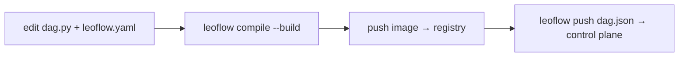

# CI/CD & deploy examples

Deploying a Leoflow DAG is the same everywhere because a DAG is an **immutable
artifact** — a `dag.json` + a container image, versioned together (ADR 0003).
The pipeline is always:



1. **`leoflow compile --build`** — parse `dag.py`, overlay `leoflow.yaml`, run the
   **guardrails** (unknown `task_id`, unsupported operator, duplicate keys), and
   build the DAG image.
2. **push the image** to your registry, tagged by git SHA (immutable).
3. **`leoflow push dag.json`** — register the artifact with the control plane.

!!! tip "The guardrails are your CI gate"
    The same checks that warn you locally in `leoflow lite` fail the CI build, so a
    bad `dag_id`/`task_id` binding or an unsupported operator never reaches prod.

## Prerequisites
- The `leoflow` CLI on the runner (download the release binary, or `go install`).
- A container registry your cluster can pull from.
- `LEOFLOW_SERVER` (control plane URL) and `LEOFLOW_TOKEN` (a push token) as CI secrets.

## Examples

=== "GitHub Actions"

    ```yaml title=".github/workflows/deploy-dag.yml"
    name: Deploy DAG
    on:
      push:
        branches: [main]
        paths: ["dags/my_pipeline/**"]
    jobs:
      deploy:
        runs-on: ubuntu-latest
        permissions: { contents: read, packages: write }
        steps:
          - uses: actions/checkout@v4
          - uses: docker/login-action@v3
            with:
              registry: ghcr.io
              username: ${{ github.actor }}
              password: ${{ secrets.GITHUB_TOKEN }}
          - name: Install leoflow
            run: curl -fsSL https://github.com/neochaotic/leoflow/releases/latest/download/leoflow-linux-amd64 -o /usr/local/bin/leoflow && chmod +x /usr/local/bin/leoflow
          - name: Compile + build + push image
            run: |
              IMAGE=ghcr.io/${{ github.repository }}/my_pipeline:${{ github.sha }}
              leoflow compile dags/my_pipeline --image "$IMAGE" --build --push -o dag.json
          - name: Register with the control plane
            env: { LEOFLOW_TOKEN: ${{ secrets.LEOFLOW_TOKEN }} }
            run: leoflow push dag.json --server ${{ secrets.LEOFLOW_SERVER }}
    ```

=== "GitLab CI"

    ```yaml title=".gitlab-ci.yml"
    deploy_dag:
      image: docker:27
      services: [docker:27-dind]
      rules:
        - if: $CI_COMMIT_BRANCH == "main"
          changes: ["dags/my_pipeline/**/*"]
      variables:
        IMAGE: $CI_REGISTRY_IMAGE/my_pipeline:$CI_COMMIT_SHA
      script:
        - echo "$CI_REGISTRY_PASSWORD" | docker login -u "$CI_REGISTRY_USER" --password-stdin "$CI_REGISTRY"
        - wget -qO /usr/local/bin/leoflow https://github.com/neochaotic/leoflow/releases/latest/download/leoflow-linux-amd64 && chmod +x /usr/local/bin/leoflow
        - leoflow compile dags/my_pipeline --image "$IMAGE" --build --push -o dag.json
        - leoflow push dag.json --server "$LEOFLOW_SERVER"   # LEOFLOW_TOKEN from CI vars
    ```

=== "Google Cloud Build + Cloud Run"

    Build/push on Cloud Build; register against a control plane on Cloud Run. The
    DAG image runs as task pods on GKE (pods are the execution unit, not Cloud Run).

    ```yaml title="cloudbuild.yaml"
    steps:
      - name: gcr.io/cloud-builders/docker
        entrypoint: bash
        args:
          - -c
          - |
            curl -fsSL https://github.com/neochaotic/leoflow/releases/latest/download/leoflow-linux-amd64 -o /usr/bin/leoflow && chmod +x /usr/bin/leoflow
            IMAGE="$_REGION-docker.pkg.dev/$PROJECT_ID/dags/my_pipeline:$SHORT_SHA"
            leoflow compile dags/my_pipeline --image "$$IMAGE" --build --push -o dag.json
            leoflow push dag.json --server "$_LEOFLOW_SERVER"
    substitutions:
      _REGION: us-central1
      _LEOFLOW_SERVER: https://leoflow.run.app
    options: { logging: CLOUD_LOGGING_ONLY }
    ```

=== "Generic / Makefile"

    Any runner with Docker + the `leoflow` CLI:

    ```bash
    IMAGE="$REGISTRY/my_pipeline:$(git rev-parse --short HEAD)"
    leoflow compile dags/my_pipeline --image "$IMAGE" --build --push -o dag.json
    leoflow push dag.json --server "$LEOFLOW_SERVER" --token "$LEOFLOW_TOKEN"
    ```

## Control-plane deployment *(coming soon)*

Deploying the control plane itself (Helm chart, published `leoflow-server`/
`leoflow-migrate` images, TLS on the agent channel, keyless cloud auth) is the
**Production** track — see [Operating modes](operating-modes.md) and the
[Roadmap](roadmap-to-release.md). The product proves itself in **Dev** first.

See also: [DAG authoring](dag-authoring.md) · [Operating modes](operating-modes.md).
