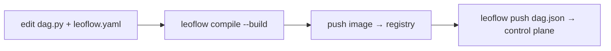

# CI/CD & deploy examples

!!! tip "New to Pro? Start with the walkthrough"
    [**Your first Pro DAG (≈20 min)**](first-pro-dag.md) takes one DAG from source
    to a running pod by hand, so you see each artifact boundary before you automate
    it. This page is the CI recipes for the same pipeline.

Deploying a Leoflow DAG is the same everywhere because a DAG is an **immutable
artifact** — a `dag.json` + a container image, versioned together (ADR 0003).
The pipeline is always:


```mermaid
flowchart LR
  E[edit dag.py + leoflow.yaml] --> C[leoflow compile --build]
  C --> P[push image → registry]
  P --> R[leoflow push dag.json → control plane]
```

1. **`leoflow compile --build`** — parse `dag.py`, overlay `leoflow.yaml`, run the
   **guardrails** (unknown `task_id`, unsupported operator, duplicate keys), and
   build the DAG image.
2. **push the image** to your registry, tagged by git SHA (immutable).
3. **`leoflow push dag.json`** — register the artifact with the control plane.

!!! tip "The guardrails are your CI gate"
    The same checks that warn you locally in `leoflow lite` fail the CI build, so a
    bad `dag_id`/`task_id` binding or an unsupported operator never reaches prod.

!!! note "First time? Do it by hand once"
    The [**first Pro DAG walkthrough**](first-pro-dag.md) runs these three steps
    manually so you can watch the DAG cross each boundary. Come back here to wire
    the same steps into CI.

## Your repo of DAGs

In Pro you keep your DAGs in a Git repository — one directory per DAG — and CI
turns each into an artifact when it changes. Nothing here is Leoflow-specific
magic: it's a normal repo plus three CLI calls.

```text
my-dags/                      # your Git repo
├── .github/workflows/
│   └── deploy-dag.yml        # the CI below
└── dags/
    ├── my_pipeline/
    │   ├── dag.py            # the DAG (TaskFlow / operators)
    │   ├── leoflow.yaml      # id, python_version, dependencies
    │   └── Dockerfile        # FROM ghcr.io/neochaotic/leoflow-runtime:py3.11
    └── another_pipeline/
        ├── dag.py
        ├── leoflow.yaml
        └── Dockerfile
```

Each DAG directory is a self-contained project — its own dependencies, its own
image. A typical `Dockerfile` is four lines of boilerplate (the
[walkthrough](first-pro-dag.md) shows it); it layers your code onto the
**published task base**, so CI pulls a signed image instead of building one.

**The mental model:** a push that touches `dags/my_pipeline/**` triggers CI for
*that* DAG only (the `paths:` filter), which compiles → builds → pushes the image
→ registers `dag.json`. The control plane runs the new version on the next
trigger. One DAG per pipeline keeps blast radius small: a broken
`another_pipeline` never blocks `my_pipeline`.

!!! tip "Tag images immutably"
    The recipes tag by git SHA (`my_pipeline:$GIT_SHA`), never `:latest`. The
    image a `dag.json` points at is then frozen — re-running an old DAG version
    pulls exactly the bytes it shipped with, and a rollback is a re-`push` of the
    older `dag.json`.

## Prerequisites
- The `leoflow` CLI on the runner (download the release binary, or `go install`).
- **Python 3.11+ on the runner** (`leoflow compile` invokes the stdlib-only
  parser shim — [ADR 0024](adr/0024-dag-parsing-structural-shim.md) — to turn `dag.py`
  into `dag.json`). See [Python on the runner](#python-on-the-runner) below.
- A container registry your cluster can pull from.
- `LEOFLOW_SERVER` (control plane URL) and `LEOFLOW_TOKEN` (a push token) as CI secrets.

## Python on the runner

The `leoflow compile` step needs Python 3.11, 3.12, or 3.13 to parse `dag.py`.
**Bring your own Python** on the runner — do not rely on `leoflow setup` to
download a managed CPython in CI (that path is designed for first-touch on a
developer laptop, not for build pipelines, where it adds ~50 MB to every run
and bypasses your runner's pin/caching).

The recommended path on each runner type:

| Runner | Recipe |
|---|---|
| **GitHub Actions** | Add `actions/setup-python@v5` with `python-version: '3.12'` before installing leoflow. Cached automatically. |
| **GitLab CI** | Use a `python:3.12-slim` (or `python:3.12-bookworm`) base image instead of a bare `alpine`/`ubuntu`. |
| **Cloud Build / CodeBuild** | Use a `python:3.x-slim` build step, or one of the cloud-provider's "python3.12" images. |
| **Self-hosted runners** | Pin Python via your image baseline (`apt install python3.12` or `pyenv`) and version-lock in your runner provisioning. |
| **Generic Docker-in-Docker** | Base your build container on `python:3.12-slim` (gives you Python + a Debian userland for the `docker build` shell). |

Older Python (≤3.10) fails the compile cleanly — `leoflow compile` errors out
with the version requirement, not a confusing traceback. Newer Python (3.14+)
is accepted by the upper end of the detection range; the range is bumped per
release once the parser shim is re-verified against it.

### One more step: `leoflow setup` extracts the parser

After the `leoflow` binary lands on the runner and Python is in scope, run
`leoflow setup` ONCE per runner. The CLI ships the parser source embedded;
`setup` extracts it under `~/.leoflow/pysrc/parser/` and writes a config
file pointing the `compile` command at the chosen interpreter. Without this
step `leoflow compile` fails with `No module named leoflow_parser` (the
runner's Python has no idea where the parser lives).

The snippets below all show `leoflow setup` as the step after the install,
before `leoflow compile`. The follow-up to make this implicit (auto-bootstrap
on first compile, or embed the parser execution inside the Go binary) is
tracked separately; for the alpha cut, calling it explicitly is the
recommended path because it's the operation that decides whether managed
CPython is downloaded, and that's a step CI operators should consciously opt
into.

!!! tip "Cache `~/.leoflow/` between CI runs"
    Ephemeral CI runners re-extract the parser on every build (~3-5 s).
    Cache the directory keyed by the leoflow binary version (or the leoflow
    release URL) to skip it on warm runs:
    `actions/cache` on GitHub Actions, `cache:` keys on GitLab CI, the
    workspace cache on Cloud Build. With Python on PATH, the cache hit makes
    `leoflow setup` a near-no-op. Skip the cache if your runner image
    already bakes `~/.leoflow/pysrc/` in (some self-hosted setups do).

## Examples

=== "GitHub Actions"

    ```yaml title=".github/workflows/deploy-dag.yml"
    name: Deploy DAG
    on:
      push:
        branches: [main]
        paths: ["dags/my_pipeline/**"]
    jobs:
      deploy:
        runs-on: ubuntu-latest
        permissions: { contents: read, packages: write }
        steps:
          - uses: actions/checkout@v4
          - uses: actions/setup-python@v5     # BYO Python — see #python-on-the-runner
            with: { python-version: '3.12' }
          - uses: docker/login-action@v3
            with:
              registry: ghcr.io
              username: ${{ github.actor }}
              password: ${{ secrets.GITHUB_TOKEN }}
          - name: Install leoflow
            run: curl -fsSL https://github.com/neochaotic/leoflow/releases/latest/download/leoflow-linux-amd64 -o /usr/local/bin/leoflow && chmod +x /usr/local/bin/leoflow
          - name: Bootstrap the parser (uses the BYO Python from above)
            run: leoflow setup
          - name: Compile + build + push image
            run: |
              IMAGE=ghcr.io/${{ github.repository }}/my_pipeline:${{ github.sha }}
              leoflow compile dags/my_pipeline --image "$IMAGE" --build --push -o dag.json
          - name: Register with the control plane
            env: { LEOFLOW_TOKEN: ${{ secrets.LEOFLOW_TOKEN }} }
            run: leoflow push dag.json --server ${{ secrets.LEOFLOW_SERVER }}
    ```

=== "GitLab CI"

    ```yaml title=".gitlab-ci.yml"
    deploy_dag:
      # Default docker:27 is Alpine-based; install python3 before leoflow compile.
      # Alternative: a custom base image that bakes Python+Docker together.
      # See #python-on-the-runner for the rationale.
      image: docker:27
      services: [docker:27-dind]
      before_script:
        - apk add --no-cache python3   # 3.12 on Alpine 3.20+; see #python-on-the-runner
      rules:
        - if: $CI_COMMIT_BRANCH == "main"
          changes: ["dags/my_pipeline/**/*"]
      variables:
        IMAGE: $CI_REGISTRY_IMAGE/my_pipeline:$CI_COMMIT_SHA
      script:
        - echo "$CI_REGISTRY_PASSWORD" | docker login -u "$CI_REGISTRY_USER" --password-stdin "$CI_REGISTRY"
        - wget -qO /usr/local/bin/leoflow https://github.com/neochaotic/leoflow/releases/latest/download/leoflow-linux-amd64 && chmod +x /usr/local/bin/leoflow
        - leoflow setup        # extracts the parser into ~/.leoflow/ using the python3 from before_script
        - leoflow compile dags/my_pipeline --image "$IMAGE" --build --push -o dag.json
        - leoflow push dag.json --server "$LEOFLOW_SERVER"   # LEOFLOW_TOKEN from CI vars
    ```

=== "Google Cloud Build + Cloud Run"

    Build/push on Cloud Build; register against a control plane on Cloud Run. The
    DAG image runs as task pods on GKE (pods are the execution unit, not Cloud Run).

    ```yaml title="cloudbuild.yaml"
    steps:
      - name: gcr.io/cloud-builders/docker
        entrypoint: bash
        args:
          - -c
          - |
            # BYO Python — Cloud Builders' docker image is Debian; install python3.
            # See #python-on-the-runner for the rationale.
            apt-get update -qq && apt-get install -y --no-install-recommends python3
            curl -fsSL https://github.com/neochaotic/leoflow/releases/latest/download/leoflow-linux-amd64 -o /usr/bin/leoflow && chmod +x /usr/bin/leoflow
            leoflow setup    # extracts the parser into ~/.leoflow/ using the python3 just installed
            IMAGE="$_REGION-docker.pkg.dev/$PROJECT_ID/dags/my_pipeline:$SHORT_SHA"
            leoflow compile dags/my_pipeline --image "$$IMAGE" --build --push -o dag.json
            leoflow push dag.json --server "$_LEOFLOW_SERVER"
    substitutions:
      _REGION: us-central1
      _LEOFLOW_SERVER: https://leoflow.run.app
    options: { logging: CLOUD_LOGGING_ONLY }
    ```

=== "Generic / Makefile"

    Any runner with Docker, **Python 3.11+**, and the `leoflow` CLI
    (see [Python on the runner](#python-on-the-runner)):

    ```bash
    leoflow setup    # one-shot per runner: extracts the parser into ~/.leoflow/
    IMAGE="$REGISTRY/my_pipeline:$(git rev-parse --short HEAD)"
    leoflow compile dags/my_pipeline --image "$IMAGE" --build --push -o dag.json
    leoflow push dag.json --server "$LEOFLOW_SERVER" --token "$LEOFLOW_TOKEN"
    ```

## Control-plane deployment (Helm chart, in validation)

Deploying the control plane itself (Helm chart, published `leoflow-server`/
`leoflow-migrate` images, TLS on the agent channel, keyless cloud auth) is the
**Pro** track. The chart is installable today and in validation against GKE —
see the [Helm chart](https://github.com/neochaotic/leoflow/blob/main/helm/leoflow/README.md), the reproducible
[GKE test setup](https://github.com/neochaotic/leoflow/blob/main/deploy/gke/README.md), [Operating modes](operating-modes.md),
and the [Roadmap](roadmap-to-release.md). The product proves itself in **Lite** first.

See also: [DAG authoring](dag-authoring.md) · [Operating modes](operating-modes.md).
