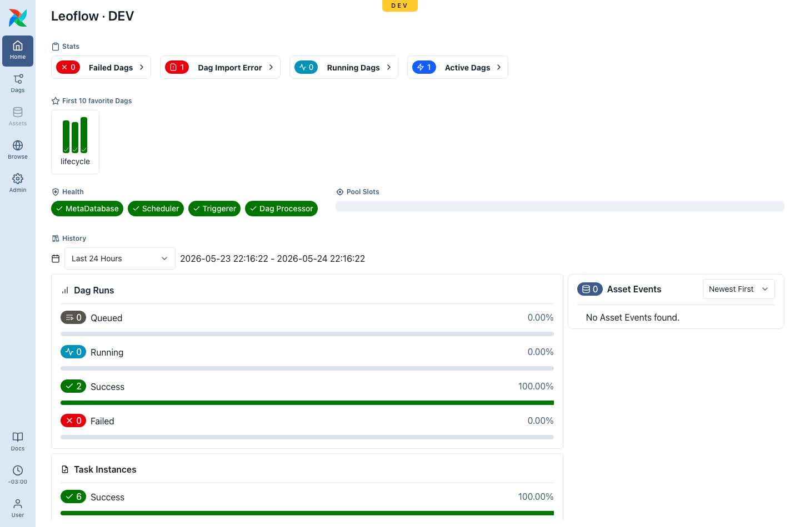
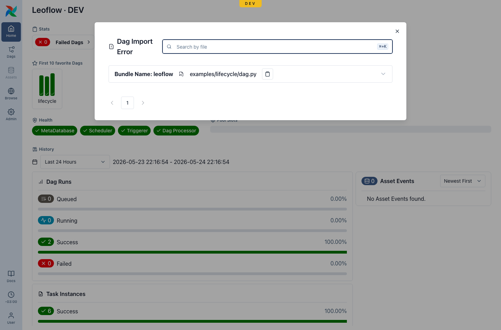

# The `leoflow lite` workflow

`leoflow lite` runs the whole stack locally — control plane, the embedded Airflow
UI, and a real executor — against an **isolated local database**, and
**hot-reloads on every save**. The UI is served on a Lite port (default
**8088**), marked with the **LITE** badge, so it never collides with a demo or
production instance.

This page is the **from-source** loop for working on Leoflow itself:

```bash
make dev-install            # build + put leoflow / server / agent on your PATH
leoflow lite provision          # provision local dev deps (base image, local DB)
leoflow init dags/my_dag    # scaffold a project
leoflow lite dags/my_dag    # hot-reload at http://localhost:8088 (marked LITE)
```

!!! note "Login"
    If you ran [`leoflow setup`](installation.md#what-leoflow-setup-does) (the
    end-user installer does), Lite enforces a real **admin login** — recover it
    with `sudo leoflow lite reset-password`. A bare source checkout without that
    config falls back to no-auth (loopback only) with a warning, for a quick loop.

(End users install Lite with one command — see [Installation](installation.md).)

!!! tip "Edit in the browser"
    Lite includes a small built-in code editor (Python/YAML highlighting, file
    tree) — click the **IDE** button in the UI, or open `/ide`. See
    [The Lite web editor](lite-web-editor.md).

## Two executors

| `--executor` | What it does | Reload to a new version |
|---|---|---|
| `k8s` (default) | Real pod-per-task on a dedicated, isolated k3d cluster (`leoflow-dev`); rebuilds the DAG image each change — highest fidelity. | **~8 s** (code-only change, layer cache warm) |
| `subprocess` | Tasks run unsandboxed on the host venv; no image build — the fast inner loop. | **~1–2 s** |

These numbers are the time from **save** to the **new version registered in the
control plane** (measured against the `lifecycle` example).

## Choosing an executor

There are **only these two** — and deliberately **no Docker executor**
([ADR 0015](https://github.com/neochaotic/leoflow/blob/main/docs/adr/0015-kubernetes-only-execution.md)).
A Docker-socket executor would mean importing the Docker Go SDK
(`github.com/docker/docker`), which carries an unfixable advisory (Moby AuthZ
bypass, GO-2026-4887) reachable from the control-plane binary — it would fail the
security gate (ADR 0014) — and talking to the Docker socket is itself a
root-equivalent privilege-escalation surface. So **Kubernetes is the sole
container path** (the same `KubernetesExecutor` locally and in production), and
**subprocess is a dev-only, unisolated escape hatch**. Docker, when installed, is
only the engine that hosts the local k3d cluster — never an executor.

| | `subprocess` | `k8s` (k3d / prod) |
|---|---|---|
| Speed (per task, reload) | fastest — host process, no build | slower — image build + pod schedule |
| Isolation | **none** (shared host venv) | real pods (limits, RBAC) |
| Production fidelity | low | **high** (identical path to prod) |
| Moving parts that can break | few (just the venv) | more (cluster, scheduler, registry, PVC) |
| Shared `/staging` volume (ADR 0022) | **not provided** (`LEOFLOW_STAGING_DIR` unset; tasks have direct host-disk access instead) | **yes** — per-run PVC at `/staging`, `LEOFLOW_STAGING_DIR` set, GC'd |

Rule of thumb: iterate on DAG logic in **`subprocess`** (instant loop), then
validate in **`k8s`** before deploy — especially anything that uses the staging
volume, resource limits, Connections injection, or other pod-only behavior, since
those only exist on the Kubernetes path.

## The edit → reload → see-it cycle

On save, the watcher recompiles and registers a **new DAG version** in seconds.
But one thing trips people up:

!!! warning "The page does not auto-refresh DAG structure — reload it"
    The hot reload is of the **backend** (recompile + register), not of the open
    browser tab. A new version (added/removed task, changed code) appears in the
    control plane in ~1–2 s, but the **open page keeps showing the old structure
    until you reload it** (Cmd/Ctrl-R).

| What changed | Updates in the open page automatically? |
|---|---|
| **DAG structure / version** — task added/removed, code edited | ❌ No — reload the page |
| **Run state** — a task going green/red during a run | ✅ Yes — Airflow's auto-refresh handles it |

### Gotcha: a `@task` only appears when you call it

In the Airflow TaskFlow API, defining a task is not enough — it joins the graph
only when **called inside the `with DAG(...)` block**:

```python
@task
def validate() -> None: ...

with DAG("my_dag", ...):
    load(transform(extract()))
    validate()      # ← without this call, `validate` never shows up in the graph
```

If a task you expected is missing, check that it is *called* — then reload the page.

## When a DAG is broken

Edit a DAG into a parse/compile error (a stray syntax error, a bad import) and the
watcher refuses to register the broken version — the last good version keeps
serving. The failure surfaces in **two** places:

**1. The dev terminal** prints the real traceback, with file and line:

```text
[22:13:52] change detected → reloading …
✗ running parser "python3 -m leoflow_parser": exit status 1
  File "examples/lifecycle/dag.py", line 51
    def broken(  # missing close paren
              ^
SyntaxError: '(' was never closed
```

**2. The Airflow home** lights up its native **Dag Import Error** banner (the same
mechanism real Airflow uses). The stat card turns red with the count:

{ .home-hero__shot }

Open it to see the offending file, its bundle, and the full traceback:

{ .home-hero__shot }

Fix the file and save — the watcher registers the next good version and the banner
**clears automatically** (~2 s). No restart, no manual cleanup.

!!! note "Dev vs production"
    This banner is driven by a control-plane feed (`GET /api/v2/importErrors`) and
    works in any environment. In **production** you rarely see it: DAGs are
    immutable artifacts and a broken DAG fails `leoflow compile` in **CI** before it
    is ever deployed — CI is the safety net there. In **dev**, where you edit live,
    the `leoflow lite` watcher publishes the error so you catch it in the UI, not
    only the terminal.

## Where to look when something's wrong

- **Edited and nothing changed in the UI?** Reload the page (structure does not
  auto-refresh). If it's still wrong, check the terminal for `✗`.
- **A task is missing from the graph?** Make sure it is *called* inside the DAG,
  then reload.
- **`Dag Import Error` on the home?** Your DAG failed to parse — open the banner
  (or read the terminal) for the traceback, fix it, and save.
- **A task ran red?** That's a runtime failure, not a parse error — open the run
  and read the task logs.
