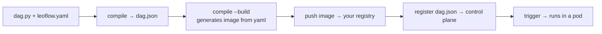

# Your first Pro DAG (≈20 min)

This is the end-to-end Pro path: take one DAG from source to a running task on a
control plane. Where the 2-minute [Lite loop](local-deploy.md) hides the artifact
boundary so you can iterate, Pro makes it explicit — because that boundary is what
your CI pipeline automates later.

A DAG is an **immutable artifact** — a `dag.json` + a container image, versioned
together ([ADR 0003](adr/0003-dag-as-image.md)). Every step below moves the DAG
across one boundary:



!!! tip "No Dockerfile to maintain"
    The real pipeline is **yaml-driven**: you ship only `dag.py` + `leoflow.yaml`.
    `leoflow compile --build` synthesizes the image from the yaml — `FROM` the
    published Leoflow base, your `dependencies:`/`connectors:` installed, your DAG
    copied in. Ship your own `Dockerfile` only if you want full control (it's then
    used verbatim).

## Prerequisites

- `docker` (or `podman`/`nerdctl` — pass `--builder`).
- The `leoflow` CLI and Python 3.11+ on your machine
  (see [Python on the runner](deploy.md#python-on-the-runner)).
- **A container registry your cluster can pull from** — anywhere you like: Docker
  Hub, GHCR, Amazon ECR, Google Artifact Registry, Azure ACR, or a private
  registry. You push the DAG image there; the control plane pulls from it.
- A reachable Leoflow **control plane** (`LEOFLOW_SERVER`) and a push token
  (`LEOFLOW_TOKEN`). For a throwaway target, the Helm chart's
  [Pro deployment](helm-chart.md) brings one up.

## Step 1 — a project (`dag.py` + `leoflow.yaml`)

No Dockerfile, no `requirements.txt` — two files:

```python title="dag.py"
from airflow.sdk import DAG, task

@task
def extract() -> dict:
    return {"rows": 42}

@task
def load(data: dict) -> None:
    print(f"loaded {data['rows']} rows")

with DAG("first_pro_dag", schedule=None) as dag:
    load(extract())
```

```yaml title="leoflow.yaml"
dag_id: first_pro_dag
python_version: "3.11"
dependencies:
  - requests==2.32.3
registry:
  # Wherever you want the artifact to live — this is just an example.
  # Docker Hub: docker.io/your-user · ECR: <acct>.dkr.ecr.<region>.amazonaws.com
  # Artifact Registry: <region>-docker.pkg.dev/<project>/<repo> · GHCR: ghcr.io/your-org
  url: docker.io/your-user
  image_name: first-pro-dag
```

The only image Leoflow owns is the **base** your DAG layers on:
`ghcr.io/neochaotic/leoflow-runtime:py<version>` (the `leoflow-agent` + Python
runtime, multi-arch, signed). It is pulled automatically; override it with
`base_image:` in `leoflow.yaml` if you mirror it into your own registry.

## Step 2 — compile, build, and push

```bash
leoflow setup                 # once per machine: extracts the parser
leoflow compile . --build --push --dag-version v1.0.0
```

This single command crosses three boundaries:

1. **compile** — parses `dag.py`, overlays `leoflow.yaml`, runs the guardrails
   (unknown `task_id`, unsupported operator, duplicate keys), writes `dag.json`.
2. **build** — synthesizes the image from `leoflow.yaml` (no Dockerfile needed) and
   builds it. With no `--image`, the reference comes from your `registry:` block →
   `docker.io/your-user/first-pro-dag:v1.0.0`. That exact ref is written into
   `dag.json`, so the registered artifact and the pushed image can never drift.
3. **push** — pushes the image to **your** registry.

!!! tip "The guardrails are your CI gate"
    The same checks fail the build here that warn you in `leoflow lite`, so a bad
    binding or an unsupported operator never reaches the control plane.

## Step 3 — register the artifact

```bash
leoflow push dag.json --server "$LEOFLOW_SERVER" --token "$LEOFLOW_TOKEN"
```

The control plane now knows the DAG, its version, and which image to pull (from
your registry).

## Step 4 — trigger and watch it run

Trigger from the Airflow UI (Trigger DAG) or the API:

```bash
curl -X POST "$LEOFLOW_SERVER/api/v2/dags/first_pro_dag/dagRuns" \
  -H "Authorization: Bearer $LEOFLOW_TOKEN" \
  -H "Content-Type: application/json" \
  -d '{"logical_date": "2026-01-01T00:00:00Z"}'
```

The scheduler pulls your image, runs each task in its own pod, and the UI shows
state and logs at the next refresh. That is the whole Pro lifecycle.

## From here

- **Automate it in CI.** Steps 2–3 are exactly what a pipeline runs on every push —
  see [CI/CD & deploy examples](deploy.md) for GitHub Actions / GitLab / Cloud Build
  recipes (and the Python-on-the-runner notes).
- **Add credentials.** Declare a connection in the UI; it is delivered to the pod as
  `AIRFLOW_CONN_*` — see [Variables & Connections](variables-connections.md).
