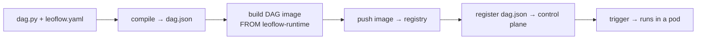

# Your first Pro DAG (≈20 min)

This is the end-to-end Pro path: take one DAG from source to a running task on a
control plane. Where the 2-minute [Lite loop](local-deploy.md) hides the artifact
boundary so you can iterate, Pro makes it explicit — because that boundary is what
your CI pipeline automates later.

A DAG is an **immutable artifact** — a `dag.json` + a container image, versioned
together ([ADR 0003](adr/0003-dag-as-image.md)). Every step below moves the DAG
across one boundary:



The DAG image is built `FROM` the **published Leoflow task base**
(`ghcr.io/neochaotic/leoflow-runtime:py3.11`), which bundles the `leoflow-agent`
(PID 1, talks gRPC to the control plane) and the `leoflow_runtime` Python helper.
You never build the base yourself — pull it from GHCR, multi-arch, signed.

## Prerequisites

- `docker` (or `podman`/`nerdctl` — pass `--builder`).
- The `leoflow` CLI and Python 3.11+ on your machine
  (see [Python on the runner](deploy.md#python-on-the-runner)).
- A reachable Leoflow **control plane** (`LEOFLOW_SERVER`) and a push token
  (`LEOFLOW_TOKEN`). For a throwaway target, the Helm chart's
  [Pro deployment](helm-chart.md) brings one up; a local registry
  (`docker run -d -p 5000:5000 registry:2`) is enough to push DAG images to.

## Step 1 — a project (`dag.py` + `leoflow.yaml` + `Dockerfile`)

```python title="dag.py"
from airflow.sdk import DAG, task

@task
def extract() -> dict:
    return {"rows": 42}

@task
def load(data: dict) -> None:
    print(f"loaded {data['rows']} rows")

with DAG("first_pro_dag", schedule=None) as dag:
    load(extract())
```

```yaml title="leoflow.yaml"
dag_id: first_pro_dag
python_version: "3.11"
dependencies:
  - requests==2.32.3
```

```dockerfile title="Dockerfile"
FROM ghcr.io/neochaotic/leoflow-runtime:py3.11
RUN pip install --no-cache-dir requests==2.32.3
COPY dag.py /home/leoflow/dag.py
ENV PYTHONPATH=/home/leoflow
```

!!! tip "The Dockerfile is boilerplate"
    It always layers the same way: `FROM` the base, install your deps, `COPY` the
    DAG, set `PYTHONPATH`. The [Lite loop](local-deploy.md) generates this for you;
    in Pro you keep it in the repo so the image is fully reproducible in CI.

## Step 2 — compile, build, and push

```bash
leoflow setup                 # once per machine: extracts the parser
leoflow compile . --build --push \
  --image localhost:5000/first-pro-dag:v1.0.0 \
  --dag-version v1.0.0
```

This single command crosses three boundaries:

1. **compile** — parses `dag.py`, overlays `leoflow.yaml`, runs the guardrails
   (unknown `task_id`, unsupported operator, duplicate keys), and writes `dag.json`
   with `--image` recorded inside it.
2. **build** — builds the image from your `Dockerfile`.
3. **push** — pushes it to your registry.

Because the `--image` you pass is written into `dag.json`, the registered artifact
and the pushed image can never drift.

!!! tip "The guardrails are your CI gate"
    The same checks fail the build here that warn you in `leoflow lite`, so a bad
    binding or an unsupported operator never reaches the control plane.

## Step 3 — register the artifact

```bash
leoflow push dag.json --url "$LEOFLOW_SERVER" --token "$LEOFLOW_TOKEN"
```

The control plane now knows the DAG, its version, and which image to pull.

## Step 4 — trigger and watch it run

Trigger from the Airflow UI (Trigger DAG) or the API:

```bash
curl -X POST "$LEOFLOW_SERVER/api/v2/dags/first_pro_dag/dagRuns" \
  -H "Authorization: Bearer $LEOFLOW_TOKEN" \
  -H "Content-Type: application/json" \
  -d '{"logical_date": "2026-01-01T00:00:00Z"}'
```

The scheduler pulls your image, runs each task in its own pod, and the UI shows
state and logs at the next refresh. That is the whole Pro lifecycle.

## From here

- **Automate it in CI.** Steps 2–3 are exactly what a pipeline runs on every push —
  see [CI/CD & deploy examples](deploy.md) for GitHub Actions / GitLab / Cloud Build
  recipes (and the Python-on-the-runner notes).
- **Add credentials.** Declare a connection in the UI; it is delivered to the pod as
  `AIRFLOW_CONN_*` — see [Variables & Connections](variables-connections.md).
