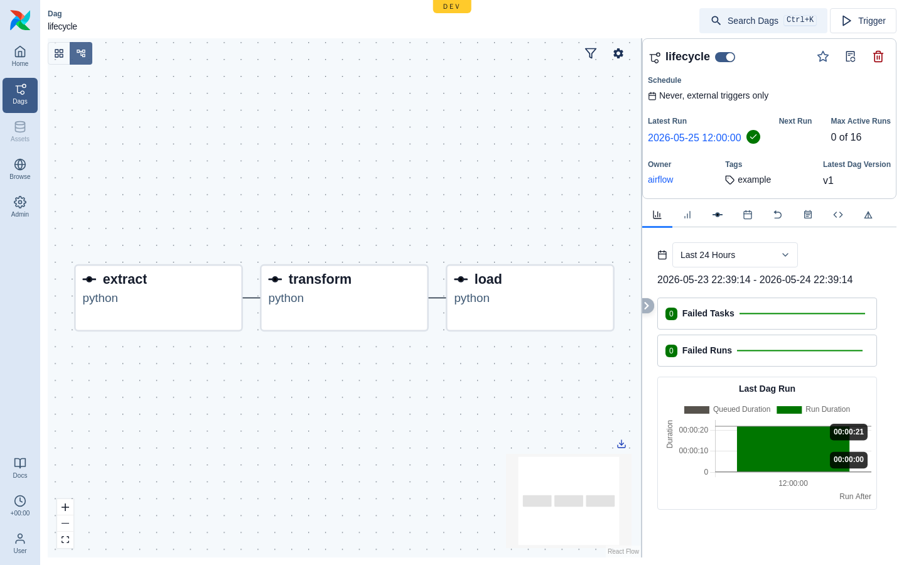

# Operating modes: Demo · Dev · Production

Leoflow runs in three modes. **The product proves itself in Dev first**;
Production is a near-term goal, not yet for testing.

| | **Demo** | **Dev** (`leoflow lite`) | **Production** *(coming soon)* |
|---|---|---|---|
| Purpose | Production-like reference (UI-compatibility, showcasing) | Author + iterate on DAGs locally | Real workloads |
| Auth | JWT login (real) | **Disabled** (loopback-only, dev bypass) | JWT + RBAC, TLS (#58), workload identity (#56) |
| UI marker | none (`instance_name: Leoflow`) | **`Leoflow · DEV`** navbar + yellow `DEV` pill | none |
| HTTP / gRPC / metrics | 8080 / 9091 / 9090 | **8088 / 9099 / 9098** (distinct, coexists with Demo) | per Helm values |
| Database | `leoflow` | **`leoflow_dev`** (isolated) | external Postgres |
| Cluster | k3d `leoflow-demo` | **k3d `leoflow-dev`** (isolated) | real K8s (GKE/EKS) |
| DAG source | frozen artifact (`compile` + `push`) | **live files, hot-reload** | immutable artifact via CI |
| Executor | KubernetesExecutor | k3d pods (default) or subprocess (`--executor`) | KubernetesExecutor |

## Demo
The familiar, production-like environment for validating the Airflow-UI
compatibility and showing the product. It serves frozen artifacts — to change a
DAG you `leoflow compile` + `leoflow push`. Auth is on; log in normally.

## Dev — `leoflow lite`
The authoring loop, fully **isolated** from Demo (own DB, own cluster, own ports)
so there is no split brain. Edit `dags/<project>/dag.py` or `leoflow.yaml`, save,
and it hot-reloads at <http://localhost:8088> (marked DEV, no login).

- `leoflow lite provision` — check + provision host deps (Docker/k3d/kubectl/python3),
  the base image, and the `leoflow_dev` database.
- `leoflow lite dags/hello` — run a project (cluster-mode: real pods).
- `leoflow lite --executor=subprocess dags/hello` — fast host loop (no image build).
- `leoflow db migrate|reset` — manage the dev database (Airflow-style).

Dev runs user code unsandboxed (subprocess) or in throwaway pods (k3d); it is for
local development only.

## Production *(coming soon)*
Helm chart + published images (#48), real cluster, TLS on the agent channel
(#58), keyless cloud auth via workload identity (#56), least-privilege secret
scoping (#59). Not yet supported for testing — see the roadmap. We harden Dev
until the product earns its way to Production.
