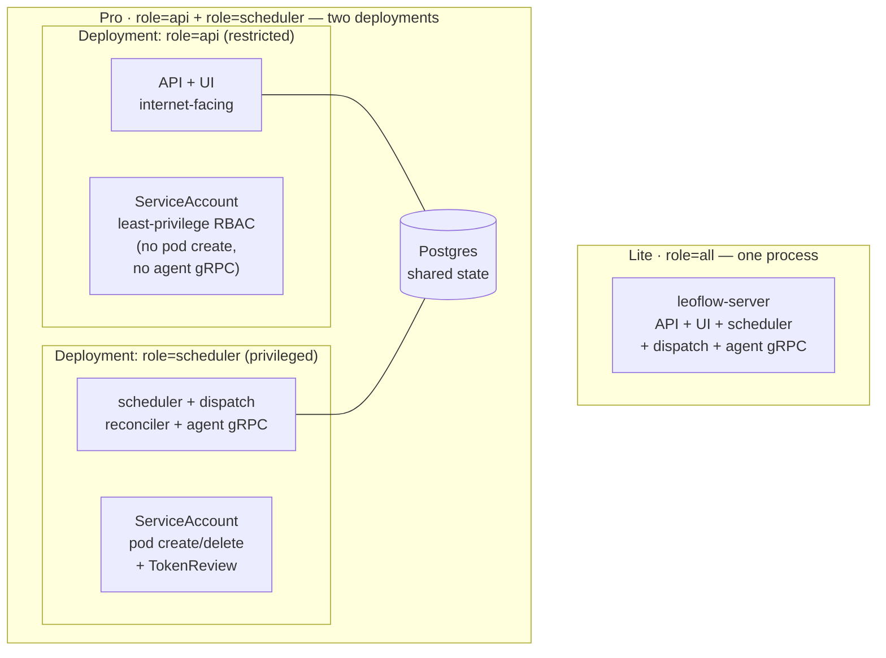

# Operating modes: Lite · Pro · Demo

Leoflow has three runtime modes. The two user-facing ones are **Lite** (the full control plane on one host — laptop, VM, or internal server) and **Pro** (Helm-installed Kubernetes); **Demo** is a
contributor-facing reference environment used to validate UI compatibility
against the production-shaped control plane. **Lite is the recommended way to
run Leoflow today** (trusted networks only); Pro is Helm-installable and in active
validation — the chart is chart-test gated and tested against GKE today, but not
yet certified for production.

> See also [Editions](editions.md) for the Lite/Pro distribution split.
> This page is the **runtime details** view — exact ports, database names,
> cluster names, and CLI surface per mode. [Editions](editions.md) is the
> **packaging + posture** view.

| | **Lite** (`leoflow lite`) | **Pro** *(in validation)* | **Demo** (contributor) |
|---|---|---|---|
| Purpose | Run DAGs on one host — develop, then light production | Real workloads at scale | production-shaped reference for UI-compatibility work |
| Auth | **Real admin login** (single admin generated by `leoflow setup`; password recoverable via `leoflow lite reset-password`) | JWT + RBAC, TLS (#58), workload identity (#56) | JWT login (real) |
| UI marker | **`Leoflow Lite`** navbar (silver edition badge) | **`Leoflow`** navbar (gold edition badge) | none (`instance_name: Leoflow`) |
| HTTP / gRPC / metrics | **8088 / 9099 / 9098** (distinct, coexists with Demo) | **8080 / 9091 / 9090** (per `helm/leoflow/values.yaml`; shares Demo's ports — not co-located on the same host) | 8080 / 9091 / 9090 |
| Database | **`leoflow_dev`** (isolated; legacy schema name preserved for upgrade-in-place safety after the Dev → Lite rename) | external Postgres | `leoflow` |
| Cluster | **k3d `leoflow-dev`** (isolated; legacy cluster name preserved) | real K8s (GKE/EKS) | k3d `leoflow-demo` |
| DAG source | **live files, hot-reload** | immutable artifact via CI | frozen artifact (`compile` + `push`) |
| Executor | k3d pods (default) or subprocess (`--executor`) | KubernetesExecutor | KubernetesExecutor |

## Lite — `leoflow lite`

The full control plane on one host, fully **isolated** from Demo (own DB, own cluster, own
ports) so there is no split brain. Edit `dags/<project>/dag.py` or
`leoflow.yaml`, save, and it hot-reloads at <http://localhost:8088> (marked
**Leoflow Lite** in the navbar, login enabled).

- `leoflow doctor` — check the host (OS, Docker/k3d/kubectl/python3) and report the
  achievable executor tier; `leoflow setup` bootstraps the managed runtime, base
  image, and workspace (run for you by the installer).
- `leoflow lite dags/hello` — run a project (k8s executor: real k3d pods).
- `leoflow lite --executor=subprocess dags/hello` — fast host loop (no image build).
- `leoflow db migrate|reset` — manage the Lite database (Airflow-style).

Lite runs tasks in isolated throwaway pods (k3d) or directly on the host (subprocess, unsandboxed — a dev-only escape hatch). Run it on a single trusted host: local development through light-to-medium production. Public, multi-user, at-scale deployment is what Pro is for.

The Dev → Lite rename is a **product/branding** change — the internal storage
names (`leoflow_dev` database, `leoflow-dev` k3d cluster) are preserved so
existing installs upgrade in place. New documentation uses "Lite" everywhere;
old `leoflow_dev` references in the database name itself are deliberately
left alone.

## Pro *(in validation)*

Real cluster install via the **[Helm chart](https://github.com/neochaotic/leoflow/blob/main/helm/leoflow/README.md)** (chart-test
gated, multi-arch images published per release, signed with cosign).
Hardening templates ship as opt-in toggles: HPA + PDB + NetworkPolicy +
ServiceMonitor. **Helm-installable and in active validation** — the chart is
installable and tested against GKE today, and runs on any K8s cluster with external
Postgres + Redis, but is not yet certified for production.

Pending Pro work (tracked separately): TLS on the agent channel
(#58), keyless cloud auth via workload identity (#56), least-privilege
secret scoping (#59).

## Deployment topology (role split)

Pro can run the control plane as **one process** or **split into two
deployments** by `server.role` ([ADR 0049](adr/0049-split-api-and-scheduler-roles.md)).
Lite is always `role=all`. Splitting lets the internet-facing API run under
least-privilege RBAC while only the scheduler holds pod-create and agent-facing
rights; the two halves share nothing but Postgres.

```mermaid
flowchart TB
  subgraph LITE["Lite · role=all — one process"]
    ALL["leoflow-server<br/>API + UI + scheduler<br/>+ dispatch + agent gRPC"]
  end

  subgraph PRO["Pro · role=api + role=scheduler — two deployments"]
    direction LR
    subgraph D1["Deployment: role=api (restricted)"]
      APIP["API + UI<br/>internet-facing"]
      RB1["ServiceAccount<br/>least-privilege RBAC<br/>(no pod create,<br/>no agent gRPC)"]
    end
    subgraph D2["Deployment: role=scheduler (privileged)"]
      SCHP["scheduler + dispatch<br/>reconciler + agent gRPC"]
      RB2["ServiceAccount<br/>pod create/delete<br/>+ TokenReview"]
    end
    APIP --- PGP[("Postgres<br/>shared state")]
    SCHP --- PGP
  end
```

`role=all` collapses every component into a single process (Lite's only mode,
and the default for a simple Pro install); `role=api` and `role=scheduler` are the
two halves you deploy separately when you want the RBAC boundary. See the
[architecture overview](architecture.md) for how the roles sit in the whole system.

## Demo *(contributor reference)*

The familiar, production-like environment **for contributors** to validate
the Airflow-UI compatibility and showcase the product. It serves frozen
artifacts — to change a DAG you `leoflow compile` + `leoflow push`. Auth is
on; log in normally. Demo is not part of the end-user surface; it is the
target for [UI compatibility](ui-compatibility.md) work and is referenced
from the [contributing guide](contributing.md).

> See [Editions](editions.md) for the Lite/Pro split (same engine,
> different distribution + posture).
