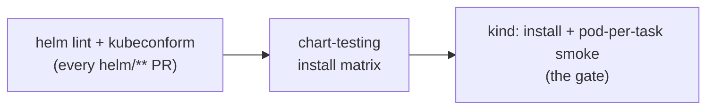
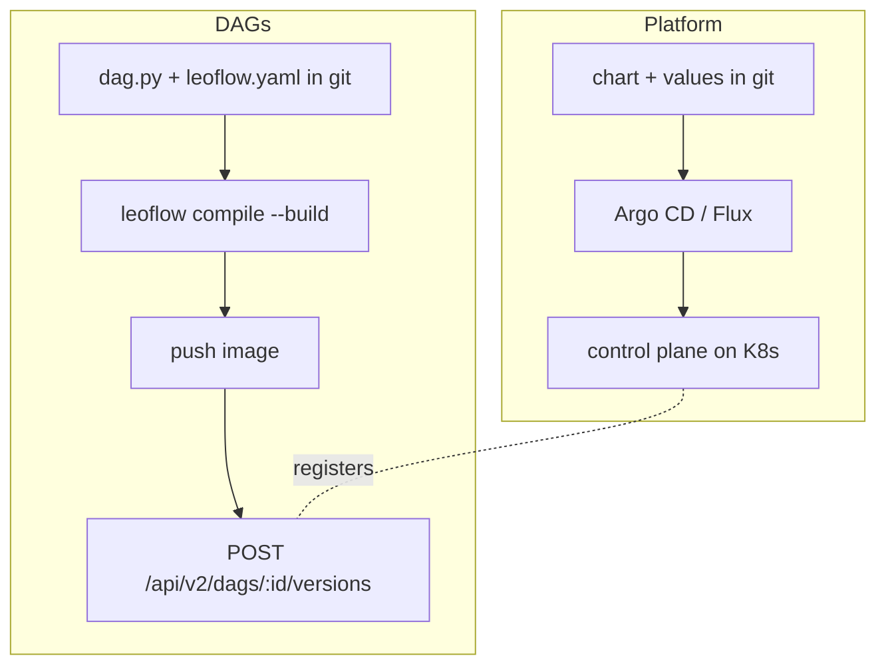

# Production deployment (draft)

!!! note "Production is a near-term goal, not yet for testing"
    Leoflow proves itself in **[Lite](operating-modes.md)** first. This guide is the
    **design + best-practice reference** for the Production edition: how the Helm
    chart is structured, how it is published and tested, and how it fits a GitOps
    delivery. The hardening templates and the chart-test workflow it describes ship
    **disabled by default** until the Production front opens.

Production runs the Go control plane on real Kubernetes with the **pod-per-task**
executor (ADR 0002, ADR 0015): the scheduler creates one pod per `TaskInstance`,
and a thin agent (ADR 0004) reports state back over gRPC. Two things are delivered
on independent tracks — **the platform** (this chart) and **the DAGs** (immutable
images, see [CI/CD & deploy](deploy.md)). Keep them separate.

## 1 · The chart

`helm/leoflow/` deploys the control plane. See the [chart README](https://github.com/neochaotic/leoflow/tree/main/helm/leoflow) for the full values reference.

| Resource | Purpose |
|---|---|
| `Deployment` | `leoflow-server` (HTTP `8080`, metrics `9090`, agent gRPC `9091`) |
| `Service` | ClusterIP for http / metrics / grpc |
| `ServiceAccount` + `Role`/`RoleBinding` | lets the control plane create/watch/delete **task pods** and read their logs in `taskNamespace` |
| `Secret` | inline DB / Redis / JWT / bootstrap credentials (skipped with `existingSecret`) |
| `Job` (hook) | `golang-migrate` before install/upgrade |
| `Ingress` | optional |

### High availability

`replicaCount > 1` is safe: the scheduler **leader-elects** (ADR 0009), so extra
replicas serve the API/UI while exactly one scheduler is active. Pair it with the
hardening toggles below.

### Hardening toggles (draft, off by default)

| Values key | Resource | Notes |
|---|---|---|
| `autoscaling.enabled` | `HorizontalPodAutoscaler` | safe with leader election (scales API/UI) |
| `podDisruptionBudget.enabled` | `PodDisruptionBudget` | keep the API available across node drains |
| `networkPolicy.enabled` | `NetworkPolicy` | trust boundary: clients → HTTP, Prometheus → metrics, **task pods → gRPC**; egress to Postgres/Redis/kube-apiserver/DNS |
| `metrics.serviceMonitor.enabled` | `ServiceMonitor` | Prometheus Operator scrape of `/metrics` (ADR 0010) |
| `agentTLS.enabled` | — | mTLS for the agent ↔ control-plane gRPC (cert-manager; issue #58) |

## 2 · Publishing the chart

Ride the same supply-chain pipeline as the binaries (ADR 0014):

- Package and push as an **OCI artifact** to GHCR: `helm push leoflow-<v>.tgz oci://ghcr.io/neochaotic/charts`.
- **Sign with cosign** and attach an SBOM, like the release images.
- Keep the chart `version` (SemVer) **decoupled** from `appVersion` (the server image tag).
- Publish on release tags so a chart version maps to a tested server build.

## 3 · Testing in CI

Mirror the Lite install gate, layered cheapest → most faithful (`.github/workflows/chart-test.yaml`, draft):

1. **`helm lint` + `kubeconform`** — chart syntax and rendered-manifest schema (with the CRD catalog for `ServiceMonitor`). Seconds.
2. **`chart-testing` (ct)** — install with a values matrix (default / HA / network-policy-on).
3. **kind, as the gate** — install the chart on a real [kind](https://kind.sigs.k8s.io/) cluster against ephemeral Postgres + Redis, then run a **pod-per-task smoke**: register a DAG image, trigger a `DagRun`, assert the task pod reaches `Succeeded`.

!!! tip "Why the kind smoke is the gate"
    The risky, scenario-specific part is the control plane **creating task pods**
    and the agent **dialing gRPC back** (plus RBAC, image pulls, the per-run staging
    volume — ADR 0022). Unit tests can't cover it; kind can. This is the K8s analog
    of the Lite cross-distro install gate. Don't test against a managed cloud cluster
    in CI — kind is faithful to the pod-per-task model and far cheaper.

## 4 · The GitOps delivery

Two independent flows — do not couple them:

- **Platform** — the chart + environment `values` live in git; **Argo CD** (or Flux)
  syncs the control-plane release. Pin the chart version in the `Application`; promote
  staging → prod by PR. Argo CD *deploys Leoflow* — it is complementary, not a competitor.
- **DAGs** — each DAG is its own **immutable image + `dag.json`** (ADR 0003), built and
  registered in CI (see [CI/CD & deploy](deploy.md)). The runtime is pinned in the
  image, so there is no dependency drift between authoring and execution.

## 5 · How this compares to Kubeflow / Argo

Separate the **engine delivery** from the **workflow delivery**:

| | Engine | Workflow / DAG |
|---|---|---|
| **Argo Workflows** | controller + CRDs | each run is a `Workflow` **CRD** (pod-per-step) |
| **Argo CD** | — (it *is* the deployer) | **GitOps** sync of manifests |
| **Kubeflow Pipelines** | KFP over Argo | Python pipeline **compiled to Argo YAML** |
| **Leoflow (Production)** | **Helm chart** (Go control plane) | **immutable image + `dag.json`**, registered via API |

Leoflow keeps the pod-per-task model Argo Workflows got right, but the source of
truth for a DAG is a **versioned image**, not a mutable CRD in etcd — and the UI/API
contract is **Airflow 3.2.x** (ADR 0007). In one line: *Argo Workflows underneath,
Airflow on top, no GIL in the middle.*

## Best practices, summarized

- Publish the chart as a **signed OCI artifact** via the existing release pipeline.
- Make the **kind pod-per-task smoke the release gate** for the chart.
- Run **two GitOps flows**: Argo CD for the platform, image+API for DAGs.
- In prod values, enable **`agentTLS`** (mTLS), **`networkPolicy`**, **`podDisruptionBudget`**, and the **`serviceMonitor`**; size with **`autoscaling`** + `resources`.
- **SHA-pin** every action and **trivy-scan** the rendered manifests (ADR 0014).
