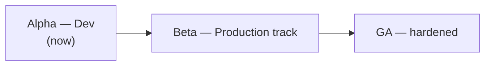

# Roadmap to first release

**Goal:** a stable MVP — a clean Airflow-3.2-compatible orchestrator that runs a
real DAG end to end, with no fancy features — before v0.1.

This consolidates the open work after the audit + reverse analysis
(`docs/reverse-analysis-mvp.md`, which captured and evaluated the real Airflow
3.2.1 task logs, XCom, lifecycle, and API and mapped each to Leoflow).

## Release phases — Alpha · Beta · GA

The product **proves itself in Dev first**; Production matures behind it.

### 🟡 Alpha — Developer experience (current focus)
A data engineer can author, run, and iterate on DAGs locally with confidence.

- `leoflow lite` (isolated k3d/subprocess), `leoflow lite setup`, `leoflow db`, hot reload, DEV marker.
- DAG authoring + binding/overrides (ADR 0023), guardrails, embedded migrations.
- Documentation site, examples, the `dags/` convention.
- **Exit:** the dev loop is reliable end-to-end; the authoring model is documented and tested.

### 🟠 Beta — Production track (next)
Run real workloads on a real cluster, deployed via CI.

- Publish images + binaries: `leoflow-server`/`-agent`/`-migrate` + per-OS CLI (#48, #61).
- TLS on the agent channel (#58); keyless cloud auth / workload identity (#56).
- Real-cluster verification of staging + pod-path on GKE (#57); least-privilege secret scoping (#59).
- Self-contained dev: migrations via library (#60, done), single binary (#61), "runs liso" embedded deps (#62).
- **Exit:** Helm install + CI deploy on a real cluster with auth + TLS.

### 🟢 GA — Hardened
- Load/scale tests, SLOs, upgrade runbooks, doc versioning (`mike`).
- OpenSSF best-practices badge; supply-chain (ADR 0014) green.
- **Exit:** production-ready, documented, supported.

> Today we are in **Alpha** — no production testing until it earns its way to Beta.

## ✅ Done (this cycle) — the MVP happy path works

End-to-end on the local k3d cluster, verified live: a 3-task Python DAG
(`extract → transform → load`) passing **XCom** (`{rows:100} → doubled:200`),
**clear structured logs** shipped from pods (`::group::` + per-line level), the
**home dashboard** showing real counts, **list filters** working, and **no
zombie/stuck runs** (undispatchable tasks fail fast with a visible reason).

Closed: #33 health · #34 Helm · #35 pod e2e · #36 pod log shipping · #37 audit ·
#38 XCom output · #39 dashboard counts · #40 filters · #41/#53 delete=clear +
deregister (ADR 0020) · #42 clear only_failed · #43 structured logs · #44 real
log levels · #45 Admin Variables+Connections (ADR 0019) · #46 undispatchable
visibility · #47 executor status / Cluster Activity=Home · #49 Code=Python · #50
no eternal-running · #51 TaskFlow value passing · #52 graceful logs.

## 🔴 Pre-release must-do (small, stability)

1. **Test DB isolation** — integration tests run against the *demo* Postgres,
   polluting the live demo (ghost dags → wrong home stats). Point
   `go test -tags integration` at a dedicated throwaway DB (compose service /
   ephemeral container), never the running demo. *(Found while QA'ing the demo.)*
2. **XCom cleared on retry/clear** — Airflow purges XCom on retry for
   idempotency; we rely on Redis TTL. Purge the key on `ResetForRetry` / clear.
3. **Task-instance property defaults** — the TI details panel looks sparse:
   `queue`, `priority_weight`, `hostname`, `executor`, `dag_version` come back
   null. Fill sensible defaults (queue `default`, priority_weight `1`), populate
   `hostname`/`executor`/`dag_version` from what the agent/dispatcher already
   knows. *(rendered_fields stays empty until Jinja — post-1.0.)*
4. **Publish the leoflow-migrate image** (#48) to ghcr so `helm install` migrates
   out of the box (image-build infra already in `deploy/Dockerfile.migrate`).
5. **Decide Bash/HTTP-operator XCom** — only Python `@task` XCom is wired. Either
   document "Python tasks for XCom" as the MVP contract, or add operator XCom.

## 🟡 Polish (nice before release, not blocking)

- **Task lifecycle audit events** (#52) — per-task Audit Log is empty (we only
  record dag.version.register). Emit audit on task transitions; needs RunState to
  carry the run_id string + audit metadata.
- **Orphan-run UX** — runs from a previous backend/dir surface missing logs;
  graceful "No logs available" now (#52), but consider hiding/expiring orphans.
- Real `monitor/health` component heartbeats beyond the scheduler (#33 partial).

## ⚪ Post-1.0 (deprioritized)

Deferrable tasks (#13), Jinja templating / rendered_fields (#25), assets/datasets
(#29), providers, pools (#31), plugins (#30), dag tags/warnings (#26/#27),
`multiple_outputs`, KMS-backed secret encryption (evolves ADR 0019), the custom
UI north star (ADR 0018).

## Release smoke test

`make e2e` (k3d) already asserts: pod-per-task success, log shipping (#36),
structured logs (#43), and TaskFlow value passing (#51). Keep it green as the
release gate.
