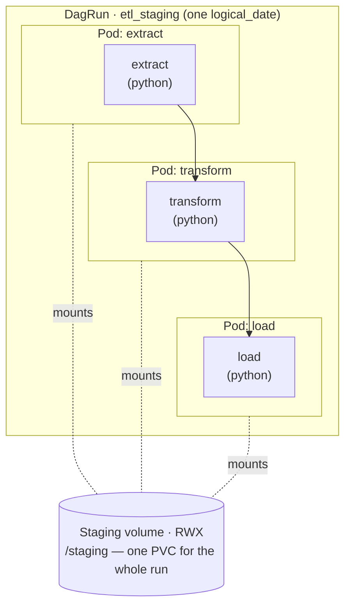
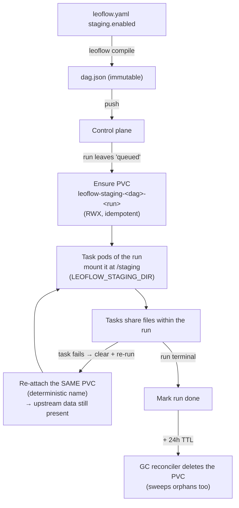

# Ephemeral per-DAG-run staging volume

Status: **design** (ADR 0022, issue #55). This document is the visual/how-to
companion to the ADR.

## What it is

An opt-in, Leoflow-managed **ReadWriteMany (RWX) volume scoped to a single DAG
run**, mounted at `/staging` in every task pod of that run. It is the place for
**large intermediate data** between a run's tasks — the gap XCom (≤256KB) and
object storage (durable, cross-run) don't fill.

- **Opt-in** via `leoflow.yaml` → compiled into the immutable `dag.json`.
- **Atomic/isolated per run**: one PVC per run, deterministic name; runs and DAGs
  never collide.
- **Re-run safe**: the PVC's lifecycle is tied to the *run*, not the pod — it
  survives retries and clear+re-run, so upstream outputs are still there.
- **GC'd** after the run is terminal **plus a 24h TTL**.

It is **not** durable, cross-run, or cross-DAG storage — use object storage
(S3/GCS via a Connection) for that.

## Configuration

```yaml
# leoflow.yaml
staging:
  enabled: true
  size: 5Gi
  storage_class: ""   # empty = the cluster's default RWX StorageClass
```

Tasks read/write under `$LEOFLOW_STAGING_DIR` (= `/staging`), shared across the
run's tasks.

## Example — an ETL on a shared staging volume

Each task runs in **its own pod**; all pods of the **same run** mount **one** RWX
volume at `/staging`. XCom carries the small *path*; the volume carries the large
*data* (XCom is capped at 256 KB).



=== "leoflow.yaml"

    ```yaml
    schema_version: "1.0"
    dag_id: etl_staging
    description: ETL that stages large intermediate data on a shared per-run volume.
    tags: [etl]
    dependencies: []
    staging:
      enabled: true
      size: 5Gi            # cluster default RWX StorageClass when storage_class is empty
    ```

=== "dag.py"

    ```python
    """etl_staging — pass large data via the shared /staging volume, not XCom."""
    import json, os
    from airflow.sdk import DAG, task

    STAGING = os.environ.get("LEOFLOW_STAGING_DIR", "/staging")

    @task
    def extract() -> str:
        path = f"{STAGING}/raw.json"
        with open(path, "w") as f:
            json.dump({"rows": list(range(100_000))}, f)   # too big for XCom (≤256 KB)
        return path                                         # XCom carries the PATH, not the data

    @task
    def transform(raw_path: str) -> str:
        data = json.load(open(raw_path))
        out = f"{STAGING}/transformed.json"
        with open(out, "w") as f:
            json.dump({"count": len(data["rows"]) * 2}, f)
        return out

    @task
    def load(out_path: str) -> None:
        print("loaded:", json.load(open(out_path)))

    with DAG("etl_staging", schedule=None, catchup=False, tags=["etl"]):
        load(transform(extract()))
    ```

!!! tip "The pattern"
    Return the **path** from each task (small → XCom); keep the **bytes** on
    `/staging` (large → the shared volume). All three pods see the same files
    because they mount the same per-run PVC.

## Lifecycle



### Why the run, not the pod

```
Task pod lifetime:   [extract]   [transform]   [load]      (each pod is ephemeral)
PVC lifetime:        |-------------------------------------------------| run + 24h
                     ^create on run start                  ^GC after terminal+TTL
```

A clear+re-run reuses the deterministically-named PVC, so data written by
already-successful upstream tasks is not lost — the re-executed task finds its
inputs and does not fail. The 24h TTL after a terminal state is the safety margin
for a re-run shortly after a failure.

## Requirements & failure mode

- A cluster **RWX StorageClass** (NFS / EFS / CephFS / Filestore). If
  `staging.enabled` is set and no RWX class is available, dispatch **fails fast**
  with a clear error — it never silently degrades.
- The volume is a shared filesystem, **not transactional**. "Atomic per DAG" means
  isolation per run, not ACID. Tasks should write atomically
  (write-temp-then-rename).

## When to use what

| Need | Mechanism |
|---|---|
| Small handoff / parameters (≤256KB) | **XCom** (Redis) |
| Large intermediate data **within a run** | **Staging volume** (this) |
| Durable / cross-run / cross-DAG data | **Object storage** (S3/GCS) via a Connection |

## How Airflow 3.x compares

Airflow offers `airflow.io.ObjectStoragePath` (fsspec + a Connection) for object
storage and a custom XCom backend for large values, but has **no first-class
ephemeral shared volume** — PVCs are wired manually via pod templates with no
managed lifecycle or isolation. The managed per-run volume here is a Leoflow
value-add.
