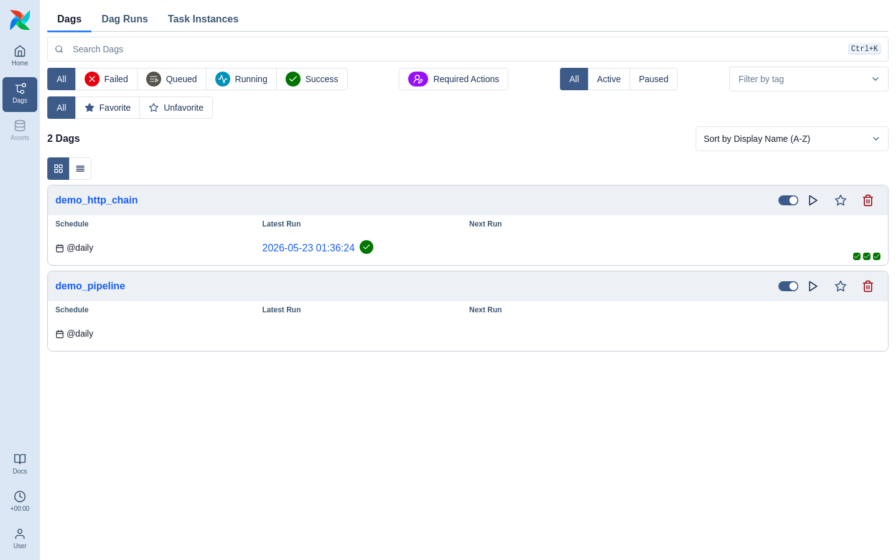
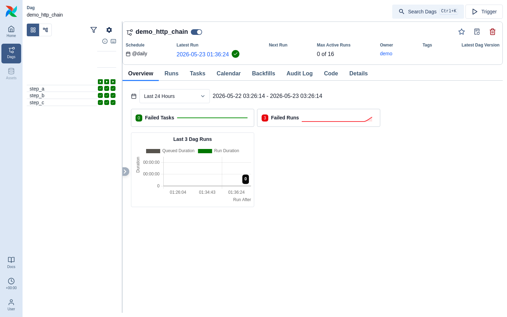
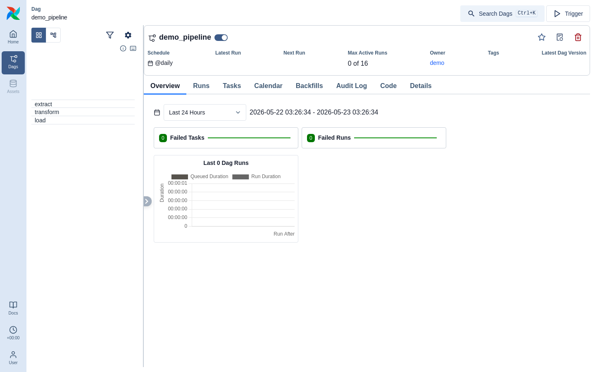
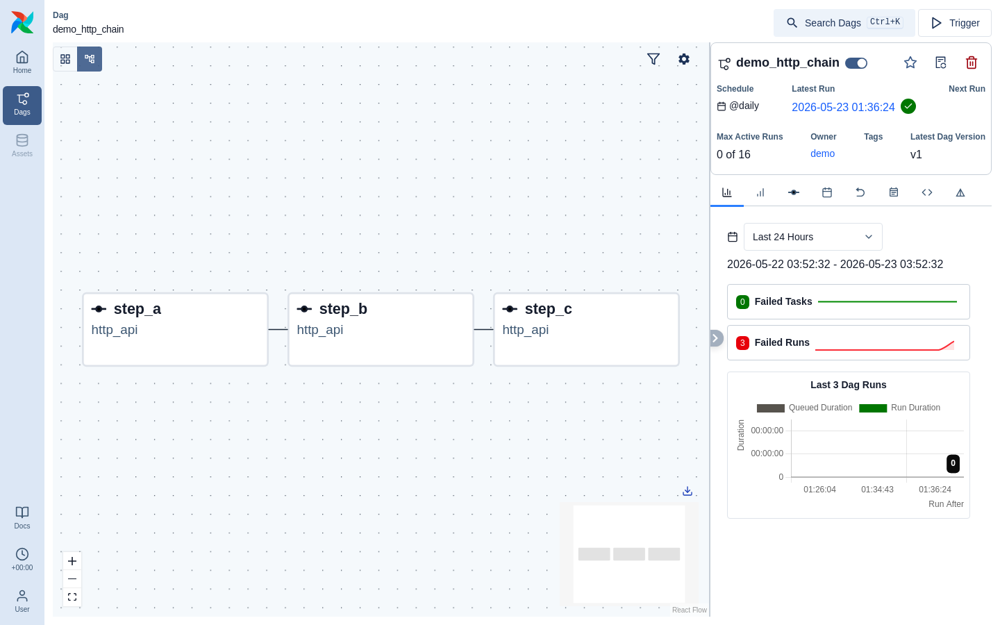
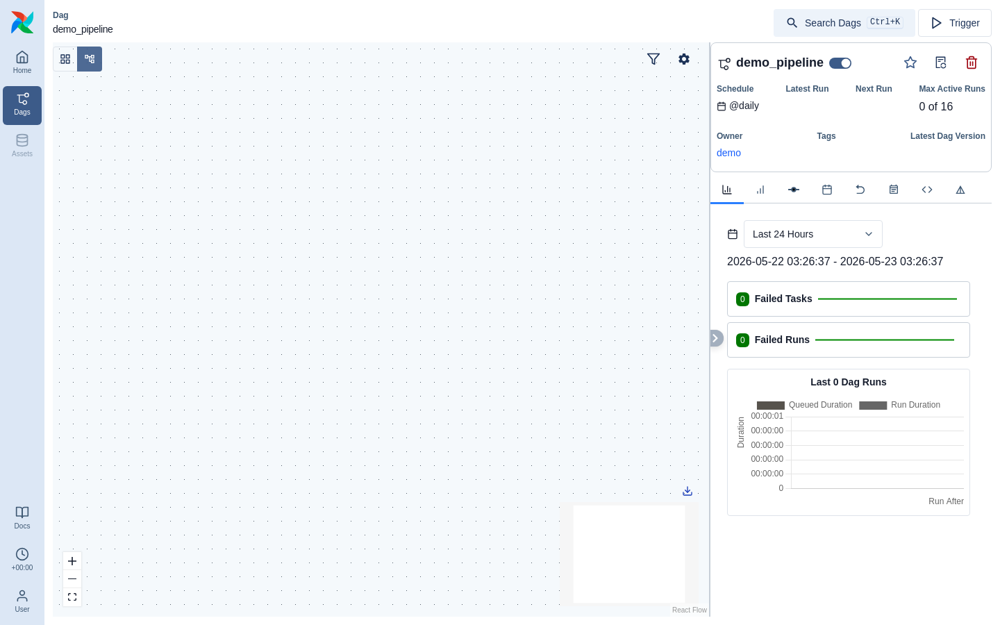

# Leoflow UI Walk — Verified Findings

**Date:** 2026-05-23
**Method:** The live demo stack (`docker compose --profile demo up`) driven by a
headless Chromium (Playwright, dockerized). Authenticated via the `_token`
cookie, navigated the screens **by clicking** (not deep-linking — direct
navigation to client routes like `/` 404s in the SPA), screenshotted each, and
captured console errors + non-2xx requests. Every screenshot below was inspected
and every finding cross-checked against the authoritative `_private_ui.yaml`
(3.2.1) — so this supersedes the earlier external audit where the two disagree.

> Why no side-by-side with real Airflow for most screens: Leoflow serves the
> **unmodified** Airflow 3.2.1 SPA, so the layout/chrome *is* Airflow's. A
> real-Airflow comparison only adds value for data-shape differences; it is
> worth doing specifically for the empty Graph view (below).

## Summary

The DAG **list** and **grid** render with full fidelity — including the run
state colors and the per-DAG fields the earlier external audit wrongly told us to
strip. The **graph** view renders an **empty canvas** (top bug). A few `/api/v2`
endpoints the UI polls still 404, and the Overview "Failed Runs" widget
miscounts.

## Screens

### DAG list — ✅ renders correctly

`demo_http_chain` shows schedule `@daily`, the latest run with a green check, and
**three green run squares** (its 3 successful runs); pause/trigger/favorite/delete
controls render. The filter chips (Failed/Queued/Running/Success), tags filter,
and sort all render. **This directly refutes the external audit's "strip
`description`/`bundle_version`/`next_dagrun_*`/`start_date`/`end_date` from
`/ui/dags`" recommendation** — those fields are *required* by the 3.2.1 schema and
the list renders correctly with them present.

### Grid view — ✅ renders correctly

`step_a/step_b/step_c` each show three green ✓ cells (3 successful runs). The DAG
header (schedule, latest run, max active runs, owner) and the tab bar (Overview /
Runs / Tasks / Calendar / Backfills / Audit Log / Code / Details) render. The grid
left column is driven by `/ui/grid/structure` (incl. the required `is_mapped`) and
the cell colors by `/ui/grid/ti_summaries` — both correct. The external audit's
"Grid broken" applies only to mapped tasks / task groups, which the MVP does not
model; for normal DAGs the grid is correct.

`demo_pipeline` (no runs) shows its `extract`/`transform`/`load` task rows.

### Graph view — ❌ EMPTY canvas (top bug)

Toggling to the Graph view shows a **blank React Flow canvas** for both DAGs — no
nodes, no edges. This is a genuine silent misrender that only the browser surfaces.

**Key diagnostic (from the server logs during the walk):** the graph view does
**not** request `/ui/structure/structure_data` at all. The only structure request
is `GET /ui/grid/structure/{dag_id}` (also used by the grid's left column). So the
3.2.1 graph builds its React Flow nodes/edges from **`/ui/grid/structure`**, whose
`GridNodeResponse` we currently return as a **flat list** (`children: null`, no
nesting). The graph needs the nested/parent-child structure (and likely edge
derivation from it) that the grid structure is supposed to carry. `structure_data`
being correct (curl-verified) is therefore a red herring for this bug.

**Next step:** compare real Airflow 3.2.1's `GET /ui/grid/structure/{dag_id}`
response for a DAG with dependencies against ours, and emit the nesting/edges the
graph renderer consumes. (This is also why the external audit's `structure_data`
field advice is moot here — the graph doesn't call that endpoint.)

## Non-2xx requests captured (to stub/implement)

- `GET /api/v2/dags/{id}/dagRuns/~/taskInstances?…state=failed&order_by=-run_after`
  → **404**. The Overview "Failed Tasks/Failed Runs" widgets poll this (`~` = all
  runs). Its failure is why the **Overview "Failed Runs" widget shows `3` for a
  DAG with 3 *successful* runs** — a visible miscount.
- `GET /api/v2/dags/{id}/dagVersions?order_by=-version_number` → **404**. Backs the
  header "Latest Dag Version" field.
- `GET /api/v2/dags/~/dagRuns` (home global run view) → already fixed (degrades to
  an empty collection).

## Other observations

- **Sidebar/menu:** Home, Dags, **Assets**, Docs (+ clock, User). Browse and Admin
  are correctly hidden by the curated `/ui/auth/menus`; **Assets is built-in nav,
  not menu-curated**, so it still appears (its pages degrade to empty states).
- **MIME warning** (`Failed to load module script … MIME type "text/html"`):
  upstream Airflow 3.2.1 build artifact, safe to ignore.

## Recommended next work

1. **Fix the empty Graph view** — the graph builds from `/ui/grid/structure`, not
   `structure_data`; diff our `GridNodeResponse` against real Airflow's for a DAG
   with dependencies and emit the nesting/edge data the React Flow graph consumes.
   (Highest UI value.)
2. Stub/implement `dagRuns/~/taskInstances` and `dagVersions` (fixes the Overview
   "Failed Runs" miscount and the version header).
3. Decide whether to hide the Assets nav (it is built-in, not menu-driven).

## Note on the external (Antigravity) audit

It is a useful lead generator (it found the `~`-wildcard 404s and documented the
write-path payloads), but its **schema diagnosis is unreliable**: it repeatedly
recommended removing fields that are *required* by the 3.2.1 spec (verified here —
the list/grid render correctly with them) and its v2 "screenshots" were all 404
pages (bad deep-links). Treat it as a source of leads, validated against the spec
and the browser — which is what this report does.
