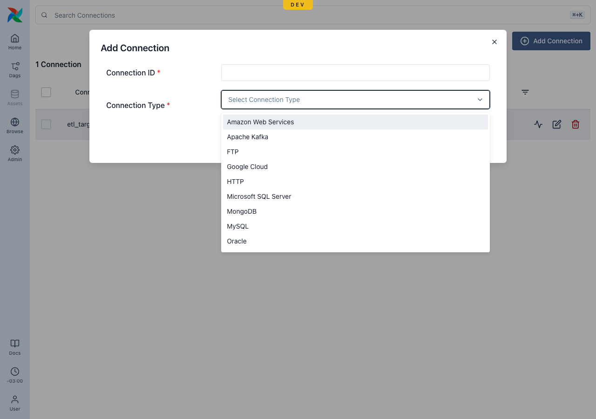
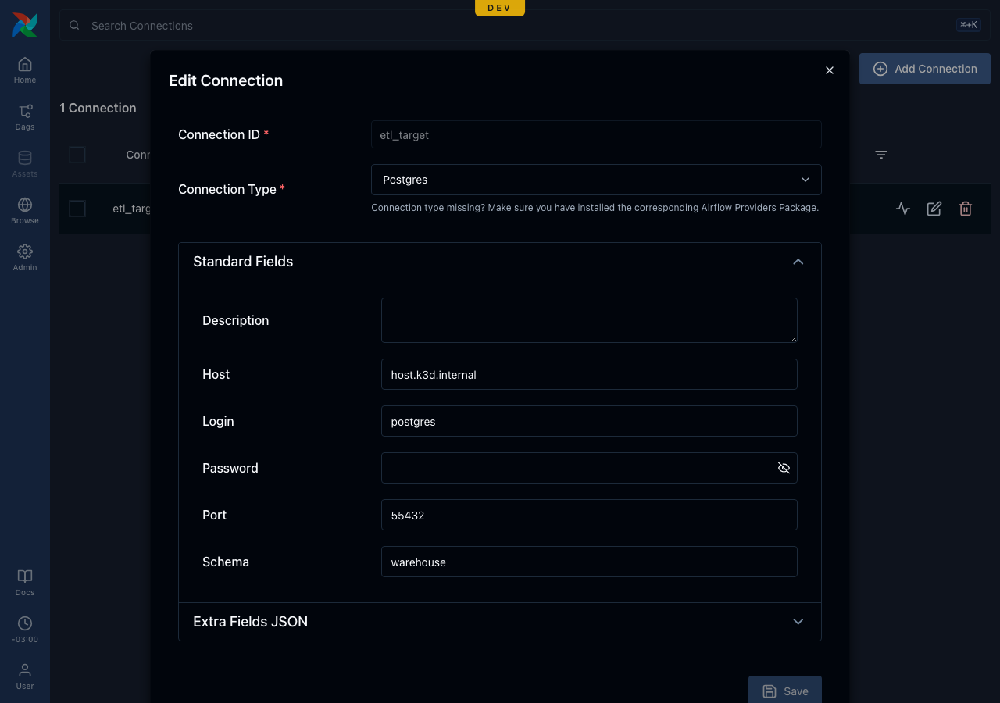

# Variables & Connections

Leoflow stores **Variables** and **Connections** in the control plane (connection
secrets encrypted at rest, AES-256-GCM — ADR 0019) and delivers them to task pods
at runtime as environment variables, so your task reads them with the **native
Airflow APIs** *and* as plain env (ADR 0021).

## Manage them
Via the Airflow-compatible UI (Admin → Variables / Connections) or the API:

```bash
# Variable
curl -X POST "$LEOFLOW_SERVER/api/v2/variables" -H "Authorization: Bearer $TOKEN" \
  -H 'Content-Type: application/json' -d '{"key":"greeting","value":"hello"}'

# Connection (password + extra are encrypted at rest)
curl -X POST "$LEOFLOW_SERVER/api/v2/connections" -H "Authorization: Bearer $TOKEN" \
  -H 'Content-Type: application/json' \
  -d '{"connection_id":"warehouse","conn_type":"postgres","host":"db","login":"u","password":"p","schema":"analytics"}'
```

## In the UI: connection types & editing

The Admin → Connections form offers a catalog of common connection types
(borrowed from Airflow's providers — Postgres, MySQL, HTTP, AWS, Google Cloud,
Snowflake, Redis, SSH, …); pick one and edit the fields it needs.

{ .home-hero__shot }

The form renders the standard fields for the chosen type (host, login, password,
port, schema, description) plus an Extra JSON block, and an existing connection
opens pre-filled (the password is write-only and never returned):

{ .home-hero__shot }

## Test a connection

The **Test** button (`POST /api/v2/connections/test`) checks the endpoint's
reachability **from the control plane** — an HTTP(S) request, or a TCP dial to
`host:port` (the type's well-known port when none is set) — and returns
`{status, message}`. Note this tests from the control plane, not the task pod, so
a host only resolvable inside the cluster (e.g. `host.k3d.internal` in dev) reads
as unreachable there even though pods can reach it. Full per-provider credential
validation needs the provider hooks (a later addition).

## Read them in a task
The agent injects each tenant's Variables/Connections before running your code:

- `AIRFLOW_VAR_<KEY>` (uppercased) → `Variable.get("key")`
- `AIRFLOW_CONN_<ID>` (a connection URI, with `extra` carried under `__extra__`) → `BaseHook.get_connection("id")`

```python
from airflow.sdk import task

@task
def use_secrets():
    import os
    from airflow.sdk import Variable          # native Airflow API
    print(Variable.get("greeting"))           # "hello"
    print(os.environ["AIRFLOW_VAR_GREETING"]) # also a plain env var
```

Scope is global (per tenant). Delivery requires a secure agent channel (TLS, #58)
or, in dev, the explicit `LEOFLOW_AGENT_ALLOW_INSECURE_SECRETS=true` (set by
`leoflow lite`). See [ADR 0021](adr/0021-exposing-variables-connections-to-pods.md).
