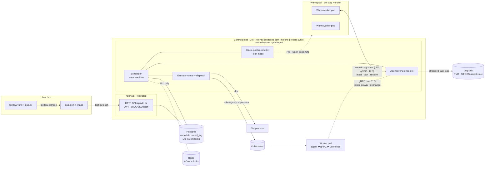
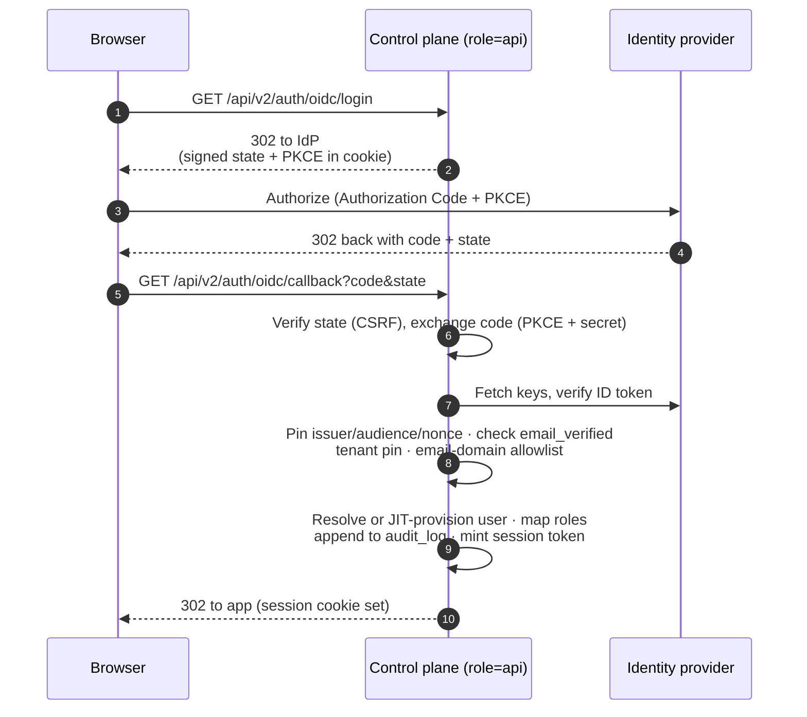

The two halves of the control plane are separate deployments joined only by
Postgres ([ADR 0049](/project/adrs/0049-split-api-and-scheduler-roles/)); `role=all`
collapses them into one process for Lite. See
[Operating modes](/concepts/editions/#deployment-topology-role-split) for the
deployment topology.

**Control plane (Go).** Gin HTTP serving the Airflow-compatible `/api/v2/*` and
`/ui/*`; a goroutine-based scheduler (state machine, leader-elected via Postgres
advisory locks — [ADR 0009](/project/adrs/0009-leader-election/)); an
executor router (Kubernetes via client-go, subprocess for dev —
[ADR 0002](/project/adrs/0002-pod-per-task/); the inline http_api path was removed (ADR 0047/0048),
[ADR 0047](/project/adrs/0047-deprecate-native-inline-http/)).

**Split roles — API and scheduler ([ADR 0049](/project/adrs/0049-split-api-and-scheduler-roles/)).**
`server.role` selects which components a process runs. `role=api` serves only the
HTTP API + UI — a **restricted** network identity with no cluster-write and no
agent gRPC listener; `role=scheduler` runs the **privileged** half: the
state-machine scheduler, executor dispatch, the warm-pool reconciler, and the
agent gRPC endpoint. Split across two deployments, the two halves share nothing
but Postgres, so the internet-facing API can run under least-privilege RBAC while
only the scheduler holds pod-create and agent-facing rights. `role=all` (the
default, and Lite's only mode) collapses both into one process, byte-for-byte the
historical monolith. (`RoleAll`/`RoleAPI`/`RoleScheduler` +
`ServesAPI`/`ServesScheduler` in `internal/config/server.go`; gated in
`cmd/leoflow-server/main.go`.)

**Authentication.** The API authenticates every request with a bearer JWT
([ADR 0008](/project/adrs/0008-jwt-auth/)). For human login it also supports
**OIDC/SSO** ([ADR 0057](/project/adrs/0057-oidc-sso/)): an Authorization Code + PKCE
flow against an external identity provider, ID-token verification (issuer pin,
audience, nonce, `azp`, clock skew, `email_verified`, **tenant pin**, and an
email-domain allowlist), just-in-time user provisioning with IdP-authoritative
role mapping, after which the control plane mints its own session token. A
verification failure is a hard `403` that never falls back to a default identity.
(`internal/oidc/`, `internal/api/oidc_handler.go`; login flow drawn below.)

**Worker pod.** Each task runs in its own pod from the DAG's image. The
**agent** (Go, PID 1) talks gRPC to the control plane: fetches the task spec,
runs the user code, streams logs, pushes XCom, reports state. That channel is
**TLS** ([#58](https://github.com/neochaotic/leoflow/issues/58)) — one-way
(server) TLS: the agent verifies the control plane's certificate against a CA and
authenticates itself with its bearer token, never a client cert. The Helm chart
auto-generates a stable self-signed CA + server cert by default
(`agentTLS.autoGenerate`), so a stock Pro install is encrypted without
cert-manager; see [Pro TLS](/operate/pro-tls/). (`internal/agent/dial.go` builds the
verifying transport; `internal/config/server.go` `GRPCTLSCert`/`GRPCTLSKey` gate
the listener.)

**Audit.** Privileged actions and auth events are appended to a tenant-scoped
**`audit_log` table in Postgres** — not a log file — so the trail is queryable and
transactional with the data it describes. (`CreateAuditLog`/`ListAuditLogs` in
`internal/storage/queries/audit.sql.go`, generated by sqlc.)

**Task logs.** The agent streams a task attempt's logs to the control plane
(`StreamLogs` on the scheduler role's gRPC endpoint), which persists them to a
**sink**: a `PersistentVolumeClaim` by default, or an **S3 / GCS object store**
([ADR 0056](/project/adrs/0056-task-log-object-sink/)) for shared multi-team clusters,
where the object store's own lifecycle policy handles retention. Each backend
uses its native, keyless-first SDK. (`internal/logs/object.go`.)

**State.** Postgres holds metadata for every edition; on **Lite** it also holds
XCom and the scheduler's advisory locks (no Redis required — [ADR 0026](/project/adrs/0026-lite-datastore-no-redis/)).
On **Pro**, Redis stores XCom (≤256 KB) and the multi-node locks.

**Stack:** Go 1.26 · Gin · sqlc/pgx · golang-migrate · client-go · gRPC ·
log/slog · Prometheus · OpenTelemetry · Cobra · Viper. Python only in the DAG
parser sidecar and inside user task containers.

## Execution: dedicated pods, warm pools, and the token transport

By default each task attempt runs in its **own** pod ([ADR 0002](/project/adrs/0002-pod-per-task/)) —
maximal isolation, at the cost of re-paying cold start every attempt. Two Pro
features change how the executor and the agent credential behave, both **off by
default** so a stock deployment is byte-for-byte the historical path:

- **Warm worker pools** ([ADR 0058](/project/adrs/0058-warm-worker-pools/), behind
  `execution.warm_pools_enabled`) reuse **one pod across many attempts of the same
  DAG version** to amortize the infrastructure cold start. A **warm-pool reconciler**
  behind the execution seam keeps a target number of warm pods ready per DAG version
  and owns an in-memory slot index over Postgres truth; each warm pod holds a
  long-lived bidirectional gRPC stream (`AwaitAssignment`) over which the scheduler
  **leases** a slot, the worker **acks** (writing a durable binding), and lost or
  capped workers are **reclaimed**. There is no new controller — the existing
  single-leader scheduler owns it. See [Warm worker pools](/operate/warm-pools/).
- **The agent credential transport** ([ADR 0055](/project/adrs/0055-secret-scoping-and-token-liveness/),
  behind `auth.agent_token_transport`) selects how the in-pod agent obtains its
  bearer credential: `envvar` (a plaintext token on the pod spec — today's default)
  or `exchange` (a projected ServiceAccount token the control plane validates once
  via a Kubernetes `TokenReview`, then swaps for a task-scoped JWT — nothing secret
  on the pod object). The exchange transport carries a **per-attempt** identity,
  which is what makes pod reuse safe; warm pools therefore **require** it (plus
  liveness enforcement), validated at boot. See
  [Agent credential transport](/operate/agent-credential-transport/).

The credential mechanics are already drawn on the credential-transport page and
are not redrawn here: the one-`TokenReview`-then-task-scoped-JWT handshake is the
[exchange flow](/operate/agent-credential-transport/#exchange-projected-sa-token-tokenreview),
and the pod-scoped-vs-attempt-scoped split that makes warm-pool reuse safe is the
[two-token model](/operate/agent-credential-transport/#the-two-token-model) (also reused
by link from [Warm worker pools](/operate/warm-pools/)).

## Authentication: OIDC/SSO login flow

With OIDC configured ([ADR 0057](/project/adrs/0057-oidc-sso/)), a browser logging in
never sees a Leoflow password — it is redirected to the identity provider, and
the control plane only trusts the identity once the returned ID token passes every
check, including the **tenant pin**. On success the browser carries a Leoflow
session token, exactly as a password login would.



Any failed check is a `403` that is audited and never falls back to a default
identity. (`internal/api/oidc_handler.go`, `internal/oidc/`.)

## Map-reduce (fan-in) data flow

Leoflow treats *N independent tasks → 1 aggregator* — the map-reduce
topology that dominates ML and batch pipelines — as a first-class shape
in the DAG. The activation criterion is purely syntactic: the parser
captures fan-in when **a parameter is bound to a list (or tuple) where
every element is a task call**.

```python
# Activates fan-in (3 equivalent forms):
select_best([trial(lr) for lr in LRs])      # list comprehension
combine([estimate(0), estimate(1), ...])    # explicit list
report((extract_a(), extract_b()))          # tuple

# Does NOT activate fan-in:
transform(extract())            # single upstream — normal TaskFlow path
shard(n=0)                      # literal kwarg → captured as call_args
start >> [a, b, c]              # dependency edge only, no arg binding
f(items=[1, 2, 3])              # list of literals → call_args JSON
```

The pipeline:

1. **Parser** (`_bind_call_arguments`) inspects the bound arguments at the
   call site. If every element of a `list`/`tuple` argument is a
   `XComArg`, it records `xcom_input[param] = [upstream_task_id_1, …,
   upstream_task_id_N]` in `dag.json`. Single-upstream is also a list
   (1-element) so the schema is uniform.

2. **Scheduler** sees the dependency edges in `depends_on` and dispatches
   the N map tasks in parallel. When all are terminal under the
   reducer's trigger rule (default `all_success`), the reducer enters
   `queued`.

3. **Agent** (in the reducer's pod / subprocess), upon `GetTaskSpec`,
   receives `xcom_input_mapping: {param: XComUpstreams{task_ids: [...]}}`.
   For each parameter it fetches every upstream's `return_value` via the
   existing `FetchXCom` gRPC (N round-trips), assembles the values into
   a JSON array in **declaration order**, and stamps
   `LEOFLOW_XCOM_<PARAM>` with the array. A missing upstream contributes
   `null` so the reducer always receives `len(upstreams)` elements.

4. **Runtime** (`_resolve_kwargs`) JSON-decodes the env var; the reducer
   function receives the list directly as its parameter — no XCom API
   call inside the user code.

The wire format on the agent contract is
`map<string, XComUpstreams>` (a proto wrapper), not a delimited string or
a polymorphic value — see [ADR 0034](/project/adrs/0034-fan-in-map-reduce-binding/)
for the full design + non-options considered. The cookbook page at
[map-reduce.md](/author-dags/map-reduce/) covers user-facing guarantees
(scope, order, null semantics, the 256 KB ceiling, the dynamic-mapping
roadmap gap).

See the [Architecture Decision Records](/project/adrs/0001-why-leoflow/) for the *why*.
