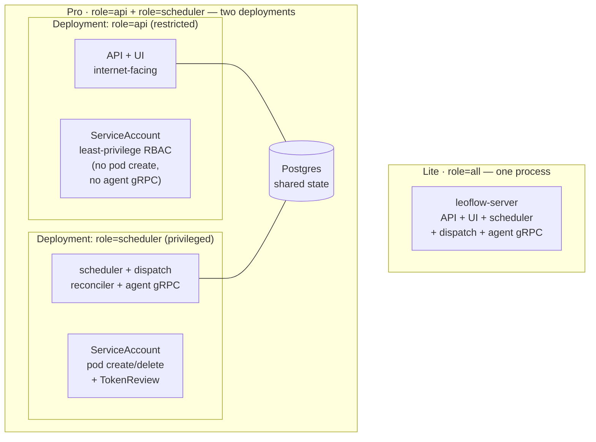

---
# --- AUTO redirect aliases (build_redirects.py) — do not edit by hand ---
aliases:
  - /editions.html
  - /operating-modes.html
# --- end AUTO redirect aliases ---
title: Editions & operating modes
linkTitle: Editions & modes
weight: 10
description: The two editions (Lite and Pro) and the three runtime modes (Lite · Pro · Demo) — one engine, one UI, one DAG format.
---

Leoflow ships in **two editions** that share the same engine, the same
Airflow-3.2.x UI, and the same DAG format (`dag.py` + `leoflow.yaml`): **Lite**
(the full control plane on one host — laptop, VM, or internal server) and **Pro**
(Helm-installed on Kubernetes). You author a DAG once and it runs on either. A
third, contributor-facing **Demo** mode is a production-shaped reference
environment used to validate UI compatibility — it is not an end-user surface.

{}
**Lite** is the local single-host edition; **Pro** is the Helm/Kubernetes
deployment. Both are supported today.

Pro is pre-1.0, which under SemVer means breaking changes ship between minor
versions with a migration note (ADR 0037). Read the release notes before
upgrading; that is the caveat, not an unsupported edition.
{}

## Editions at a glance (packaging & posture)

| | **Lite** | **Pro** |
|---|---|---|
| Status | **Supported** — single host | **In validation** — Helm on Kubernetes (tested against GKE; pin a tag) |
| Install | one command (`curl … \| sh`) on one machine | [Helm chart](https://github.com/neochaotic/leoflow/blob/main/helm/leoflow/README.md) on your cluster |
| Command | `leoflow lite` | the deployed control plane |
| Auth | a single local **admin** login (password shown once at setup) | enterprise: SSO/OIDC, full RBAC, multi-tenant |
| Executors | a local **k3d** mini-cluster (real pods, **requires Docker** to host the cluster) or **subprocess** (dev-only, unsandboxed, no Docker) | **Kubernetes only**, at scale |
| Deploy | edit + hot-reload | GitOps: `leoflow compile` in CI → immutable image + `dag.json` |
| Intended use | local, small, or **light production** projects on a **trusted/internal network** | teams and production workloads at scale |
| Datastores | **Postgres, auto-selected** (Docker `postgres:16` or embedded managed); **no Redis** — see [below](#datastore-auto-selected-no-redis) | **external** managed Postgres + Redis ([versions](https://github.com/neochaotic/leoflow/blob/main/helm/leoflow/README.md#datastore-compatibility)) |

## Runtime modes (Lite · Pro · Demo)

This is the **runtime details** view — exact ports, database names, cluster
names, and CLI surface per mode.

| | **Lite** (`leoflow lite`) | **Pro** *(in validation)* | **Demo** (contributor) |
|---|---|---|---|
| Auth | **Real admin login** (single admin generated by `leoflow setup`; password recoverable via `leoflow lite reset-password`) | JWT + RBAC, TLS (#58), workload identity (#56) | JWT login (real) |
| UI marker | **`Leoflow Lite`** navbar (silver edition badge) | **`Leoflow`** navbar (gold edition badge) | none (`instance_name: Leoflow`) |
| HTTP / gRPC / metrics | **8088 / 9099 / 9098** (distinct, coexists with Demo) | **8080 / 9091 / 9090** (per `helm/leoflow/values.yaml`; shares Demo's ports — not co-located on the same host) | 8080 / 9091 / 9090 |
| Database | **`leoflow_dev`** (isolated; legacy schema name preserved for upgrade-in-place safety after the Dev → Lite rename) | external Postgres | `leoflow` |
| Cluster | **k3d `leoflow-dev`** (isolated; legacy cluster name preserved) | real K8s (GKE/EKS) | k3d `leoflow-demo` |
| DAG source | **live files, hot-reload** | immutable artifact via CI | frozen artifact (`compile` + `push`) |
| Executor | k3d pods (default) or subprocess (`--executor`) | KubernetesExecutor | KubernetesExecutor |

## Leoflow Lite

Lite is the whole control plane on your machine, scoped down for local use. One
command installs it, [`leoflow setup`](/get-started/installation/#what-leoflow-setup-does)
provisions a managed Python and a single admin, and `leoflow lite <project>`
serves the UI with hot-reload at <http://localhost:8088> (marked **Leoflow Lite**
in the navbar, login enabled). Edit `dags/<project>/dag.py` or `leoflow.yaml`,
save, and it hot-reloads — fully **isolated** from Demo (own DB, own cluster, own
ports) so there is no split brain.

- `leoflow doctor` — check the host (OS, Docker/k3d/kubectl/python3) and report
  the achievable executor tier.
- `leoflow lite dags/hello` — run a project (k8s executor: real k3d pods).
- `leoflow lite --executor=subprocess dags/hello` — fast host loop (no image build).
- `leoflow db migrate|reset` — manage the Lite database (Airflow-style).

It is deliberately simple, which has security implications:

{}
Lite's admin password is short and human-friendly (easy to type), and it is a
single local admin — there is no SSO/RBAC. Run Lite on **localhost, an internal
network, or a VPN**. Do **not** expose a Lite instance to the public internet.
For team/production use, that is what the Pro edition is for.
{}

Lite also includes a small built-in **[web editor](/author-dags/lite-web-editor/)**
(Monaco, with Python/YAML highlighting) so you can edit DAG projects from the
browser — a Lite-only convenience; Pro teams use their own editor and the GitOps
flow.

The Dev → Lite rename is a **product/branding** change — the internal storage
names (`leoflow_dev` database, `leoflow-dev` k3d cluster) are preserved so existing
installs upgrade in place.

### Datastore (auto-selected), no Redis

Lite's datastore is **Postgres, chosen automatically for the host**: when Docker is
present it uses the `postgres:16` container; when it is not, it falls back to an
**embedded managed Postgres** (a pinned, checksum-verified relocatable build
downloaded under `~/.leoflow`, on a local Unix socket) — so `leoflow lite` runs on
a **Docker-free host with nothing to install**. (Force either with
`--postgres docker|managed`.)

Either way Lite needs **no Redis** — scheduler locks use Postgres advisory locks and
XCom is stored in Postgres. The Postgres-backed XCom is *durable* (it survives a
restart), which suits light production, and a single datastore is simpler to
operate; Redis is a production-scale concern. (See
[ADR 0026](/project/adrs/0026-lite-datastore-no-redis/).)

{}
Lite's [BufferedDispatcher](/project/adrs/0031-scheduler-architecture/) uses
`BufferSize=0` — task dispatch runs synchronously on the scheduler tick, one task
at a time. A fan-out DAG with N parallel branches still **executes** in parallel
inside the cluster (real pods, or subprocesses), but the **launch** of those tasks
is serialized through one goroutine. This is what makes Lite cheap to operate on a
single machine. For higher launch throughput, Pro uses `BufferSize>0` +
`Workers>1` (a bounded pool).
{}

For task execution, the **k3d** path runs real pods and therefore **requires Docker
to host the cluster** — but Docker is only the *substrate* of k3d, never an
executor: Lite talks to the Kubernetes API, and a Docker-socket executor was
rejected because it is **equivalent to host root**. `subprocess` runs tasks directly
on the host (no Docker, no isolation) as an explicitly dev-only escape hatch. (See
[ADR 0027](/project/adrs/0027-product-editions-executors-delivery/).)

## Leoflow Pro (chart-installable)

Pro is the enterprise control plane: enterprise authentication (SSO/OIDC), full
role-based access control, multi-tenant isolation, the Kubernetes executor at
scale, first-class observability, and the GitOps deploy flow (DAGs as immutable
images + `dag.json`, shipped from CI). The Helm chart is **Helm-installable and in
active validation** — tested against GKE, not yet certified for production. Pin a
specific tag and read the release notes before upgrading (pre-1.0, breaking changes
ship between minor versions with a migration note, ADR 0037).

Install via the **[Helm chart](https://github.com/neochaotic/leoflow/blob/main/helm/leoflow/README.md)**
(chart-test gated, multi-arch images published per release, signed with cosign).
Hardening templates ship as opt-in toggles: HPA + NetworkPolicy + ServiceMonitor;
the PodDisruptionBudget turns itself on when the control plane runs more than one
replica (see [Control-plane HA](/operate/control-plane-ha/)). Runs on any K8s
cluster with external Postgres + Redis.

### Deployment topology (role split)

Pro can run the control plane as **one process** or **split into two deployments**
by `server.role` ([ADR 0049](/project/adrs/0049-split-api-and-scheduler-roles/)).
Lite is always `role=all`. Splitting lets the internet-facing API run under
least-privilege RBAC while only the scheduler holds pod-create and agent-facing
rights; the two halves share nothing but Postgres.

See the [architecture overview](/concepts/architecture/) for how the roles sit in
the whole system.

## Demo *(contributor reference)*

The familiar, production-like environment **for contributors** to validate the
Airflow-UI compatibility and showcase the product. It serves frozen artifacts — to
change a DAG you `leoflow compile` + `leoflow push`. Auth is on; log in normally.
Demo is the target for [UI compatibility](/concepts/ui-compatibility/) work and is
referenced from the [contributing guide](/contribute/contributing/).

## Which one? (recommendation)

**Choose by deployment, not by feature checklist:**

- **Choose Lite** when you run on **one machine** (laptop, a small VM, an internal
  box), want a **one-command, Docker-free install**, and your workload is local
  development, a small project, or **light production** on a trusted/internal
  network. Lite goes from zero-dependency (`subprocess`) to real pod-per-task
  (`k3d`) on the same binary, with a durable embedded Postgres.
- **Choose Pro** when you need **Kubernetes at scale**, a team (SSO/OIDC + RBAC +
  multi-tenant), high XCom throughput, external managed datastores, and the GitOps
  deploy flow — delivered as the **Helm chart**.

Rule of thumb: if it fits on one host and the network is trusted, Lite is enough;
when you need a cluster, multiple users, or scale, that's Pro. Because both editions
share the DAG format, the engine, and the UI, a DAG authored on Lite carries
straight over to Pro **unchanged** — going from a single host to a cluster is a
deployment change, not a DAG rewrite.
