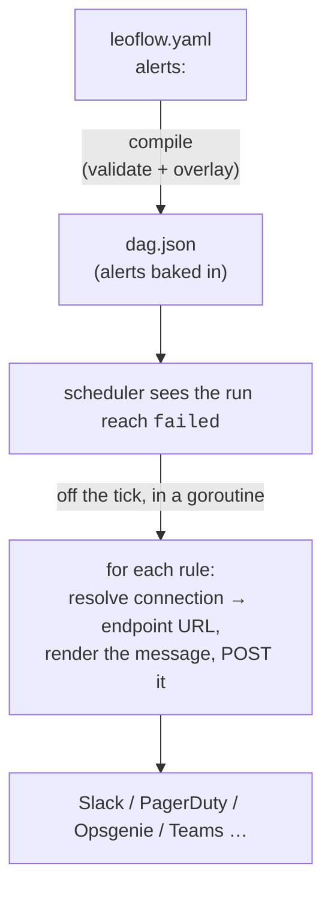

Leoflow can **notify you when a run fails** — Slack or a generic webhook — with no
extra task and no Python. You declare the rules in `leoflow.yaml`; the **scheduler
fires them in Go** the moment a DagRun reaches the terminal `failed` state.

```yaml
# leoflow.yaml
alerts:
  on_failure:
    - type: slack
      conn: slack_prod
      message: "🚨 {{dag}} run {{run_id}} failed on {{task}}"
    - type: webhook
      conn: pagerduty
```

That's it. Compile and deploy as usual — when a run of this DAG fails, both the
Slack message and the PagerDuty webhook fire.

{}
This runs in the control plane on the terminal failure — no task pod, no Python in
the hot path, and it can't be skipped by an upstream failure the way a notify *task*
can. For the task-based pattern (and its trade-offs) see
[When to use a task instead](#when-to-use-a-task-instead).
{}

## How it works



Three guarantees hold by design:

- 🔒 **The secret stays in the connection.** The webhook URL (which *is* a secret)
  lives encrypted in a managed connection — never in `leoflow.yaml` and never in
  the compiled `dag.json`.
- 🛟 **Best-effort.** A delivery that fails (a 500, a bad URL, a missing
  connection) is logged and dropped — it can **never** fail the run, and one bad
  rule never stops the others.
- ⚡ **Off the tick path.** Alerts dispatch in a detached goroutine, so a slow
  endpoint can't stall the scheduler.

## Setting up the connection

The endpoint URL is stored as the connection's **secret** (so it's encrypted at
rest). Create the connection once, then reference it by id from any DAG.


{}
Create a [Slack incoming webhook](https://api.slack.com/messaging/webhooks)
and store its full URL:

```console
$ curl -X POST .../api/v2/connections -d '{
    "connection_id":"slack_prod","conn_type":"slack",
    "password":"https://hooks.slack.com/services/T00000000/B00000000/XXXXXXXX"}'
```
{}
{}
Any endpoint that accepts a JSON `POST` (PagerDuty Events v2, Opsgenie, a
Microsoft Teams incoming webhook, your own service):

```console
$ curl -X POST .../api/v2/connections -d '{
    "connection_id":"pagerduty","conn_type":"http",
    "password":"https://events.pagerduty.com/v2/enqueue"}'
```
{}


{}
The webhook URL goes in `password` on purpose: Leoflow encrypts it at rest and
hands it straight to the sender at failure time. `host`/`login`/`schema` are
ignored for alert connections.
{}

## The message

`message` is optional. When set, these placeholders are substituted at failure
time; when omitted, Leoflow sends a default one-line summary.

| Placeholder        | Becomes                                             |
| ------------------ | --------------------------------------------------- |
| `{{dag}}`          | the DAG id                                              |
| `{{run_id}}`       | the run id you see in the UI (`manual__2026-07-30T…`)   |
| `{{logical_date}}` | the run's logical date, RFC3339                         |
| `{{task}}`         | the first task that failed                              |
| `{{tasks}}`        | every failed task, comma-separated                      |

A placeholder with no value for this run renders `(none)` rather than an empty
string. Anything else in `{{…}}` is a **compile error**, naming the offending
placeholder and listing what is available.

**What each channel receives:**

- **`slack`** → Slack's incoming-webhook shape: `{"text": "<your message>"}`.
- **`webhook`** → a structured JSON body, so your service can route on it:

  ```json
  {
    "dag_id": "sales",
    "run_id": "manual__2026-07-17T09:00:00Z",
    "logical_date": "2026-07-17T09:00:00Z",
    "failed_tasks": ["transform"],
    "message": "🚨 sales run … failed on transform"
  }
  ```

## When to use a task instead

The `alerts:` block is the right default. But if you need the notification to run
your **own code** (enrich the payload, hit an internal API, page via a provider
operator), add a notify **task** guarded by a failure trigger rule — it runs in a
pod with full operator fidelity:

```python
alert = SlackWebhookOperator(
    task_id="alert", slack_webhook_conn_id="slack",
    message="pipeline failed 🚨", trigger_rule="one_failed",
)
[extract, transform] >> alert
```

Trade-off: a task runs a pod and is itself a task in the graph (it can be skipped
if the whole run is torn down), whereas the native `alerts:` block always fires on
the terminal failure, in the control plane, for free.

## Reference

| Field                      | Required | Notes                                              |
| -------------------------- | -------- | -------------------------------------------------- |
| `alerts.on_failure[].type` | yes      | `slack` or `webhook`                               |
| `alerts.on_failure[].conn` | yes      | managed connection id; its secret = the endpoint URL |
| `alerts.on_failure[].message` | no    | templated (see above); empty → default summary     |

{}
Two on-failure surfaces ship: the native `alerts:` block (this page's focus,
firing on the terminal **DagRun** failure) and Airflow's per-task
`on_failure_callback`, which runs in the task's pod on its terminal failure.
`on_success` / `on_retry` callbacks and SLA-miss alerts are not wired yet (a loud
compile error, never a silent drop) — tracked in
[#424](https://github.com/neochaotic/leoflow/issues/424).
{}
