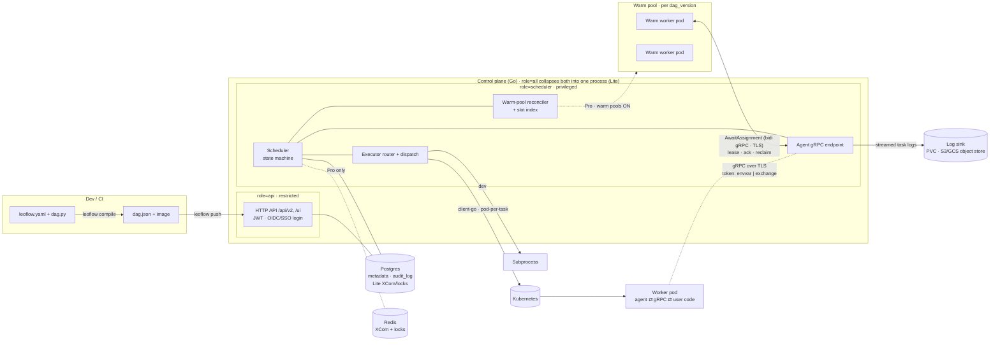
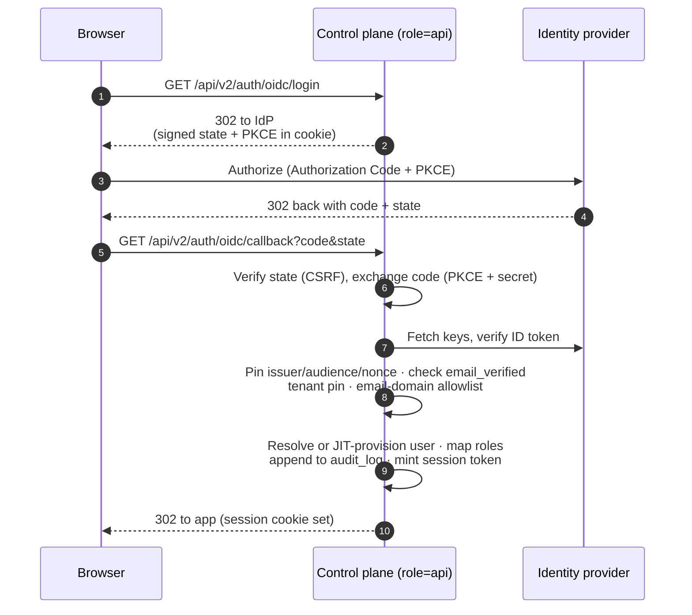

The two halves of the control plane are separate deployments joined only by
Postgres ([ADR 0049](https://github.com/neochaotic/leoflow/blob/main/docs/adr/0049-split-api-and-scheduler-roles.md));
`role=all` collapses them into one process for Lite.

**Control plane (Go).** Gin HTTP serving the Airflow-compatible `/api/v2/*` and
`/ui/*`; a goroutine-based scheduler (state machine, leader-elected via Postgres
advisory locks — [ADR 0009](https://github.com/neochaotic/leoflow/blob/main/docs/adr/0009-leader-election.md)); an
executor router (Kubernetes via client-go, subprocess for dev —
[ADR 0002](https://github.com/neochaotic/leoflow/blob/main/docs/adr/0002-pod-per-task.md); the inline http_api path was removed,
[ADR 0047](https://github.com/neochaotic/leoflow/blob/main/docs/adr/0047-deprecate-native-inline-http.md)).

**Split roles — API and scheduler.**
`server.role` selects which components a process runs. `role=api` serves only the
HTTP API + UI — a **restricted** network identity with no cluster-write and no
agent gRPC listener; `role=scheduler` runs the **privileged** half: the
state-machine scheduler, executor dispatch, the warm-pool reconciler, and the
agent gRPC endpoint. Split across two deployments, the two halves share nothing
but Postgres, so the internet-facing API can run under least-privilege RBAC while
only the scheduler holds pod-create and agent-facing rights. `role=all` (the
default, and Lite's only mode) collapses both into one process, byte-for-byte the
historical monolith.

**Authentication.** The API authenticates every request with a bearer JWT
([ADR 0008](https://github.com/neochaotic/leoflow/blob/main/docs/adr/0008-jwt-auth.md)). For human login it also supports
**OIDC/SSO** ([ADR 0057](https://github.com/neochaotic/leoflow/blob/main/docs/adr/0057-oidc-sso.md)): an Authorization Code + PKCE
flow against an external identity provider, ID-token verification (issuer pin,
audience, nonce, `azp`, clock skew, `email_verified`, **tenant pin**, and an
email-domain allowlist), just-in-time user provisioning with IdP-authoritative
role mapping, after which the control plane mints its own session token. A
verification failure is a hard `403` that never falls back to a default identity.

**Worker pod.** Each task runs in its own pod from the DAG's image. The
**agent** (Go, PID 1) talks gRPC to the control plane: fetches the task spec,
runs the user code, streams logs, pushes XCom, reports state. That channel is
**TLS** — one-way (server) TLS: the agent verifies the control plane's certificate
against a CA and authenticates itself with its bearer token, never a client cert.
The Helm chart auto-generates a stable self-signed CA + server cert by default
(`agentTLS.autoGenerate`), so a stock Pro install is encrypted without cert-manager.

**Audit.** Privileged actions and auth events are appended to a tenant-scoped
**`audit_log` table in Postgres** — not a log file — so the trail is queryable and
transactional with the data it describes.

**Task logs.** The agent streams a task attempt's logs to the control plane
(`StreamLogs` on the scheduler role's gRPC endpoint), which persists them to a
**sink**: a `PersistentVolumeClaim` by default, or an **S3 / GCS object store**
for shared multi-team clusters, where the object store's own lifecycle policy
handles retention. Each backend uses its native, keyless-first SDK.

**State.** Postgres holds metadata for every edition; on **Lite** it also holds
XCom and the scheduler's advisory locks (no Redis required).
On **Pro**, Redis stores XCom (≤256 KB) and the multi-node locks.

**Stack:** Go 1.26 · Gin · sqlc/pgx · golang-migrate · client-go · gRPC ·
log/slog · Prometheus · OpenTelemetry · Cobra · Viper. Python only in the DAG
parser sidecar and inside user task containers.

## Authentication: OIDC/SSO login flow

With OIDC configured, a browser logging in never sees a Leoflow password — it is
redirected to the identity provider, and the control plane only trusts the identity
once the returned ID token passes every check, including the **tenant pin**. On
success the browser carries a Leoflow session token, exactly as a password login
would.

Any failed check is a `403` that is audited and never falls back to a default
identity.

See the [Architecture Decision Records](https://github.com/neochaotic/leoflow/tree/main/docs/adr)
for the *why*.
