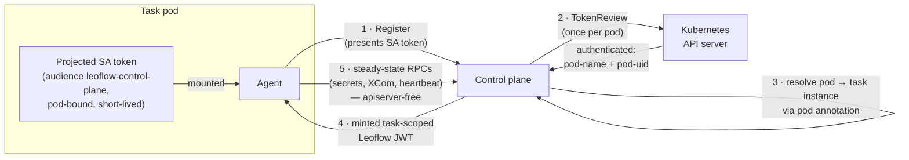
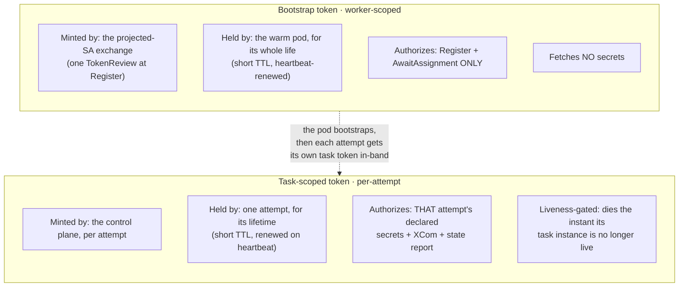

---
# --- AUTO redirect aliases (build_redirects.py) — do not edit by hand ---
aliases:
  - /agent-credential-transport.html
# --- end AUTO redirect aliases ---
title: Agent credential transport
weight: 90
description: "How declared secrets reach the in-container agent, and the trust boundary."
---

Every task pod runs a Leoflow **agent** ([ADR 0004](/project/adrs/0004-thin-agent/)) that
talks to the control plane over gRPC to fetch the task spec, resolve the task's
Variables and Connections, push XCom, and report state. To do that the agent needs
a **bearer credential** the control plane trusts. How that credential reaches the
pod is the **agent token transport**, selected by
`auth.agent_token_transport` — **operator-scoped, never DAG-author-settable**.

There are two transports: **`envvar`** (the default; today's behavior, byte-for-byte)
and **`exchange`** (the projected-ServiceAccount-token path). The exchange transport
is a **prerequisite for [warm worker pools](/operate/warm-pools/)**.

{}
Both transports concern the Kubernetes executor. Lite runs the agent as a
subprocess of the server with an in-process credential handoff — there is no pod
spec, no ServiceAccount, and no `TokenReview` — so this setting does not apply to
Lite.
{}

## `envvar` — the plaintext bearer (default)

With `auth.agent_token_transport=envvar`, the control plane mints a Leoflow JWT at
dispatch and sets it as a plaintext `LEOFLOW_AGENT_TOKEN` environment variable on the
task pod's spec. This is the historical behavior and remains the default so that
nothing regresses.

The in-pod agent reads the variable; an agent-only environment strip removes it (and
every other `LEOFLOW_`-prefixed variable outside a tiny allowlist) before user code
runs, so **task code cannot read the token from its own process environment**.

The residual exposure this transport cannot close: the token sits **in plaintext on
the `Pod` object in etcd**. Any principal with `get pods` in the task namespace can
read it (`kubectl get pod -o yaml`, the Kubernetes API, any controller or audit sink
that logs pod specs). The in-process strip closes the task's own read path; it does
nothing for the cluster read path. That, plus the fact that a single per-pod
credential cannot carry a **per-attempt** identity, is why warm pools cannot use this
transport.

## `exchange` — projected SA token + TokenReview

With `auth.agent_token_transport=exchange`, **no bearer credential sits on the pod
object at all.** Instead the pod mounts a **projected ServiceAccount token**
(audience `leoflow-control-plane`, pod-bound, short-lived, auto-rotated by the
kubelet). The agent presents that token **once**, and the control plane exchanges it
for a task-scoped Leoflow JWT:

1. **Register.** At `Register` the agent presents the projected SA token.
2. **TokenReview — once per pod.** The control plane calls the Kubernetes
   `TokenReview` API to validate the token. This call lands **inside the window the
   API server was already required to create the pod**, so the net added API-server
   coupling is ≈ 0. (Doing a `TokenReview` on *every* secret fetch was explicitly
   rejected — it would load the API-server budget on the secret hot path, and an SA
   token identifies the ServiceAccount, not the attempt.)
3. **Resolve pod → task instance.** From the authenticated pod identity the control
   plane resolves the exact task instance via the pod's identity annotation (pod
   labels are sanitized and lossy, so the annotation is the single-sourced contract).
4. **Mint a task-scoped JWT.** The control plane returns a **task-scoped Leoflow JWT**
   — the identity that secret scoping filters on and that liveness enforcement checks.
5. **Apiserver-free steady state.** Every steady-state RPC (secrets, XCom, heartbeat)
   authenticates with **that JWT**. The projected SA token was a bootstrap credential
   exchanged exactly once, not a per-fetch capability — so the secret hot path never
   touches the API server.

The invariant this satisfies is unconditional: **no bearer credential is ever a
plaintext field on the `Pod` object.** (For a cluster that cannot project a
ServiceAccount token, a `SecretKeyRef` fallback sources the credential from a
Kubernetes Secret rather than a plaintext value — still off the plaintext pod spec.)

## The two-token model

Under a warm pool the exchange cleanly separates a **pod-scoped** credential from an
**attempt-scoped** one — the property that makes reusing a pod across attempts safe:

| | Bootstrap token | Task-scoped token |
|---|---|---|
| **Scope** | worker (pod) | one attempt |
| **Minted by** | the projected-SA exchange (TokenReview at `Register`) | the control plane, per attempt, delivered in-band |
| **Lifetime** | pod lifetime; short TTL, heartbeat-renewed | the attempt; short TTL, renewed on heartbeat |
| **Authorizes** | `Register` + `AwaitAssignment` only | that attempt's declared secrets, XCom, state report |
| **Reaches the vault?** | **no** | yes — only its declared subset |
| **Liveness-gated?** | authenticates the pod only | **yes** — stops resolving secrets the instant its task instance is not live |

The task-scoped token is what "dies with the attempt": because it is minted per
attempt, short-lived, and gated on task-instance liveness, a finished or superseded
attempt's token stops resolving secrets **regardless of the clock**. On a reused pod
that is exactly what stops one attempt's credential from bleeding into the next.
This blast-radius argument holds **only** when `secret_liveness_mode=enforce`; under
the `observe` default a superseded attempt's token would still resolve secrets. That
is why warm pools require **both** `agent_token_transport=exchange` **and**
`secret_liveness_mode=enforce`, validated fail-closed at boot — see
[Warm worker pools → How to enable](/operate/warm-pools/#how-to-enable).

## RBAC — the `tokenreviews` grant

The `TokenReview` call requires a **cluster-scoped** RBAC grant
(`create` on `authentication.k8s.io/tokenreviews`) for the control plane's
ServiceAccount. Token review is inherently cluster-scoped — it is not namespaced —
so this is a `ClusterRole` + `ClusterRoleBinding`, not a namespaced `Role`.

The Helm chart renders that `ClusterRole` and binding **only when the exchange
transport is selected**. On the default `envvar` transport nothing cluster-scoped is
created, so a default install grants the control plane no cluster-wide permission it
does not need. Selecting `exchange` is what opts the deployment into the
`tokenreviews` grant.

## Relationship to secret scoping

The transport is one of four related knobs from
[ADR 0055](/project/adrs/0055-secret-scoping-and-token-liveness/). They narrow different
dimensions of the same credential and are configured independently:

| Knob | Controls | Default | Notes |
|---|---|---|---|
| `agent_token_transport` | **how** the credential reaches the pod | `envvar` | `exchange` keeps it off the plaintext pod spec and enables per-attempt identity. |
| `secret_liveness_mode` | **when** a token stops resolving secrets | `observe` | `enforce` denies a not-live token's secret reads. Always-on liveness renewal underlies both modes. |
| `secret_scoping` | **what** a task may fetch | `permissive` | `enforce` delivers only the DAG's declared subset; `off` disables scoping. |
| `max_attempt_credential_lifetime` | **how long** an attempt's renewed credential may live — also the `activeDeadlineSeconds` floor of a task pod with no declared `execution_timeout`, and the warm-pool per-attempt watchdog | `24h` | A runaway-task backstop for the credential, the pod and the warm slot; the short per-attempt TTL is what bounds a stolen token. Non-positive disables all three — a wedged task then has no wall-clock bound of its own — and boot logs a `WARN`. |

Warm pools require `agent_token_transport=exchange` **and**
`secret_liveness_mode=enforce`. `secret_scoping` and
`max_attempt_credential_lifetime` are independent hardening choices with their own
rollout arcs. All are operator-scoped and documented in the
[Configuration reference](/reference/configuration/#server-environment-leoflow_).

## See also

- [Warm worker pools](/operate/warm-pools/) — the feature that requires the exchange transport.
- [Variables & Connections](/author-dags/variables-connections/) — what the task-scoped token resolves.
- [ADR 0055 — Secret scoping and token liveness](/project/adrs/0055-secret-scoping-and-token-liveness/).
- [ADR 0004 — The thin agent](/project/adrs/0004-thin-agent/).
- [Configuration reference](/reference/configuration/).
