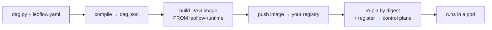

This is the end-to-end Pro path: take one DAG from source to a running task on a
control plane — in **one command**. Where the 2-minute [Lite loop](/contribute/local-dev-loop/)
hides the artifact boundary so you can iterate, Pro makes it explicit, because that
boundary is what `leoflow deploy` automates for you.

A DAG is an **immutable artifact** — a `dag.json` + a container image, versioned
together ([ADR 0003](/project/adrs/0003-dag-as-image/)). `leoflow deploy` moves it across
every boundary in one shot:



{}
- **The simple path (below)** — a minimal DAG with a `Dockerfile`, deployed
  today with `leoflow deploy`. Everything here runs as-is.
- **[The complete path](#the-complete-path-your-own-dag-yaml-driven)** — author
  your own DAG with **no Dockerfile** (the build is synthesized from
  `leoflow.yaml`) and real `connectors:`. That richer flow is still landing;
  it is shown at the end so you can see where this is going.
{}

## Prerequisites

- **`docker`** (or `podman`/`nerdctl` — pass `--builder`). Used to build and push
  the DAG image. On Docker Desktop, cross-building for the cluster "just works".
- The **`leoflow` CLI** and Python 3.11+ on your machine (`leoflow setup` once).
- **A container registry your cluster can pull from** — anywhere: Docker Hub, GHCR,
  Amazon ECR, Google Artifact Registry, Azure ACR, or a private one. You push the
  DAG image there; the control plane pulls it. (Lite needs none — this is a Pro
  thing.)
- **A reachable Pro control plane.** A throwaway one comes from the
  [Helm chart](/operate/helm-chart/).

## Step 0 — log in once

```console
$ leoflow auth login --server https://pro.example.com
Username: admin
Password:
Logged in to https://pro.example.com (token saved to ~/.leoflow/config.yaml)
```

The token is stored, so every later `leoflow deploy` needs **no auth flags**. The
password is read hidden — it never lands in your shell history. (This is the
control-plane login; it is unrelated to `docker login`, which authenticates your
*builder* to the registry — do that once too: `docker login ghcr.io`.)

## Step 1 — a project (`dag.py` + `leoflow.yaml` + `Dockerfile`)

```python title="dag.py"
from airflow.sdk import DAG, task

@task
def extract() -> dict:
    return {"rows": 42}

@task
def load(data: dict) -> None:
    print(f"loaded {data['rows']} rows")

with DAG("first_pro_dag", schedule=None) as dag:
    load(extract())
```

```yaml title="leoflow.yaml"
dag_id: first_pro_dag
python_version: "3.11"
dependencies:
  - requests==2.32.3
registry:
  # Wherever you want the artifact to live — this is just an example.
  # Docker Hub: docker.io/your-user · ECR: <acct>.dkr.ecr.<region>.amazonaws.com
  # Artifact Registry: <region>-docker.pkg.dev/<project>/<repo> · GHCR: ghcr.io/your-org
  url: ghcr.io/your-org
  image_name: first-pro-dag
```

```dockerfile title="Dockerfile"
FROM ghcr.io/neochaotic/leoflow-runtime:py3.11
RUN pip install --no-cache-dir requests==2.32.3
COPY dag.py /home/leoflow/dag.py
ENV PYTHONPATH=/home/leoflow
```

{}
Your image layers `FROM` the **published Leoflow task base**
(`ghcr.io/neochaotic/leoflow-runtime:py3.11`) — it bundles the `leoflow-agent`
(PID 1, talks gRPC to the control plane) and the `leoflow_runtime` helper, is
multi-arch and signed, and is built by our CI. You only add your deps and copy
your DAG in. (In [the complete path](#the-complete-path-your-own-dag-yaml-driven)
even this Dockerfile goes away — it is synthesized from `leoflow.yaml`.)
{}

## Step 2 — deploy (one command)

```console
$ leoflow deploy
Deploy first_pro_dag -> https://pro.example.com? [y/N] y
…  (compile → build for linux/amd64 → push → register)
Deployed first_pro_dag -> https://pro.example.com
  image ghcr.io/your-org/first-pro-dag@sha256:9f2c…
  registered version 1a2b3c4
```

That one command crossed every boundary:

1. **compile** — parsed `dag.py`, overlaid `leoflow.yaml`, ran the guardrails
   (unknown `task_id`, unsupported operator, duplicate keys), wrote `dag.json`.
2. **build** — built the image from your `Dockerfile`, **for the cluster's
   architecture** (`linux/amd64` by default, so a macOS/arm64 laptop produces an
   image the cluster can actually run).
3. **push** — pushed it to your `registry:`.
4. **re-pin + register** — captured the image **digest** and wrote
   `…@sha256:…` into `dag.json`, then registered that with the control plane. Pro
   now pulls **exactly** the bytes you built — no `:latest` drift.

{}
`deploy` publishes the artifact; a scheduled DAG then runs on its schedule.
Add `--trigger` to kick a run immediately, or trigger from the Airflow UI.
{}

## Step 3 — trigger and watch it run

```console
$ leoflow deploy --trigger
…
Deployed first_pro_dag -> https://pro.example.com
  image ghcr.io/your-org/first-pro-dag@sha256:9f2c…
  registered version 1a2b3c4
  triggered run manual__1717525200
```

The scheduler pulls your image, runs each task in its own pod, and the Airflow UI
shows state and logs. That is the whole Pro lifecycle, in one verb.

## When it doesn't work

`deploy` fails loudly and tells you the fix. The four you'll actually hit:

| Symptom | Cause | Fix |
|---|---|---|
| `deploy requires a container registry…` | no `registry:` in `leoflow.yaml` | add the `registry:` block (Step 1) and `docker login <registry>` |
| `denied` / `unauthorized` on push | builder not logged in to the registry | `docker login ghcr.io` (registry auth ≠ control-plane auth) |
| Task pod: `exec format error` | image arch ≠ cluster arch | already handled — deploy builds `linux/amd64`; for a Graviton cluster pass `--platform linux/arm64` |
| DAG runs but a task fails on a missing `conn_id` | connections live in the control plane, **not** in the image | deploy prints `note: this DAG expects connection(s): …` — create them on Pro (UI/API) first; see [Variables & Connections](/author-dags/variables-connections/) |

## Deploy more than one DAG

```bash
leoflow deploy <dag_id>     # a specific DAG in a multi-DAG workspace
leoflow deploy --all        # every DAG in the workspace (best-effort; non-zero exit if any fail)
leoflow deploy --skip-build # promote an already-built image without rebuilding
```

## The complete path — your own DAG, yaml-driven

{}
The flow below is the **complete, Dockerfile-free** authoring experience. The
yaml-driven build (synthesizing the image from `leoflow.yaml`) is still
landing. On the current release, keep the `Dockerfile` from Step 1.
This section shows where the happy path is going.
{}

When the yaml-driven build lands, the project is **two files** — no Dockerfile, no
`requirements.txt`:

```python title="dag.py"
from airflow.sdk import DAG, task
from airflow.providers.postgres.hooks.postgres import PostgresHook  # inside a @task

@task
def load() -> int:
    rows = PostgresHook(postgres_conn_id="warehouse").get_first("SELECT count(*) FROM orders")[0]
    print(f"orders: {rows}")
    return rows

with DAG("orders_report", schedule="@daily") as dag:
    load()
```

```yaml title="leoflow.yaml"
dag_id: orders_report
python_version: "3.11"
connectors:
  - postgres            # installs the provider; the form renders in the UI
registry:
  url: ghcr.io/your-org
  image_name: orders-report
```

```console
$ leoflow auth login --server https://pro.example.com   # once
$ leoflow deploy --trigger
note: this DAG expects connection(s): warehouse
      create them on the control plane (UI or API) before the run.
Deployed orders_report -> https://pro.example.com
  image ghcr.io/your-org/orders-report@sha256:… · triggered run manual__…
```

`leoflow compile --build` synthesizes the image from the yaml — `FROM` our base,
your `connectors:`/`dependencies:` installed, your DAG copied in. The only
Dockerfiles in the repo are the ones under `examples/`.

## From here

- **Automate it.** `leoflow deploy` is exactly what a pipeline runs on every push —
  see [CI/CD & deploy examples](/operate/cicd-deploy/) for GitHub Actions / GitLab / Cloud Build
  recipes (and the Python-on-the-runner notes).
- **The design.** [ADR 0041](/project/adrs/0041-leoflow-deploy-pipelineless/) records why
  deploy works the way it does (registry mandatory, digest pinning, two-tier path).
