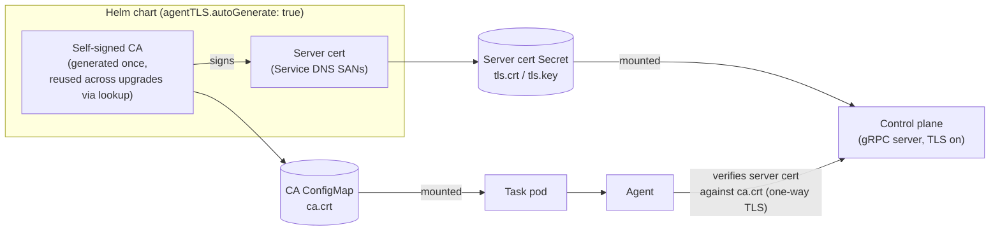

---
# --- AUTO redirect aliases (build_redirects.py) — do not edit by hand ---
aliases:
  - /pro-tls.html
# --- end AUTO redirect aliases ---
title: Pro TLS (cert-manager)
linkTitle: Pro TLS
weight: 100
description: Terminate TLS on the Pro control plane with cert-manager.
---

The Pro control plane delivers secrets (Connections, Variables) to task pods over
gRPC. In Pro that channel **must be TLS** — the server refuses to boot without it
(#281).

{}
The chart **auto-generates** a stable self-signed CA + server cert by
default (`agentTLS.autoGenerate: true`, reused across upgrades) — so
`helm install` needs **no cert-manager and no pre-created Secret**, and TLS
is still on. That default is live on `main` today and ships in the first
release cut after it; see the
[Quickstart](/get-started/installation/#quickstart-one-command-any-cloud).
This page is the **opt-in production path**: cert-manager-issued (or
externally-rooted) certs with automatic rotation. It is also the path you
**must** use under **GitOps** (ArgoCD/Flux), where cluster-less rendering
can't `lookup` the existing Secret and auto-gen is unsafe.
{}

## How the trust flows

The channel is **one-way (server) TLS**, not mutual mTLS: the **agent verifies the
server**, and the agent's own identity is its **bearer token**
([agent credential transport](/operate/agent-credential-transport/)), never a client cert.
So provisioning a cert is only ever about the *server* side of the handshake.



On a default install the chart **auto-generates** the CA and server cert itself:
the CA signs the server leaf (carrying the control-plane Service DNS as SANs), the
leaf lands in the server cert Secret the control plane mounts, and the CA's
`ca.crt` lands in a ConfigMap every task pod mounts so the agent can verify the
server. The material is generated **once and reused on every `helm upgrade`** (the
chart reads the existing objects via Helm `lookup`), so the CA never rotates and
running agents keep trusting it. That is why a fresh cluster installs with TLS on
and **no cert-manager and no pre-created Secret** — see the
[Quickstart](/get-started/installation/#quickstart-one-command-any-cloud).

The rest of this page is the **opt-in production path** — cert-manager-issued (or
externally-rooted) certs with automatic rotation — and the **required** path under
GitOps, where a cluster-less `helm template` render cannot `lookup` the live Secret
and auto-gen would rotate the CA on every sync.

Setting `agentTLS.serverCertSecret` **and** `agentTLS.caConfigMap` makes the
chart use them verbatim and skip auto-generation. The clean way to provision
that cert is [cert-manager](https://cert-manager.io).

An operator-ready values file is at
[`helm/leoflow/examples/values-pro-tls.yaml`](https://github.com/neochaotic/leoflow/blob/main/helm/leoflow/examples/values-pro-tls.yaml)
— `-f` it after the steps below. (The full chart value reference is the
[Helm chart](/operate/helm-chart/) page.)

## 1. Install cert-manager

```console
$ helm repo add jetstack https://charts.jetstack.io --force-update
$ helm install cert-manager jetstack/cert-manager \
    --namespace cert-manager --create-namespace \
    --version v1.16.2 --set crds.enabled=true
```

## 2. An Issuer

**Self-signed** (in-cluster / internal — the common case, since the agent channel
never leaves the cluster):

```yaml
apiVersion: cert-manager.io/v1
kind: Issuer
metadata:
  name: leoflow-selfsigned
  namespace: leoflow
spec:
  selfSigned: {}
```

For a CA that agents across namespaces trust, use a **self-signed CA** issuer (a
root Certificate + a `kind: Issuer` with `ca.secretName`); for externally-reachable
endpoints use an **ACME/Let's Encrypt** `ClusterIssuer` instead.

## 3. A Certificate

The Certificate's `secretName` must match `agentTLS.serverCertSecret`:

```yaml
apiVersion: cert-manager.io/v1
kind: Certificate
metadata:
  name: leoflow-agent-tls
  namespace: leoflow
spec:
  secretName: leoflow-agent-tls          # == agentTLS.serverCertSecret
  duration: 2160h                        # 90d
  renewBefore: 360h                      # 15d
  issuerRef:
    name: leoflow-selfsigned
    kind: Issuer
  dnsNames:
    - leoflow.leoflow.svc                 # the control-plane Service DNS
    - leoflow.leoflow.svc.cluster.local
    # When split.enabled=true (ADR 0049) the scheduler runs as its own
    # Service and task pods dial IT, not the api Service. The agent verifies
    # the server hostname, so the cert MUST also carry the scheduler DNS or
    # every task's connection fails verification and hangs. Drop these two
    # SANs only if you run the fused `all` role (split.enabled=false).
    - leoflow-scheduler.leoflow.svc
    - leoflow-scheduler.leoflow.svc.cluster.local
```

> The Service names above assume a release named `leoflow` in namespace
> `leoflow`; both derive from the chart fullname. If you install under a
> different release/namespace, substitute `<fullname>` and `<fullname>-scheduler`
> (run `helm template` and read the `Service` names) into every SAN.

## 4. The CA trust bundle for task pods

Task pods verify the server cert against `agentTLS.caConfigMap`. Publish the
signing CA to a ConfigMap — cert-manager's
[trust-manager](https://cert-manager.io/docs/trust/trust-manager/) `Bundle` is the
standard way, or copy the issuer's `ca.crt` into a ConfigMap keyed `ca.crt`. Set
`agentTLS.caConfigMap` to that ConfigMap's name.

## 5. Install

```console
$ helm install leoflow oci://ghcr.io/neochaotic/charts/leoflow --version <VERSION> \
    -n leoflow --create-namespace \
    -f values-pro-tls.yaml
```

(Use the chart version for the [latest release](https://github.com/neochaotic/leoflow/releases) —
the tag with the leading `v` stripped. From a source checkout, swap the OCI
reference for `./helm/leoflow`.)

## Troubleshooting

- **`the Pro edition requires TLS on the agent gRPC channel, but it is off`** — the
  server refused to boot because `LEOFLOW_SERVER_GRPC_TLS_CERT`/`_KEY` are unset:
  the cert Secret didn't mount, or the server was started outside this chart.
  Provide the cert as above (#281).
- **`agentTLS.enabled=false is not a supported configuration`** — helm refused the
  install. This chart only deploys the Pro edition, and that edition cannot boot
  without a cert, so turning TLS off buys a `CrashLoopBackOff`, not a plaintext
  deployment. Provision the cert as above; for a plaintext local loop use the Lite
  dev server (`leoflow lite`), not this chart (#459).
- **`agentTLS.caConfigMap is required when agentTLS.enabled`** — helm refused the
  install because the CA ConfigMap is missing. Without it task pods fail the cert
  chain (`x509: certificate signed by unknown authority`) and hang (#280). Do step 4.
- **Tasks stuck queued, agent logs `certificate signed by unknown authority`** —
  `caConfigMap` points at a ConfigMap that doesn't hold the CA that signed
  `serverCertSecret`. Re-check the trust bundle.
