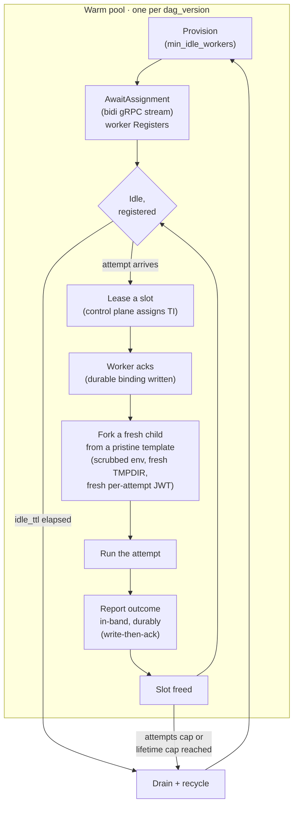

---
# --- AUTO redirect aliases (build_redirects.py) — do not edit by hand ---
aliases:
  - /warm-pools.html
# --- end AUTO redirect aliases ---
title: Warm worker pools
linkTitle: Warm pools
weight: 80
description: Cut task start latency with pre-warmed worker pods.
---

{}
Warm worker pools are a **Pro** feature, gated behind
`execution.warm_pools_enabled` (default **`false`**). With the flag off,
Leoflow runs a **dedicated pod per task attempt** — the historical behavior
([ADR 0002](/project/adrs/0002-pod-per-task/)), byte-for-byte unchanged. Lite ignores
the flag entirely. Turning warm pools on has hard security prerequisites; read
[How to enable](#how-to-enable) before you flip it.
{}

By default every task attempt runs in its own fresh pod. That pod is correct and
maximally isolated, but each attempt re-pays the full cold start: image pull, pod
schedule, kubelet admit, container start, and the agent's `Register` handshake.
For a DAG whose attempts run for seconds, that overhead can dominate the wall
clock.

A **warm worker pool** amortizes cold start by keeping a small number of task pods
alive and reusing **one pod across many attempts of the same DAG version**
([ADR 0058](/project/adrs/0058-warm-worker-pools/)). The reuse is safe because a warm pod
never reuses a task *identity*: each attempt receives its own short-lived,
liveness-gated credential (the [security model](#security-model) below).

## What it amortizes — and what it does not

A warm pod amortizes the **infrastructure** cold start — image pull, pod schedule,
kubelet admit, container start, and the agent's `Register`/`TokenReview` handshake
(≈ 2–15 s, depending on image size and node state). That cost is paid once when the
pod is provisioned and then spread across every attempt the pod serves.

It does **not** amortize the **Python import graph**. Each attempt runs in a fresh,
hard-scrubbed child process (see [isolation](#isolation-between-attempts)), so it
re-imports the DAG's libraries every time: pandas + numpy ≈ 1 s, dbt ≈ 1–4 s,
torch/tf ≈ 3–10 s. For an import-heavy DAG you therefore retain only ~40–65 % of
the theoretical amortization, not all of it. Isolation is chosen over raw speed
here; a future forkserver optimization (a parent that pre-imports the heavy
libraries and CoW-forks scrubbed children) is the escape hatch when the numbers
justify it, and it will not weaken the isolation invariant.

## When to use it — and when not to

Warm pools help most when the **infrastructure** cold start is large relative to
the work, and the same DAG version runs many attempts.

**Good fits**

- Short tasks (seconds) that would otherwise spend most of their wall clock in pod
  startup.
- Stable DAG versions that run **many attempts** between deploys — the win is a
  function of *attempts-per-version*, not attempts-per-DAG (see the pool key
  below).
- Large images where the pull/schedule cost is the bottleneck.

**Poor fits — or outright excluded**

- **Import-heavy DAGs** (large ML/data-science dependency closures) keep only part
  of the amortization, because each attempt re-pays the import cost.
- **Import-light, infrequent DAGs** — if a version runs only a handful of attempts,
  the pool barely warms before it drains, and you approach pod-per-task economics
  anyway.
- **CI/CD-heavy teams that push often.** The pool is keyed by DAG *version*
  ([D1](#pool-key-dag-version)), so a version bump starts a fresh pool. Teams that
  deploy on every commit keep thin, short-lived pools and see little benefit.
- **DAGs that use the [staging volume](/operate/staging-volume/).** A pod's volumes are
  fixed at creation, so a warm pod (which spans runs) cannot hot-mount a future
  run's per-run staging PVC. Any DAG that declares `staging.enabled: true`
  **automatically falls back to a dedicated pod per task** — this is detected
  statically, no configuration needed.
- **Non-idempotent tasks.** Warm-pool recovery re-runs an attempt after a worker is
  lost, and the safety argument for "a re-run is harmless" holds only for
  idempotent tasks. This is the same assumption Airflow itself makes; it is a
  precondition, not a guarantee warm pools provide.

### Pool key: DAG version

A pool is keyed by **`dag_version_id`**, never by `dag_id`. A warm pod caches a
specific image + dependency closure ([ADR 0003](/project/adrs/0003-dag-as-image/)); keying
by `dag_id` would let a pod built on the *old* image serve attempts of *new* code —
silent stale-code execution. When you push a new version, the old version's pool
drains by idle-TTL and a fresh pool starts for the new version; attempts already
in flight on the old version finish on the old pod.

The practical consequence: the benefit tracks **attempts per version**. A DAG that
runs thousands of attempts on a stable version pools well; a DAG that ships a new
version hourly does not.

## How to enable

Turning warm pools on is a two-part decision: a **security prerequisite** that the
server enforces at boot, and the **pool knobs** themselves.

### 1. Satisfy the security prerequisite (enforced, fail-closed)

A warm pod reuses one *pod* across attempts, so the credential a task uses must be
**per-attempt**, not per-pod. That requires the exchange transport and liveness
enforcement from [ADR 0055](/project/adrs/0055-secret-scoping-and-token-liveness/). The
control plane **refuses to boot** with warm pools on unless both are set:

```
auth.agent_token_transport = exchange   # LEOFLOW_AUTH_AGENT_TOKEN_TRANSPORT
auth.secret_liveness_mode  = enforce    # LEOFLOW_AUTH_SECRET_LIVENESS_MODE
```

This coupling is deliberate and has **no safe degraded mode** — the degraded mode
*is* the vulnerability. Under the shipped `observe` liveness default, a superseded
attempt's token still resolves secrets; on a reused pod that would let one
attempt's credential outlive its attempt. See
[Agent credential transport](/operate/agent-credential-transport/) for the full envvar-vs-
exchange story and the two-token model, and
[Security model](#security-model) below for why per-attempt identity is what makes
reuse safe.

The exchange transport needs a cluster-scoped `tokenreviews` RBAC grant so the
control plane can validate the projected ServiceAccount token each pod presents.
The Helm chart renders that `ClusterRole` + binding **only** when the exchange
transport is selected — see
[Agent credential transport → RBAC](/operate/agent-credential-transport/#rbac--the-tokenreviews-grant).

### 2. Turn on the pool and tune it

The pool knobs live under the chart's `execution` values (which map to the
`LEOFLOW_EXECUTION_*` server environment). Start with the default,
`minIdleWorkers: 0`:

```yaml
execution:
  warmPoolsEnabled: true      # LEOFLOW_EXECUTION_WARM_POOLS_ENABLED
  minIdleWorkers: 0           # default: scale-to-zero, no standing cost
```

`minIdleWorkers: 0` is the real code default and the right starting point. The
pool scales to zero — **no idle pods are kept**, so there is **no standing
cost**, preserving the zero-idle floor of pod-per-task. A pod is provisioned on
demand at the first attempt and then reused while it stays busy or within its
idle-TTL, so you still get the reuse win on a hot version without paying for a
pod that sits idle. Everything else carries a sane default (see the
[config reference](#configuration-reference)).

**To see it work — or to measure the latency win — raise it to `1`:**

```yaml
execution:
  warmPoolsEnabled: true
  minIdleWorkers: 1           # keep 1 warm pod ready per DAG version — has a cost
```

`minIdleWorkers: 1` keeps a pod ready the instant an attempt arrives (no
first-attempt provisioning wait), which is what you want when demonstrating or
benchmarking the feature. It is not free: it keeps **one pod warm per DAG
version** standing idle (multiplied across every active version), and — like
turning warm pools on at all — it rides on the cluster-wide pod-auth change from
the `exchange` transport + `enforce` liveness prerequisite above, which alters
how **every** task pod authenticates, warm or dedicated. Measure the win against
that cost before raising it in production.

{}
Unit and integration tests prove the *logic* with fakes; they cannot prove the
*timing and topology*. Before you flip `warmPoolsEnabled` on a shared cluster,
validate against a real cluster — see [Enable readiness](#enable-readiness).
{}

## Lifecycle



1. **Provision.** The reconciler keeps `EffectiveMinIdle` warm pods per DAG version
   ready (the DAG's declared warmth, clamped by the operator's floor and per-version
   cap). With the default `minIdleWorkers: 0`, that target is zero until an attempt
   demands a pod.
2. **AwaitAssignment.** Each warm pod opens a long-lived bidirectional gRPC stream
   (`AwaitAssignment`) and **registers** under its authenticated identity, naming
   its `dag_version` and pod name. Work assignments flow down the stream; acks and
   slot-free signals flow up. The stream is gated to the scheduler **leader**.
3. **Lease + ack.** When an attempt for that version is ready, the control plane
   leases a free slot on a registered worker and sends the assignment. The worker
   **acks**, and a durable warm-attempt binding is written so a leader failover can
   recover which worker holds which task instance.
4. **Fork from a pristine template.** The worker runs each attempt in a **fresh
   child process forked from a pristine template — never from a sibling attempt**
   ([isolation](#isolation-between-attempts)).
5. **Durable in-band outcome.** The worker records the attempt's terminal outcome
   (`Succeeded` / `Failed` / `Unexecutable` / `Rescheduled`) **in-band, per attempt,
   durably** — written **before** it acks the attempt on the control channel
   (write-then-ack). A crash between write and ack replays at-least-once, and an
   idempotent, `(run, task, try_number)`-guarded settle makes the replay harmless.
   The warm path **never reads pod phase** to decide an outcome (there is no
   per-attempt pod) — a tested invariant.
6. **Slot free → reuse.** The slot is freed and the worker waits for the next
   assignment on the same stream.
7. **Drain + recycle.** On any recycle trigger the worker **drains** — see
   [Drain and recycle](#drain-and-recycle).

### Isolation between attempts

Each attempt runs in a **fresh child process, hard-scrubbed, forked from a pristine
template — never from a sibling attempt.** Before each attempt the worker:

- **rebuilds the environment from scratch** — only that attempt's `AIRFLOW_VAR_*` /
  `AIRFLOW_CONN_*` + `LEOFLOW_*`, with no residue from a prior attempt, and the
  agent-only variable strip re-runs per attempt;
- **resets the agent scratch and redirects `TMPDIR` into it** — the child's
  `TMPDIR` points at a per-attempt subdirectory of the agent scratch that is wiped
  before every attempt, so a token cache, a dbt profile, or `~/.aws`-style
  credentials written to `$TMPDIR` do not survive into the next attempt;
- **drops the prior attempt's task JWT** before minting the next one.

The invariant, tested rather than best-effort: *each attempt's child forks from a
pristine template, never from a sibling attempt; no attempt observes another
attempt's secrets, environment, or the writable filesystem state under the agent's
control — the agent scratch and the `TMPDIR` redirected into it.* A long-lived
shared interpreter (state persisting across attempts) is explicitly rejected.
Phrasing the invariant as "fork from pristine" keeps a future forkserver
optimization open without reopening the guarantee — library code carries no tenant
data, and secrets re-enter per child.

{}
The per-attempt scrub covers what the agent owns: the scratch space and the
`TMPDIR` redirected into it. It does **not** reset paths outside the agent's
control on a writable root filesystem — most notably **`$HOME`** (which keeps its
image-baked `~/.config` and anything a task writes there, e.g. `~/.aws/credentials`
or a `~/.dbt/profiles.yml`), the container image layers, and mounted volumes. These
persist for the whole worker's lifetime and are shared by every attempt the worker
serves (same tenant + DAG version). Tasks that write secrets to `$HOME` rather than
`$TMPDIR` should run warm pods with a **read-only task root filesystem**
(`read_only_task_root_filesystem`) so those writes fail closed instead of leaking to
the next attempt.
{}

Because a fresh scrubbed child and a fresh per-attempt token are mandatory, there is
**no per-pod secret cache** to leak across attempts: each attempt does exactly one
scoped secret read, the same as pod-per-task. Reuse does not amortize secret reads —
by design (correctness over caching).

## Security model

Warm pools are only *safe* to run because reuse never reuses a task **identity**.
Two distinct credentials keep the pod-scoped and attempt-scoped concerns apart:

| Credential | Held by | Lifetime | Authorizes |
|---|---|---|---|
| **Bootstrap token** (worker-scoped) | the warm pod | pod lifetime (short TTL, heartbeat-renewed) | **only** `Register` + `AwaitAssignment` — authenticates the pod to the control plane; **fetches no secrets** |
| **Task-scoped token** (per-attempt) | one attempt | the attempt (short TTL, liveness-gated) | that attempt's declared secrets, XCom, and state report — dies with the attempt |

The two-token split is the whole security argument, and it is the same exchange
mechanism described on the
[Agent credential transport](/operate/agent-credential-transport/#the-two-token-model)
page (with the [two-token diagram](/operate/agent-credential-transport/#the-two-token-model)).
Why it makes reuse safe:

- **Per-attempt identity is what dies with the attempt.** The task-scoped token is
  minted per attempt, short-lived, and gated on task-instance **liveness** — a
  finished, failed, or superseded attempt's token stops resolving secrets the
  instant its task instance is no longer live, regardless of the clock. On a reused
  pod that is exactly the property that stops a superseded attempt's credential from
  leaking into the next one. This blast-radius argument holds **only** under
  `secret_liveness_mode=enforce`, which is why enforcement is a boot prerequisite.
- **The bootstrap token cannot reach the vault.** It authenticates the pod and
  nothing more; it fetches no tenant secrets. Even a fully compromised idle worker
  loses its channel within one TTL of the operator cutting it, because the bootstrap
  token is short-TTL and heartbeat-renewed.
- **Recycle on suspicion.** Any attempt that trips a security signal — an auth
  failure, or a liveness denial under enforce — **recycles the whole worker** rather
  than serving the next attempt on it. Cheap, bounded insurance.

Without the exchange transport a bearer credential would sit in plaintext on the pod
spec and could not carry a per-attempt identity at all — which is why
`agent_token_transport=exchange` is the other half of the boot prerequisite. The
full contrast between the plaintext-envvar transport and the exchange transport is
on the [Agent credential transport](/operate/agent-credential-transport/) page.

## Drain and recycle

A warm worker is recycled — never a task killed mid-flight — on any of:

- **Attempts cap** (`maxAttemptsPerWorker`, default 50): the worker has served its
  budget of attempts.
- **Lifetime cap** (`maxWorkerLifetime`, default 1h): the worker has been alive past
  its wall-clock ceiling.
- **Idle-TTL** (`workerIdleTtl`, default 5m): the worker has sat idle with no work.
- **Suspicion**: an attempt tripped a security signal (see above).

The caps exist to bound the exposure that a persistent worker would otherwise
accumulate — a stale image, or a leaked in-pod credential — while staying high
enough to keep real amortization. They are **operator-set, never DAG-author-set**,
the same stance as the secret-scoping policy: whether a pod may be reused, and for
how long, is a security decision the operator owns.

**Recycle is a graceful drain, never a mid-attempt kill.** The `should_terminate`
signal to a warm worker means *"finish the current attempt, ack it, then exit and
let the pool respawn"* — it **must not** hard-kill an in-flight attempt (a tested
invariant). A separate `terminate_now` signal is the hard-kill reserved for a
compromise. Because recycle drains rather than force-kills, a worker whose lifetime
cap is shorter than the credential ceiling is harmless: the worker finishes its
in-flight attempt on its own renewed credential before recycling. (There is
therefore **no** `max_worker_lifetime ≥ max_attempt_credential_lifetime` boot guard —
the real "credential lapses mid-attempt" bound is per-attempt, enforced on the
execution path via the attempt watchdog, not by an ordering rule between these two
knobs. The watchdog is derived from `max_attempt_credential_lifetime`, so a
non-positive ceiling disables it too — boot logs a `WARN`.)

### Losing a worker

Losing a **worker** is one infrastructure event that fans out to **all** the
in-flight task instances on that pod. Each is re-placed on the infrastructure-retry
budget **without** charging the user's `try_number`, exactly as a lost dedicated pod
is today. The pod-lost liveness check runs **per pod**, not per task instance, which
collapses the API-server load from "proportional to running tasks" to "proportional
to pools" — the shared-cluster win. On a leader failover the reconciler reconciles
its in-memory slot index against a live pod list once before trusting it, so a stale
index cannot drive incorrect reaps. A double-run is bounded to wasted compute by the
`try_number`-guarded idempotent settle — and is harmless only for idempotent tasks
(stated as a precondition above).

## Per-tenant cap

On a shared, multi-team cluster one tenant must not pin unlimited idle pods and
starve its neighbors. `maxWarmPodsPerTenant` (default 100) caps the **total** warm
pods a single tenant may hold across **all** its DAG versions — where
`maxPoolSize` bounds a single version's pool, this bounds the tenant's aggregate
warm footprint.

It is a **reserve-then-ration budget, never a starvation lever**:

- A tenant's **promised idle floors** — the sum of its versions' effective
  `minIdleWorkers` — are always honored, even when that sum exceeds the cap. The
  reconciler raises the effective budget to the floor sum and **meters the
  misconfiguration** (so you can see a tenant whose floors overcommit its cap)
  rather than silently starving a promised floor.
- The cap is enforced **only by refusing to create new** warm pods once a tenant is
  at its budget — **never** by deleting a busy worker.

## Enable readiness

Turning warm pools on for real traffic is a **reliability decision, stated in rates,
not median latency**. The warm reaper, reclaim, and placement decisions already
surface on the metrics endpoint (the scheduler-decisions counter, labelled by
decision, plus the warm-pool reconciler counters), so the safety bar is scrapeable
today without new instrumentation. Cold-start decomposition and warm-hit-vs-dedicated
latency are read from pod events/timestamps on the cluster during the run.

Drive a warm workload on a **real cluster** (k3d/CI or staging) and gate the flip on:

**Go / no-go bar (rates, not means)**

- **Zero double-runs** under induced worker death — a hard requirement.
- Cold-start-failure and worker-register-failure rates below your agreed threshold.
- The dispatch-lost-deferred count non-zero but bounded (the double-run defer is
  working without over-deferring); lease-expiry reclaim rate low (else the lease
  window is mistuned).
- Warm-hit rate high in steady state — the pool is actually being used, not churning
  back to dedicated pods.

**Real-cluster scenarios only a cluster can prove**

Each of these is unprovable in fakes; validate every one before you enable:

1. **HA topology** — workers reach the leader; a follower refuses and the agent
   reconnects to the leader.
2. **Worker dies mid-attempt** (SIGKILL / OOM / node loss) — fan-out to the
   infrastructure budget (not `try_number`), the attempt re-runs, **double-run == 0**.
3. **Leader failover with in-flight warm attempts** — busy workers survive; the new
   leader recovers from the durable binding + reconciler.
4. **Slow-start deferral** — an attempt queued past the slow-start threshold defers
   correctly.
5. **Node drain / eviction** — busy workers finish; the reconciler replaces them.
6. **Image-pull storm** — a new version with `minIdleWorkers = N` pulls all at once
   with no thundering herd; dispatch defers on slow pulls.
7. **Scale-to-zero and back.**
8. **Per-tenant cap under contention** — a tenant at its cap starves neither its
   neighbors nor its own promised floor.
9. **Reclaim re-placement vs reconciler recovery** — no double dispatch.

Enable is gated on all of the above passing **and** the two security flips
(`agent_token_transport=exchange`, `secret_liveness_mode=enforce`) being in place.

## Configuration reference

Pool knobs live under `execution` in the Helm chart values and map to the
`LEOFLOW_EXECUTION_*` server environment. All are **operator-scoped** (never
DAG-author-settable). With `warmPoolsEnabled: false` (the default) **none** of the
others is read — the deployment is byte-for-byte pod-per-task.

| Chart value (`execution.`) | Env (`LEOFLOW_EXECUTION_`) | Type / unit | Default | Meaning |
|---|---|---|---|---|
| `warmPoolsEnabled` | `WARM_POOLS_ENABLED` | bool | `false` | Master switch for N:1 pod reuse. Off ⇒ dedicated pod-per-task. Requires the exchange + enforce security flips at boot. |
| `minIdleWorkers` | `MIN_IDLE_WORKERS` | int (pods) | `0` | Warm pods kept ready **per DAG version**. `0` = scale-to-zero. A DAG author may request warmth per DAG; this is the operator floor when the DAG declares none, and the value is clamped to `maxPoolSize`. |
| `maxPoolSize` | `MAX_POOL_SIZE` | int (pods) | `8` | Cap on total warm workers a **single DAG version** may hold. Must be ≥ 1 when warm pools are on. |
| `maxAttemptsPerWorker` | `MAX_ATTEMPTS_PER_WORKER` | int (attempts) | `50` | Attempts a worker serves before it drains + recycles. Must be ≥ 1. Bounds stale-image / leaked-credential exposure. |
| `maxWorkerLifetime` | `MAX_WORKER_LIFETIME` | duration | `1h` | Wall-clock ceiling on a worker before it drains + recycles, independent of attempt count. Must be > 0. |
| `workerIdleTtl` | `WORKER_IDLE_TTL` | duration | `5m` | How long an idle worker is kept before recycle. Must be > 0. |
| `maxWarmPodsPerTenant` | `MAX_WARM_PODS_PER_TENANT` | int (pods) | `100` | Cap on total warm pods a **single tenant** may hold across all its DAG versions (M4). Reserve-then-ration; promised idle floors are always honored. Must be ≥ 1. |

Durations accept Go duration strings (`"90s"`, `"5m"`, `"1h"`). When
`warmPoolsEnabled` is on, the server **validates these at boot and refuses to start**
on a value that would recycle a worker instantly (zero/negative cap, lifetime, or
TTL) or on a missing security prerequisite — a fail-closed boot error rather than a
silent correction.

The related auth knobs — `agent_token_transport`, `secret_liveness_mode`,
`secret_scoping`, `max_attempt_credential_lifetime` — are documented on the
[Agent credential transport](/operate/agent-credential-transport/) page and in the
[Configuration reference](/reference/configuration/#server-environment-leoflow_).

## See also

- [Agent credential transport](/operate/agent-credential-transport/) — the envvar-vs-exchange
  transport, the two-token model, and the `tokenreviews` RBAC that warm pools require.
- [Architecture](/concepts/architecture/) — where warm pools and the exchange transport sit
  in the control plane.
- [ADR 0058 — Warm worker pools](/project/adrs/0058-warm-worker-pools/) — the full decision
  record.
- [ADR 0055 — Secret scoping and token liveness](/project/adrs/0055-secret-scoping-and-token-liveness/) —
  the security prerequisite this feature depends on.
- [Configuration reference](/reference/configuration/) — every `LEOFLOW_*` server variable.
